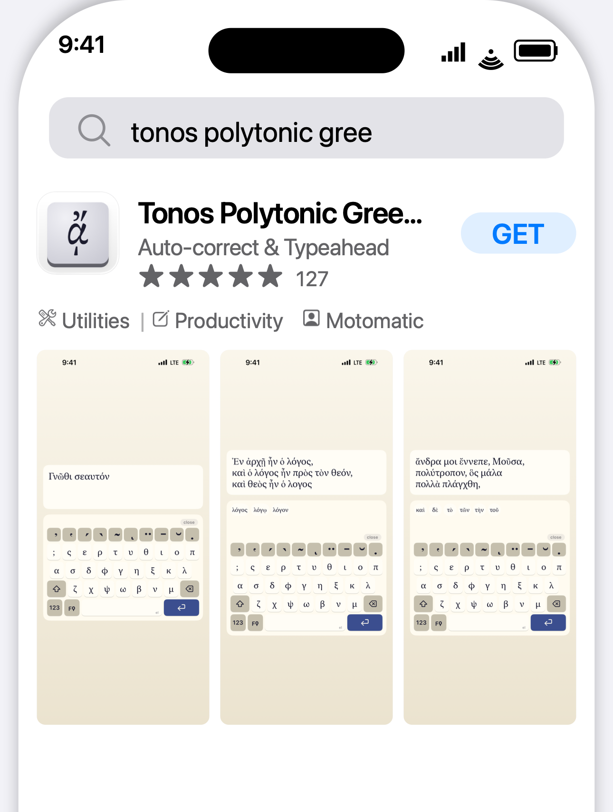
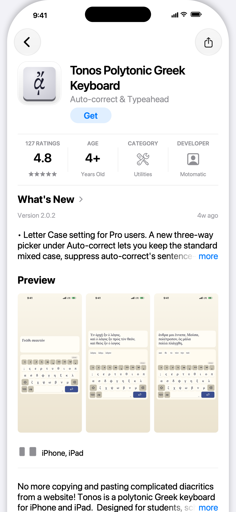

# StoreScreens

Every App Store Connect API call. Granular, agentic screenshot rendering.

StoreScreens is a `brew`-installed Swift MCP/CLI (and MD Skill) that drives the entire App Store Connect pipeline from one config file: XCUITest screenshots, framed renders with markdown captions (optionally unique per device/locale), metadata and binary upload via Apple's official API. Beautiful, modern bezels, no Ruby version hell.

Captures run your UI tests on multiple simulators in parallel (or natively on macOS), organize the output by device and locale, and auto-detect which App Store size each simulator maps to. Supports iPhone, iPad, Apple Watch, and Mac App Store screenshots.

## Three pieces, one workflow

StoreScreens ships as three complementary pieces. Most users only need the CLI; the other two exist to make AI coding assistants first-class operators.

| Piece | What it is | When you want it |
|---|---|---|
| `storescreens` (CLI) | The core binary. Runs UI tests across simulators, captures screenshots, builds the HTML preview gallery. | Always - this is the engine. Use it from your terminal, CI, or scripts. |
| `storescreens-mcp` (MCP server) | A structured wrapper that exposes the CLI's operations as [Model Context Protocol](https://modelcontextprotocol.io) tools with inline progress streaming. | When your AI coding assistant (Claude Code, Cursor, etc.) should drive captures directly instead of parsing CLI output from a Bash call. |
| [storescreens-skill](https://github.com/ciscoriordan/storescreens-skill) | An agent skill - instructions and templates that teach an assistant how to detect your Xcode project, generate config, scaffold UI tests, and run a capture. | When you want an assistant to do the full setup for you, from zero to first screenshots, with no manual steps. Works with any assistant that supports skills. |

Both the CLI and MCP server are installed by `brew install storescreens`.

### How this compares to other Xcode MCP servers

StoreScreens is purpose-built for one job: generating the complete set of App Store Connect screenshots. It is not a general Xcode control surface, and it is not competing with the general-purpose Xcode MCP servers, it complements them.

| Tool | Scope | Best for | App Store screenshot output |
|---|---|---|---|
| `storescreens` | Narrow. App Store screenshot capture, device-size routing, locale and appearance matrix, HTML preview gallery. | Producing the final screenshot set for App Store Connect in one command. | Yes. Named, organized by device and locale, ready to upload. |
| [Apple Xcode MCP](https://developer.apple.com/documentation/xcode/giving-agentic-coding-tools-access-to-xcode) (built into Xcode 26.3+) | Xcode-resident tools. Most notably `RenderPreview` for a single SwiftUI `#Preview`. | Checking one view's layout without spinning up a simulator. | No. |
| [XcodeBuildMCP](https://github.com/getsentry/XcodeBuildMCP) | General iOS/macOS build, test, and device interaction driven by `xcodebuild`. | Letting an agent compile, test, and debug iOS/macOS projects through a unified MCP interface. | No. |
| [xc-mcp](https://github.com/conorluddy/xc-mcp) | 29 tools covering build, simulator lifecycle, and accessibility-first UI automation. Optimized for low-context agent interactions. | Agents that need to drive the simulator via semantic accessibility queries (fast, token-cheap) instead of parsing screenshots. | No, its screenshot tool is for a single capture, not a full App Store matrix. |

If you are shipping an app, you will likely use StoreScreens alongside one of the general servers: the general server handles build and run, StoreScreens handles the screenshot matrix at the end.

Each run produces a browsable HTML preview with per-device galleries:


When the MCP server is configured, the agent streams per-screenshot progress inline as each device captures:


<video src="https://github.com/user-attachments/assets/fb0c0cf1-8fdc-4e28-98c9-1baded6dd947" controls></video>

## Install

Requires macOS 14+ (Sonoma or later) on Apple Silicon (arm64). Intel Macs are not supported.

### Homebrew

```bash
brew tap ciscoriordan/tap
brew install storescreens
```

### Script

```bash
curl -fsSL https://raw.githubusercontent.com/ciscoriordan/storescreens-cli/main/install.sh | sh
```

### From source

Requires Xcode 16+.

```bash
git clone https://github.com/ciscoriordan/storescreens-cli.git
cd storescreens-cli
swift build -c release
sudo cp .build/release/storescreens-cli /usr/local/bin/storescreens
```

Verify the install worked:

```bash
storescreens --help
```

## Quick Start

```bash
cd /path/to/your/xcode-project

# 1. Generate a config file
storescreens init

# 2. Generate screenshot UI tests
storescreens setup

# 3. Open the generated test file and add your app navigation (see below)
open MyAppUITests/ScreenshotTests.swift

# 4. Capture screenshots on all devices (--verbose for live output)
storescreens capture --verbose
```

### How it works

The CLI uses XCUITest - Apple's built-in UI testing framework - to drive your app and capture screenshots. A UI test launches your app in a simulator, taps through screens programmatically, and saves screenshots at each step. The CLI then runs that test across every device size in your config.

#### Do I need a UI test target?

Yes. If your project doesn't have one yet, add it in Xcode:

1. File > New > Target
2. Select UI Testing Bundle
3. Name it something like `MyAppUITests`
4. Make sure it's targeting your app

`storescreens setup` will detect the target automatically. If none exists, it prints these steps for you.

#### Using a manually written test file

If you wrote your `ScreenshotTests.swift` by hand (rather than generating it with `storescreens setup`), the target setup requires one extra step because Xcode auto-creates a placeholder test file when you add the target:

1. File → New → Target → UI Testing Bundle
2. Name it to match your `test_target` in `storescreens.yml` (e.g. `ExampleUITests`)
3. Set Target to be Tested to your app
4. Click Finish - Xcode creates the target with a default `ExampleUITestsLaunchTests.swift` placeholder
5. Delete the placeholder file Xcode generated (move to Trash)
6. Right-click your UI test group in the Project Navigator → Add Files to "[project]"
7. Select your `ScreenshotTests.swift` and confirm it is added to the `ExampleUITests` target
8. In `storescreens.yml`, set `test_target` and `test_class` to match:

```yaml
test_target: ExampleUITests
test_class: ScreenshotTests
```

Then verify everything builds before running the full capture. Pipe the output to a log file so you can inspect errors:

```bash
# Confirm the test target builds and the test is discoverable
xcodebuild build-for-testing \
  -workspace Example.xcworkspace \
  -scheme Example \
  -destination 'platform=iOS Simulator,name=iPhone 17 Pro' \
  2>&1 | tee build.log

# Then capture (--verbose for live terminal output; logs are always saved)
storescreens capture --verbose
```

#### The generated test file

`storescreens setup` asks you to name the screens you want to capture, then generates a test file:

```swift
// MyAppUITests/ScreenshotTests.swift

import XCTest

class ScreenshotTests: XCTestCase {
    func testScreenshots() {
        let app = XCUIApplication()
        app.launch()

        takeScreenshot(named: "Home")

        // TODO: Navigate to Search Results
        takeScreenshot(named: "SearchResults")

        // TODO: Navigate to Detail
        takeScreenshot(named: "Detail")

        // TODO: Navigate to Settings
        takeScreenshot(named: "Settings")
    }

    func takeScreenshot(named name: String) {
        let screenshot = XCUIScreen.main.screenshot()
        let attachment = XCTAttachment(screenshot: screenshot)
        attachment.name = name
        attachment.lifetime = .keepAlways
        add(attachment)
    }
}
```

The first screenshot captures whatever's on screen right after launch. Each `// TODO` is where you add code to navigate to the next screen.

Name screenshots with meaningful identifiers (`Home`, `Search`, `Detail`) and let the `screenshots:` list in `storescreens.yml` drive display order. After capture, storescreens stamps each output PNG's mtime and creationDate in that order, so `ls -t` and Finder's "Date Created" sort match the order you configured. No numeric prefixes needed.

#### Adding navigation

Replace each TODO with XCUITest calls that interact with your app's UI. Common patterns:

```swift
// Tap a tab bar button
app.tabBars.buttons["Search"].tap()

// Tap a navigation link or button
app.buttons["Settings"].tap()

// Tap a list row
app.cells["My Profile"].tap()

// Type into a search field
app.searchFields.firstMatch.tap()
app.typeText("recipes")

// Scroll down
app.swipeUp()

// Wait for content to load
let element = app.staticTexts["Welcome"]
_ = element.waitForExistence(timeout: 5)
```

A complete example:

```swift
func testScreenshots() {
    let app = XCUIApplication()
    app.launch()

    // Home screen - shown right after launch
    takeScreenshot(named: "Home")

    // Search - tap the search tab, enter a query
    app.tabBars.buttons["Search"].tap()
    app.searchFields.firstMatch.tap()
    app.typeText("recipes")
    takeScreenshot(named: "Search")

    // Detail - tap a result
    app.cells.firstMatch.tap()
    takeScreenshot(named: "Detail")

    // Settings - go back, open settings
    app.navigationBars.buttons.firstMatch.tap()
    app.tabBars.buttons["Settings"].tap()
    takeScreenshot(named: "Settings")
}
```

You can test your navigation works before running the full capture - just run the test in Xcode with Cmd+U or click the diamond next to the test function.

#### Accessibility identifiers

UI tests find elements by accessibility identifier, text label, or type. Always prefer `.accessibilityIdentifier()` over matching by text, since text labels can appear in multiple places (e.g. your app name on both the launch screen and the main toolbar), causing tests to match the wrong element or pass prematurely.

Add identifiers to your SwiftUI views:

```swift
// Buttons and interactive elements
Button("Save") { ... }
  .accessibilityIdentifier("saveButton")

// Loading indicators - so tests can wait for loading to finish
ProgressView()
  .accessibilityIdentifier("loadingIndicator")

// Content containers - so tests can wait for content to appear
ScrollView { ... }
  .accessibilityIdentifier("mainContent")

// Toolbar items
ToolbarItem(placement: .topBarLeading) {
  Button { ... } label: { Image(systemName: "gear") }
    .accessibilityIdentifier("settingsButton")
}

// Search fields
TextField("Search", text: $query)
  .accessibilityIdentifier("searchField")
```

Then in your test, wait for elements by identifier instead of using `sleep()`:

```swift
// Bad: fragile timing, screenshots may capture loading spinners
sleep(5)
takeScreenshot(named: "Home")

// Good: waits for actual content to load
waitForElement(id: "mainContent", timeout: 15)
takeScreenshot(named: "Home")
```

The generated `waitForElement()` helper searches all element types by accessibility identifier, so it works for buttons, text, scroll views, or any other element.

Common pitfall: If your app name (e.g. "MyApp") appears as `Text("MyApp")` in both `LaunchScreen.swift` and your main view's toolbar, a test like `app.staticTexts["MyApp"].waitForExistence(timeout: 10)` will match the launch screen text and proceed before your main content loads. Use a unique identifier instead:

```swift
// In your main view:
Text("MyApp")
  .accessibilityIdentifier("mainTitle")

// In your test:
app.staticTexts["mainTitle"].waitForExistence(timeout: 10)
```

#### How screenshots are saved

By default, screenshots are collected from the filesystem. Your test code writes PNGs directly to a cache directory, and the CLI copies them to the output folder after the test finishes.

The generated `takeScreenshot()` helper does two things:
1. Creates an `XCTAttachment` (stored in the `.xcresult` bundle as a backup)
2. Writes a PNG file to the StoreScreens cache directory on the host filesystem

The CLI reads the cache directory from a breadcrumb file at `~/.storescreens-cache-dir`, which it writes before each capture run. Your test code discovers this path using `SIMULATOR_HOST_HOME`:

```swift
let hostHome = ProcessInfo.processInfo.environment["SIMULATOR_HOST_HOME"]
    ?? ProcessInfo.processInfo.environment["HOME"]
    ?? NSHomeDirectory()
let breadcrumb = (hostHome as NSString).appendingPathComponent(".storescreens-cache-dir")
let cacheDir = try? String(contentsOfFile: breadcrumb, encoding: .utf8)
    .trimmingCharacters(in: .whitespacesAndNewlines)
```

Intermediate screenshots and named pipes for real-time logging are stored in `.storescreens-cache/` in your project directory. Add it to `.gitignore`:

```
.storescreens-cache
```

##### Why filesystem over xcresult?

Filesystem capture is the primary path because it gives you things xcresult export can't:

- Streaming progress - PNGs land one-by-one as the test runs, so the MCP server streams per-screenshot updates to your AI assistant. `xcresulttool export` only runs after the entire test finishes, so progress is all-or-nothing.
- Incremental safety - if the test crashes partway through, you still get every screenshot captured before the crash.
- Deterministic filenames - you pick the name. `xcresulttool` appends `_N_UUID.png` to every attachment, which has to be regex-stripped back to the original name.
- No silent skip rules - `xcresulttool` silently drops attachments whose names start with `Screenshot`, `UI Snapshot`, `Synthesized Event`, `Screen Recording`, and several others. Filesystem writes are always kept, no matter what you name them.
- Faster - no post-processing step after the test finishes.

The tradeoff: filesystem capture only works on simulators, because it relies on `SIMULATOR_HOST_HOME` to cross the sandbox boundary back to your Mac. App Store screenshots are simulator-only anyway, so this rarely matters.

If you need to capture on real devices, or you want attachments visible in Xcode's built-in test report UI, pass `--xcresult` instead:

```bash
storescreens capture --xcresult
```

#### Screenshot mode in your app

Your app can detect when it's being run by StoreScreens and adjust its behavior accordingly. The generated test file launches your app with `--screenshotMode` as a launch argument:

```swift
app.launchArguments = ["--screenshotMode"]
```

Check for this in your app to set up the ideal state for screenshots:

```swift
// In your root view or app entry point
.task {
    if ProcessInfo.processInfo.arguments.contains("--screenshotMode") {
        // Grant pro/premium access so screenshots show full features
        settings.isProUser = true

        // Disable animations for faster, deterministic screenshots
        UIView.setAnimationsEnabled(false)

        // Reset any persisted UI state (e.g., expansion toggles, onboarding)
        UserDefaults.standard.set("", forKey: "expandedSections")
    }
}
```

Common things to configure in screenshot mode:

- Simulate pro/premium access - show the full app without paywalls. Make sure your entitlement checks don't override this (skip StoreKit verification in screenshot mode).
- Disable animations - makes UI interactions instant and screenshots deterministic.
- Reset UI state - clear persisted toggles, expansion states, or onboarding flags so tests always start from a known state.
- Seed sample data - pre-populate the app with good-looking content if it would otherwise be empty on first launch.

#### Simple mode (no tests needed)

If you don't want to write UI tests, use simple mode instead:

```bash
storescreens capture --mode simple
```

This boots each simulator, installs and launches your app, and takes a single screenshot of whatever's on screen. Good for capturing your launch screen or a static state.

## Commands

| Command | Description |
|---------|-------------|
| `storescreens init` | Generate a `storescreens.yml` config file |
| `storescreens setup` | Set up screenshot UI tests (interactive wizard) |
| `storescreens capture` | Capture screenshots on all configured devices |
| `storescreens check` | Scan source for iPad-unsafe patterns and device assumptions |
| `storescreens list` | Show available simulators and App Store size mappings |
| `storescreens screenshot` | Take a quick screenshot of a running simulator |
| `storescreens render` | Render captioned/framed screenshots from an existing capture |
| `storescreens search-preview` | Render an iPhone App Store search-result preview (icon + name + subtitle + stars + 3 screenshots) in light/dark |
| `storescreens templates` | List the built-in render templates (curated background + type + chrome presets) |
| `storescreens bezels` | Import / inspect Apple device bezel assets used by `render` |
| `storescreens auth` | Manage App Store Connect API credentials |
| `storescreens metadata init` | Scaffold `metadata/<locale>/*.txt` files + README |
| `storescreens submit` | Upload rendered screenshots + metadata to App Store Connect |
| `storescreens upload-build` | Archive, export, and upload the `.ipa` to App Store Connect / TestFlight |
| `storescreens status` | Show current ASC state: versions and any in-flight review submission |
| `storescreens testflight ...` | TestFlight: beta groups, testers, builds, beta-app/build-localizations, beta-review, license-agreement, tester-metrics |
| `storescreens iap ...` | In-App Purchases (V2): products, localizations, pricing, submissions, content-hosting, images, promoted purchases |
| `storescreens subscriptions ...` | Auto-renewing subscriptions: groups, products, prices, offer codes, promotional offers, availability, submissions |
| `storescreens reviews ...` | Customer reviews: list with filters, get, respond (create/update/delete) |
| `storescreens reports ...` | Sales (TSV), finance (CSV), analytics report requests/instances/segments, perf-power metrics, diagnostic signatures |
| `storescreens users ...` | Team users, invitations, user-visible-apps |
| `storescreens devportal ...` | Developer Portal: certificates, profiles, devices, bundle IDs + capabilities |
| `storescreens previews / app-clips / cpp / events / experiments / encryption-decl / routing-coverage` | App Previews, App Clips, Custom Product Pages, in-app App Events, A/B Version Experiments, App Encryption Declarations, Routing App Coverage |
| `storescreens game-center ...` | Game Center: achievements, leaderboards (+ sets + members), matchmaking, app versions, groups |
| `storescreens xcode-cloud ...` | Xcode Cloud (CI/CD): products, workflows, build runs (start/cancel/retry), actions, artifacts, issues, test results, SCM repositories |
| `storescreens alt-dist ...` | Alternative Distribution (EU DMA): keys, packages, package versions/deltas/variants, domains, marketplace search + webhooks |
| `storescreens apple-pay ...` | Apple Pay: pass type IDs + certificates (from CSR), merchant domains |
| `storescreens sandbox / resource-limits / diagnostic-sessions` | Sandbox testers, team resource quotas, Xcode Instruments diagnostic sessions |
| `storescreens webhooks ...` | General-purpose ASC webhooks: subscribe to build/review/availability events, list deliveries, resend, health-ping |
| `storescreens build-uploads ...` | API-native .ipa upload (alternative to altool): buildUploads + buildUploadFiles, chunked PUT, high-level `upload-ipa` convenience |
| `storescreens accessibility ...` | Accessibility Nutrition Labels: per-device-family declaration of VoiceOver / captions / contrast / motion / etc. support |
| `storescreens background-assets ...` | Background Assets: large post-install asset download (200GB/app); upload chunks, version + state per build channel |
| `storescreens version-release ...` | Version release control: phased releases, promo carousels, manual release requests, end-of-pre-order |
| `storescreens game-center-v2 ...` | Game Center Activities + Challenges (+ images + localizations + versions), V2 versioning for achievements / leaderboards / sets, sandbox-only score and achievement submissions |
| `storescreens beta-feedback / beta-recruitment / beta-app-clip ...` | Modern TestFlight: feedback crash + screenshot submissions, beta crash logs, automatic-recruitment criteria, App Clip invocation configs |
| `storescreens iap-offer-codes ...` | One-time-IAP offer codes (custom + one-time-use variants); distinct from subscription offer codes covered by `subscriptions` |
| `storescreens subs-extras / review-extras / asc-extras` | Subscription intro / win-back offers / grace periods / group submissions, review summarizations + attachments, plus merchant IDs / nominations / app tags / EULAs / Android→iOS mapping / actors / app price points V3 / etc. |
| `storescreens wall submit` | Submit your app to the storescreens.app Wall of Apps |
| `storescreens --help` | Show help and available commands |

### `storescreens init`

Generates a `storescreens.yml` config file by auto-detecting your project:

- Finds your `.xcodeproj` or `.xcworkspace`
- Detects your scheme and deployment target
- Picks simulators that match required App Store sizes and are compatible with your deployment target
- Warns if any required sizes are missing

```bash
storescreens init              # generate config
storescreens init --force      # overwrite existing config
```

### `storescreens setup`

Interactive wizard that generates a screenshot test file and wires it into your config. It scans your Swift source to auto-discover screens from `TabView`, `NavigationLink`, `.sheet`, `.fullScreenCover`, and [Navigator](https://github.com/hmlongco/Navigator) route patterns.

```
$ storescreens setup

Project Detection
  ✓ Found project: MyApp.xcodeproj
  ✓ Detected scheme: MyApp

UI Test Target
  ✓ Found UI test target: MyAppUITests

Screenshot Screens
  Found 4 screens in your source code:
    1. Home (TabView)
    2. Search (TabView)
    3. Settings (NavigationLink)
    4. Profile (sheet)

  Press Enter to use these, or type your own (comma-separated)
  >
  ✓ Using discovered screens.

  ✓ Wrote MyAppUITests/ScreenshotTests.swift (4 screenshots)
  ✓ Updated storescreens.yml
```

If no screens are found in your source, it falls back to asking you to type them manually. If no UI test target exists, it prints step-by-step instructions to create one in Xcode.

Use `--non-interactive` to skip prompts and use auto-discovered screens (or defaults if none found).

### `storescreens capture`

Captures screenshots using one of two modes.

XCTest mode (default) - runs your UI tests, collects screenshots written to the filesystem by your test code. Use `--verbose` to see full xcodebuild output in the terminal (logs are always saved to the output directory either way):

```bash
storescreens capture --verbose
```

How it works:
1. Runs `xcodebuild test` on each target simulator
2. Your test code writes screenshots as PNGs to a shared cache directory
3. The CLI collects PNGs from the cache and organizes them into folders by device size

Simple mode - boots each simulator, installs your app, and takes a raw screenshot of whatever's on screen:

```bash
storescreens capture --mode simple
```

Useful if you don't have UI tests and just want a quick capture of your launch screen.

Options:

| Flag | Description |
|------|-------------|
| `--mode xctest\|simple` | Capture mode (default: `xctest`) |
| `--config PATH` | Config file path (default: `storescreens.yml`) |
| `--output DIR` | Override output directory |
| `--locale LOCALE` | Override locales (repeatable) |
| `--retries N` | Retry failed test runs per device |
| `--keep-alive` | Keep simulators running after capture |
| `--xcresult` | Extract screenshots from `.xcresult` bundle instead of filesystem |
| `--only PREFIXES` | Only capture screenshots matching these prefixes (comma-separated) |
| `--skip-check` | Skip preflight source code check |
| `--no-render` | Skip the post-capture render pass even if `render.enabled: true` is set in config |
| `--verbose` | Stream full xcodebuild output to terminal (logs are always saved to `logs/`) |

### `storescreens check`

Scans your Swift source files for patterns that can crash or break on iPad and other device-specific assumptions. Runs automatically before every `storescreens capture` unless disabled.

```
$ storescreens check

Preflight Check
  iPad detected in config - running iPad-specific checks
✗ Views/ContentView.swift:47  [toolbar-tabbar-hidden]
    .toolbarVisibility(.hidden, for: .tabBar) without iPad guard - may crash on iPad
! Views/CardView.swift:89  [hardcoded-screen-dimensions]
    Possible hardcoded iPhone screen dimension (390) - use GeometryReader instead

1 error, 1 warning found
Errors block capture. Use --skip-check to bypass.
```

Detection rules:

| Rule | Severity | What it catches |
|------|----------|-----------------|
| `toolbar-tabbar-hidden` | Error | `.toolbarVisibility(.hidden, for: .tabBar)` without an iPad device check - can crash on iPad |
| `unguarded-cloudkit` | Error | `CKContainer`/`CKDatabase` usage without an `accountStatus` check, error handling, or UI-testing guard - crashes in simulator without iCloud account |
| `uiscreen-main-bounds` | Warning | `UIScreen.main.bounds` - deprecated, doesn't handle iPad split view or multiple scenes |
| `hardcoded-screen-dimensions` | Warning | Literal iPhone screen sizes (390, 844, etc.) used in layout context |
| `navigation-view-stack` | Warning | `.navigationViewStyle(.stack)` forces stack navigation on iPad |

iPad-specific rules only fire when an iPad is in your configured device list. The scanner is guard-aware - it won't flag `.toolbarVisibility(.hidden, for: .tabBar)` if it finds a `UIDevice` / `userInterfaceIdiom` check in the surrounding lines, and it won't flag CloudKit usage if the file contains an `isUITesting` guard, `accountStatus` check, `try`/`catch`, or `screenshotMode` launch argument check.

| Flag | Description |
|------|-------------|
| `--config PATH` | Config file path (default: `storescreens.yml`) |
| `--directory DIR` | Directory to scan (default: `.`) |
| `--verbose` | Show verbose output |

### `storescreens list`

Shows available simulators and which App Store size they map to. By default, only shows devices that match a known App Store size (excludes Apple Watch).

```
$ storescreens list

Available Simulators
  Name                    State     App Store Size
  ──────────────────────────────────────────────────
  iPad Pro 13-inch (M5)   Shutdown  iPad Pro 13"
  iPhone 17 Pro Max       Shutdown  iPhone 6.9"
  iPhone 17 Pro           Shutdown  iPhone 6.3"
  iPhone 16 Plus          Shutdown  iPhone 6.7"
  ...
```

| Flag | Description |
|------|-------------|
| `--all` | Show all simulators, including non-App Store sizes |
| `--include-watch` | Include Apple Watch simulators |
| `--include-mac` | Show Mac App Store screenshot sizes |
| `--json` | Machine-readable output |

### `storescreens screenshot`

Takes a quick screenshot of a running simulator's current screen. No build, no tests - just captures whatever is on screen and saves it to a file. Intended for quick visual checks during UI development.

```bash
# Screenshot the first booted simulator
storescreens screenshot

# Screenshot a specific simulator
storescreens screenshot --simulator "iPhone 17 Pro" --output screenshot.png

# Boot the simulator if it's not running
storescreens screenshot --simulator "iPhone 17 Pro" --boot
```

| Flag | Description |
|------|-------------|
| `--simulator NAME` | Simulator name (default: first booted simulator) |
| `--udid UDID` | Simulator UDID (alternative to `--simulator`) |
| `--output PATH` | Output file path (default: `screenshot.png`) |
| `--boot` | Boot the simulator if it's not already running |
| `--verbose` | Show verbose output |

## Configuration

`storescreens.yml`:

```yaml
project: "MyApp.xcodeproj"
scheme: "MyApp"

devices:
  - simulator: "iPhone 17 Pro Max"
  - simulator: "iPhone 17 Pro"
  - simulator: "iPad Pro 13-inch (M5)"
  # macOS devices run tests natively (no simulator)
  # - simulator: "Mac 2560x1600"
  #   platform: macOS

# Multiple locales (optional) - runs the full capture once per locale
# locales:
#   - en-US
#   - ja
#   - de-DE

output_dir: "./storescreens-output"

# XCTest mode: which tests to run
test_target: MyAppUITests
test_class: ScreenshotTests

# Preflight source code check (default: true)
# preflight: false
```

All values can be overridden via CLI flags.

<details>
<summary>Full config reference</summary>

```yaml
# Project or workspace (one required)
project: "MyApp.xcodeproj"
# workspace: "MyApp.xcworkspace"

scheme: "MyApp"

devices:
  - simulator: "iPhone 17 Pro Max"
  - simulator: "iPhone 17 Pro"
  - simulator: "iPad Pro 13-inch (M5)"
  # macOS: tests run natively, no simulator needed
  # - simulator: "Mac 2560x1600"
  #   platform: macOS
  # Per-device test selection: restrict a device to specific test methods,
  # overriding the top-level test_class. Useful for iPad-only or iPhone-only
  # screenshots that render poorly on the other form factor.
  #   - simulator: "iPad Pro 13-inch (M5)"
  #     tests:
  #       - testLandscapePolytonic   # shorthand, expanded to test_target/test_class/method
  #       - LandscapeTests/testFoo   # class-qualified, expanded to test_target/LandscapeTests/testFoo
  #       - MyAppUITests/Other/testBar  # fully qualified, passed through verbatim

# Locales - runs full capture once per locale
locales:
  - en-US
  - ja
  - de-DE

# Custom flags for the HTML preview gallery (optional).
# Keys are Xcode locale codes. Values are either:
#   - A filename (without .svg) from ciscoriordan/svg-flags/circle/languages/
#   - A full https:// URL, used as-is
# Merged with built-in defaults; your values win on collisions.
# locale_flags:
#   en-IN: in-en
#   hi: in-hi
#   custom: https://example.com/my-flag.svg

# Display order for App Store Connect. Drives render order, HTML preview
# gallery order, and the mtime stamp on captured PNGs so `ls -t` / Finder
# "Date Created" sort matches this list. Also acts as a filter: only
# screenshots whose name appears here are kept.
# screenshots:
#   - "Home"
#   - "Search"
#   - "Detail"

output_dir: "./storescreens-output"

# Run history: 1 = overwrite (default), 0 = keep all, N = keep last N
# keep_runs: 1

# XCTest mode
test_target: MyAppUITests
test_class: ScreenshotTests

# Simple mode: launch arguments (not supported for macOS devices)
# launch_arguments:
#   - "--uitesting"
#   - "--reset-state"

# Preflight source code check before capture (default: true)
# Scans for iPad-unsafe patterns. Use --skip-check to bypass per-run.
# preflight: true

# Upload after capture (default: false)
# upload: true

# Advanced: run the test suite twice per device (discard first, capture
# second). Useful when the app needs one full launch to finish seeding
# data (CloudKit, ODR, etc.). Default: false.
# warmup_run: true

# Advanced: override the simulator status bar (9:41 AM, full signal, full
# battery) for clean screenshots. Default: true. Set to false to leave
# the live status bar alone.
# status_bar: false

# Advanced: custom args passed to `xcrun simctl status_bar override` when
# status_bar is true. Default covers time, cellular mode, battery, and
# operator; override when a specific screenshot needs different values.
# status_bar_arguments: "--time 9:41 --batteryLevel 100"

# Advanced: auto-dismiss system alerts (App Store review prompts, etc.)
# during tests. Default: true.
# dismiss_system_alerts: false

# Advanced: log verbosity. "quiet" (errors/warnings only), "normal"
# (default), or "verbose" (full xcodebuild output).
# log_level: verbose

# Advanced: persistent DerivedData directory for faster incremental
# builds. When unset, a per-run temp dir is used and cleaned up after.
# derived_data_path: .derivedData

# Advanced: keep older `preview_*.html` pages on the gallery index under
# a "From older runs" heading. Default: false (a fresh capture wipes
# previews whose device/appearance isn't in the current run).
# keep_old_previews: true

# Render pass (optional): composites captioned images from captures
# render:
#   enabled: true
#   output_dir: ./storescreens-framed
#   caption:
#     title:
#       font: system
#       weight: bold
#       font_size_pct: 5.5
#       color: "#ffffff"
#     min_height_pct: 22
#   chrome:
#     style: bezel
#   slides:
#     "Home":
#       caption: "Your recipes, organized."

# App Store search preview (optional): renders a faithful iPhone search
# result row + iPhone bezel + status bar, sourced from your metadata files
# and captured assets. Useful for confirming how the app shows up in App
# Store search before you ship.
# search_preview:
#   enabled: true
#   output_dir: ./storescreens-search-preview
#   appearances: [light]
#   developer: "Acme Co"
#   rating: 4.8
#   reviews: "1.2K"
```

</details>

## Rendering captioned screenshots

`storescreens` can post-process captured screenshots into framed, captioned images suitable for App Store Connect uploads. Add a `render:` block to `storescreens.yml` and run `storescreens render` (or let it run automatically after `storescreens capture`).

### Quick start

```yaml
render:
  enabled: true
  output_dir: ./storescreens-framed

  background:
    color: "#1a1a2e"

  caption:
    title:
      font: system
      weight: bold
      font_size_pct: 5.5
      color: "#ffffff"
    min_height_pct: 22

  chrome:
    style: stroke
    stroke_color: "#ffffff"
    stroke_width: 3

  slides:
    "Home":
      caption: "Your recipes, organized."
    "Search":
      caption:
        - Find anything
        - in *seconds*.
    "Detail":
      caption:
        title: Every **detail**, at a glance.
        subtitle: Powered by AI
        highlights:
          - { match: detail, color: "#feb909", weight: heavy }
```

Run the render independently:

```bash
storescreens render
```

Or run capture with the render pass included (auto-enabled by `render.enabled: true`):

```bash
storescreens capture
```

Use `--no-render` to skip the render pass on a given capture run.

### Templates

Skip the hand-tuning with a named template: a curated palette, typography, and background pattern bundle. Add `template: <id>` under `render:` and every field that a template provides becomes a default (your own explicit fields still win).

```yaml
render:
  enabled: true
  template: sahara     # see `storescreens templates` for the list

  slides:
    "Home":
      caption: "Your adventure, planned."
```

Or try one on an existing capture without editing the config:

```bash
storescreens render --template midnight
```

List what's available:

```bash
storescreens templates
```

| | ID | Look | Best for |
|---|---|---|---|
|  | `ascent` | Cream paper with topographic contours | Outdoor, fitness, health |
|  | `all_the_wiser` | Warm cream with playful scattered shapes | Education, kids, language |
|  | `ethereal` | Warm taupe gradient, soft serif | Wellness, meditation, lifestyle |
|  | `sahara` | Sand-to-terracotta gradient with dune layers | Travel, adventure |
|  | `midnight` | Deep charcoal with champagne accent text | Premium, entertainment, nightlife |
|  | `pinecrest` | Forest moss gradient with cream type | Games, health, lifestyle |
|  | `blueprint` | Pale drafting paper with a grid | Developer tools, productivity |
|  | `sunset_blvd` | Bold four-stop sunset gradient, display type | Entertainment, lifestyle, social |
|  | `jazz_and_wine` | Deep bordeaux with elegant cream serif | Food, drink, hospitality, creative |

The showcase PNGs above are rendered by `TemplateShowcaseTests.testRegenerateShowcaseAssets`. Regenerate with `STORESCREENS_WRITE_SHOWCASE=1 swift test --filter TemplateShowcaseTests` after tweaking any template. The white rounded-rect frame in each thumbnail is `chrome.style: stroke` (a CoreGraphics outline), not a real Apple bezel PSD, so regenerating doesn't require the Apple Design Resources DMGs to be installed. When you apply a template to your own captures, each defaults to `chrome.style: bezel` and uses real silver/titanium bezels once you've run `storescreens bezels import`.

#### Template credits

The nine built-in templates are clean-room reproductions of the *visual direction* (palette, typography mood, pattern concept, target app category) of the free templates in [ButterKit](https://butterkit.app/templates/), which are [MIT-licensed](https://butterkit.app/license-agreement/). Nothing from ButterKit is bundled: no PSDs, SVGs, bitmaps, or code. Backgrounds are drawn procedurally in CoreGraphics (`PatternRenderer.swift`), fonts resolve via the Google Fonts API at render time, and every color, weight, and size is redefined in `RenderTemplate.swift` using StoreScreens' own render config shape. The showcase PNGs in `assets/templates/` are generated by `TemplateShowcaseTests` against a synthetic placeholder screenshot (also not sourced from ButterKit). Names are preserved so users who've seen ButterKit's catalog recognize the aesthetic.

Individual credits: *Ethereal* is by Zach Spitulski (founder of ButterKit); the other eight (*Ascent*, *All The Wiser*, *Sahara*, *Midnight*, *Pinecrest*, *Blueprint*, *Sunset Blvd*, *Jazz & Wine*) are credited to the ButterKit team on [butterkit.app/templates](https://butterkit.app/templates/). If you like the aesthetic, check out ButterKit directly. They ship many more templates plus a 3D rendering engine for the marketing pieces StoreScreens doesn't do.

Templates set `background`, `caption`, and `chrome` defaults. You still pick captions per slide via the usual `slides:` block, and any field you write in the config overrides the template.

Background patterns (`topographic`, `blueprint_grid`, `dune_layers`, `soft_waves`, `gamified_shapes`) can also be used directly without a template:

```yaml
render:
  background:
    color: "#F4EFE7"
    pattern:
      pattern: topographic
      color: "#1A1F2E"
      opacity: 0.15
```

### Background scrim

Layer a flat tint or vertical gradient on top of the background to deepen contrast under the caption, mute a busy photo, or punch up a flat color. Drawn after the background and pattern, before the device chrome.

```yaml
render:
  background:
    image: ./marketing/hero.jpg
  scrim:
    color: "#000000"
    opacity: 0.35           # 0.0 = invisible, 1.0 = opaque

  # Or a top-to-bottom gradient (color stays the same; opacity ramps):
  scrim:
    color: "#000000"
    gradient:
      top_opacity: 0.0
      bottom_opacity: 0.6
```

`color` defaults to `#000000`. If `gradient` is set, `opacity` is ignored; the gradient ramps between `top_opacity` and `bottom_opacity`.

### Chrome styles

- `none`: no chrome; screenshot drawn at the padded rect.
- `stroke`: rounded-rect clip with device-derived corner radius plus optional colored border and drop shadow. Zero asset download.
- `bezel`: screenshot composited inside a real Apple device bezel. Requires [bezel assets](#device-bezels).

### Fonts

Four forms for `font:`:

```yaml
font: system                        # SF Pro / system font
font: "Helvetica Neue"              # installed font family
font: "./assets/Inter-Bold.otf"     # local file
font:                               # bundle for correct bold/italic
  regular: ./Inter-Regular.otf
  bold: ./Inter-Bold.otf
  italic: ./Inter-Italic.otf
font:                               # Google Fonts auto-download
  google: Inter
  version: "3.19"                   # optional version pin
```

Google Fonts are cached to `~/Library/Caches/storescreens/fonts/`.

#### Per-locale font overrides

A single typeface rarely covers every script you ship. Add `locale_overrides:` to either caption role to swap the font (or any other style field) when a specific locale is being rendered:

```yaml
caption:
  title:
    font:
      google: Cormorant Garamond     # default for Latin scripts
    weight: bold
    locale_overrides:
      el:
        font: { google: GFS Didot }  # Greek slides use Didot
      ja:
        font: "Hiragino Mincho ProN" # CJK serif for Japanese
        weight: regular
```

Each entry is itself a `CaptionRole`; non-nil fields shadow the role defaults for that locale, the rest fall through. Works for both `caption.title` and `caption.subtitle`. Locales absent from the map keep the role unchanged.

### Captions

- Bare string → single title, wraps at canvas width.
- Array of strings → strict line breaks (never wrapped inside an array item).
- Object → `title:`, `subtitle:`, optional `highlights:` for per-word color/weight.
- Markdown supported inline: `**bold**`, `*italic*`, `` `code` ``.
- `highlights:` overrides color / weight / italic on literal substring matches (case-sensitive, all occurrences).

### Alignment and nudge

Each caption role (`title`, `subtitle`) has independent horizontal alignment:

```yaml
caption:
  title:
    align: left        # left | center (default) | right
  subtitle:
    align: right
```

The caption block as a whole can be vertically positioned inside its reserved band, and captions, images, laurels, and logos all accept a fine-grained `nudge`:

```yaml
caption:
  vertical_align: top   # top | center (default) | bottom
  nudge:
    x_pct: 0            # positive = right, negative = left
    y_pct: -2           # positive = up (toward screen top), negative = down

logo:
  nudge:
    x_pct: 1
    y_pct: 0
```

`nudge.x_pct` and `nudge.y_pct` are percentages of the canvas width and height respectively, so offsets stay the same relative size across iPhone 6.9", iPad 13", and Mac renders. Both are optional; omit a field and it's treated as zero.

### Images

Up to two image overlays per slide, dropped into one of three slots around the caption block. Each entry is independent: each has its own path, slot, alignment, and nudge.

```yaml
render:
  images:
    - path: ./marketing/logo-wordmark.svg
      position: above_title       # above_title | below_title | above_subtitle | below_subtitle
      align: center               # left | center (default) | right
      max_height_pct: 6           # % of canvas height; default 8
      placement: first_only       # first_only | all | none
```

`below_title` and `above_subtitle` are aliases for the same physical slot (the gap between the title and subtitle text); pick whichever reads more naturally. `placement` defaults to `first_only` for the `above_title` slot and `all` for every other slot, matching the "logo on slide 1, badges on every slide" convention.

When a caption is present, the `above_title` slot extends from the canvas top down to just above the caption block, so the image is automatically balanced between the canvas edge and the caption text without any manual `nudge.y_pct`. When the caption shifts (via `caption.nudge` or `caption.vertical_align`), the image follows. Configs upgraded from pre-2.8 may want to drop their old `images[].nudge.y_pct` workaround, since the default already puts the logo near the caption.

Two images in the same slot stack horizontally:

```yaml
render:
  images:
    - path: ./marketing/badge-editors-choice.png
      position: below_subtitle
      align: center
      max_height_pct: 9
    - path: ./marketing/badge-press.png
      position: below_subtitle
      align: center
      max_height_pct: 9
```

Slot distribution rules:

- 1 item: respects its `align` (default `center`), centered vertically in the slot, with `nudge` applied last.
- 2 items: auto-distribute with equal whitespace. `gap = (canvas_width - item1_width - item2_width) / 3`; item 1 left at `gap`, item 2 left at `canvas_width - gap - item2_width`. Items never overlap as long as their combined width fits the canvas. The `align` field controls each item's internal text alignment (e.g. laurel title alignment) but does not affect anchoring. If the items are too wide together, they're clamped to abut at the midline and a warning is logged - lower `max_height_pct` to fit.

`path` accepts a `{ light:, dark: }` variant the same way `background.image` does, so a wordmark can swap between dark/light files when rendering both appearances.

The legacy `logo:` block still works and is treated as a single image at `above_title`. Setting `images: []` (an explicitly empty array) suppresses that legacy fallback.

### Laurels

A laurel "award badge" overlay - left and right laurel SVGs flanking centered title and subtitle text, tinted to a single color. Up to two per slide, same slot rules as `images`.

```yaml
render:
  laurels:
    - title: "Editors' Choice"
      subtitle: "App Store"
      color: "#FFD66B"               # single hex, or { light:, dark: } variant
      position: below_subtitle       # default; same slots as images
      align: center
      max_height_pct: 11
      placement: all                 # default; laurels usually repeat
```

`title` is bold by default, `subtitle` is regular. Override per-role with `title_style` and `subtitle_style`, which take the same fields as `caption.title` / `caption.subtitle` (font, weight, italic, font_size_pct, color, align):

```yaml
render:
  laurels:
    - title: "4.9"
      subtitle: "200k reviews"
      color:
        light: "#1A1F2E"
        dark:  "#FFD66B"
      title_style:
        font_size_pct: 4.0
        weight: heavy
      subtitle_style:
        font_size_pct: 2.4
        italic: true
      inset_pct: 4                     # default 4. Positive = laurels closer to text (may overlap); negative = wider gap.
```

The laurel SVGs ship with the renderer; `color` tints both leaves with a solid fill (alpha-mask, so any color works). Two laurels in the same slot follow the same same-align/different-align rules as images.

### Tables

A 2D grid of text with optional borders. Up to two per slide, same slot semantics as images and laurels.

```yaml
render:
  tables:
    - rows:
        - ["5,064",   "Verbs"]
        - ["2x more", "than competitors"]
      text_color: "#FFFFFF"
      border_color: "#FFD66B"
      cell_style:
        weight: bold
      position: below_subtitle
      max_height_pct: 14
```

Use `columns:` instead of `rows:` for column-major content. Rows of unequal length are padded with empty cells, so the grid is always rectangular. Cell content can include `\n` for in-cell line breaks; the row containing the multi-line cell auto-grows. Cell font size auto-derives to fit `max_height_pct` divided across the total number of text lines (a row with 2-line cells takes twice the height of a 1-line row), uniformly applied unless you override `cell_style.font_size_pct`. Per-column horizontal alignment via `column_aligns: [left, right]`; per-column vertical alignment via `column_valigns: [top, top]` (handy when a row auto-grows for a multi-line cell and you want neighboring single-line cells to anchor to the top instead of vertical-centering in the row). Border defaults to all sides + inner grid lines at width_pct: 0.15; override with `border.sides: [outer]`, `[inner]`, or per-side names like `[top, bottom]`.

### Per-slide overrides

Every render field shown above (`background`, `scrim`, `caption`, `chrome`, `images`, `laurels`, `tables`, `logo`) can be overridden per slide under the `slides:` block. Plus two slide-only fields:

#### Per-slide appearance

By default, capture runs each slide in every appearance listed at `appearances: [light, dark]` (a cross-product across all slides). To pin specific slides to one appearance instead, set `appearance:` on the slide and skip the cross-product:

```yaml
render:
  slides:
    "Home":
      appearance: dark       # this slide is always rendered dark
      caption: "Built for late nights."
    "Search":
      appearance: light      # this slide is always rendered light
      caption: "Find anything, fast."
```

Capture groups slides by their effective appearance so each runs at most once per (device, locale) combo. Chrome fields that use the `{ light:, dark: }` variant shape automatically pick the matching side. Slides without an `appearance:` override still flow through the legacy top-level `appearances:` cross-product, so the two modes coexist.

#### Per-slide localized captions

`caption_locales:` lets a single slide carry per-locale title text without duplicating the whole `slides:` block per locale. Keyed by Xcode locale code (`en-US`, `el`, `ja`, `zh-Hans`, …):

```yaml
render:
  slides:
    "Spellcheck":
      caption: "Auto-corrections"             # default for unlisted locales
      caption_locales:
        el: "Αυτόματες διορθώσεις"
        ja: "オートコレクト"
```

When the current render's locale matches a key, that entry replaces the slide's `caption:` for that pass. Locales absent from the map fall back to the slide's default caption. This is distinct from the `locale_overrides:` on caption roles documented above: `locale_overrides` swaps font/weight/color for the whole role across all slides; `caption_locales` swaps the actual title text on a single slide.

## App Store search preview

`storescreens search-preview` renders faithful iPhone App Store mockups so you can see how the app will read in search results - and on its detail page - before you ship. SF Pro throughout, drawn natively in Swift Core Graphics. Two modes:

- **Search row** - icon, three-line name/subtitle/stars stack next to the icon, category icons + developer in the meta row, 3-up screenshot strip.
- **Detail page** - what users see after tapping a search result. Hero row + GET, stats strip (ratings · age · category · developer), What's New (version + release notes with `more` link), Preview screenshots, About This App (description with `more` link).

<table>
  <tr>
    <td align="center"></td>
    <td align="center"></td>
  </tr>
  <tr>
    <td align="center"><code>mode: search_row</code></td>
    <td align="center"><code>mode: detail_page</code></td>
  </tr>
</table>

Every input is sourced from elsewhere in the pipeline - no copy to maintain twice:

```yaml
search_preview:
  enabled: true
  output_dir: ./storescreens-search-preview
  appearances: [light]                  # add `dark` for App Store dark mode
  devices: ["iPhone 6.9\""]             # or "iPhone 6.3\""; default is Pro Max
  mode: both                            # search_row | detail_page | both
  developer: "Acme Co"
  rating: 4.8
  reviews: "1.2K"
  age_rating: "4+"                      # detail-page stats strip
  version: "2.1.0"                      # detail-page "What's New" header
  # categories ← app_store_connect.categories.primary + .secondary
  # name + subtitle ← metadata/<locale>/{name,subtitle}.txt
  # whats_new ← metadata/<locale>/release_notes.txt
  # description ← metadata/<locale>/description.txt
  # icon ← <captureDir>/AppIcon.png from your last capture
  # screenshots ← first 3 entries from `screenshots:` or the manifest
```

With `enabled: true`, the preview runs automatically after `storescreens capture` (skip with `--no-search-preview`). Standalone:

```bash
storescreens search-preview --appearance light --locale en-US
```

Output mirrors the rest of the pipeline: `<output_dir>/<locale>/<appearance>/iPhone_6.9_search-row.png` and `iPhone_6.9_detail-page.png`.

## Device bezels

The `bezel` chrome style requires PSD files from Apple's Design Resources. Apple licenses these for use with Apple products; we don't redistribute.

### Install

1. Download DMGs from https://developer.apple.com/design/resources/ (Product Bezels section; iPhone, iPad, MacBook as needed).
2. Double-click each DMG to mount.
3. Run:

```bash
storescreens bezels import
```

This auto-scans `/Volumes/` for Apple Design Resource DMGs, classifies PSDs by screen pixel dimensions, applies your colorway preferences, and exports transparent-screen PNGs + JSON sidecars to `~/Library/Application Support/storescreens/bezels/`.

### Inspect

```bash
storescreens bezels check   # list installed bezels
storescreens bezels path    # print the install directory
```

### Override per project

Drop bezel PNGs + their JSON sidecars into `./bezels/` next to `storescreens.yml` to override the user-global set for that project only.

### Colorway / model preference

By default the importer picks "Space Black" when available, else Silver / Natural Titanium. Override per project:

```yaml
render:
  chrome:
    style: bezel
    model_preference: [Pro Max, Pro, Air]
    colorway_preference: ["Cosmic Orange", Silver]
```

## Uploading to App Store Connect

`storescreens submit` pushes rendered screenshots and per-locale metadata (description, what's new, keywords, etc.) to App Store Connect via Apple's official API.

### Prerequisites

1. Create an App Store Connect API key at https://appstoreconnect.apple.com/access/integrations/api. Choose either Admin or App Manager access. Download the `AuthKey_XXXXXX.p8` file and keep it safe; Apple only lets you download it once.
2. Record the Key ID (10-character alphanumeric) and Issuer ID (a UUID) from the same page.

### Configure credentials

Either set environment variables (CI-friendly):

```bash
export ASC_KEY_ID=ABCDE12345
export ASC_ISSUER_ID=69a6de84-03c8-47e3-e053-5b8c7c11a4d1
export ASC_KEY_PATH=~/.appstoreconnect/AuthKey_ABCDE12345.p8
```

Or generate a pre-filled credentials template and edit it:

```bash
storescreens auth init
```

This writes `~/.storescreens/asc-credentials.yml` (0600 perms) with commented placeholders for `key_id`, `issuer_id`, and `key_path`, and opens it in your editor. Replace the three `REPLACE_ME` values with your real credentials.

Or run the interactive login that prompts for each value:

```bash
storescreens auth login
```

Either way, verify with:

```bash
storescreens auth status
```

This mints a JWT and hits `/v1/users` to confirm the key works.

### Add an `app_store_connect:` block

```yaml
app_store_connect:
  # One of app_id or bundle_id is required. bundle_id is resolved via the API.
  bundle_id: com.example.recipes
  # app_id: "1234567890"

  metadata_dir: ./metadata    # default: ./metadata

  submit:
    create_version: "1.2.0"   # creates the version if it doesn't exist
    screenshots: true
    metadata: true
    submit_for_review: false  # hard default; review submission is manual
```

### Metadata directory layout

Scaffold a starting directory with:

```bash
storescreens metadata init --locales en-US es-ES ja
```

This creates `metadata/<locale>/` folders plus a `metadata/README.md` field reference. You create only the `.txt` files you want; missing files mean "don't touch that App Store field".

Fastlane convention. One folder per locale, one file per field:

```
metadata/
  en-US/
    name.txt
    subtitle.txt
    description.txt
    keywords.txt
    promotional_text.txt
    release_notes.txt
    support_url.txt
    marketing_url.txt
    privacy_url.txt
    privacy_choices_url.txt
    review_notes.txt
    review_contact_first_name.txt
    review_contact_last_name.txt
    review_contact_phone.txt
    review_contact_email.txt
    review_demo_account_name.txt
    review_demo_account_password.txt
  es-ES/
    description.txt
    release_notes.txt
    ...
```

App Store Connect splits per-locale metadata across two resources, and `submit` routes each file to the correct endpoint:

| File | ASC resource |
|------|--------------|
| `name.txt` | `appInfoLocalizations.name` |
| `subtitle.txt` | `appInfoLocalizations.subtitle` |
| `privacy_url.txt` | `appInfoLocalizations.privacyPolicyUrl` |
| `privacy_choices_url.txt` | `appInfoLocalizations.privacyChoicesUrl` |
| `description.txt` | `appStoreVersionLocalizations.description` |
| `keywords.txt` | `appStoreVersionLocalizations.keywords` |
| `promotional_text.txt` | `appStoreVersionLocalizations.promotionalText` |
| `release_notes.txt` | `appStoreVersionLocalizations.whatsNew` |
| `support_url.txt` | `appStoreVersionLocalizations.supportUrl` |
| `marketing_url.txt` | `appStoreVersionLocalizations.marketingUrl` |

`appInfoLocalizations` lives on the app-level `appInfo` record, which can only be edited while the app has a version in an editable state (`PREPARE_FOR_SUBMISSION`, `DEVELOPER_REJECTED`, `METADATA_REJECTED`, etc.). If the only existing version is `READY_FOR_SALE`, App Store Connect won't accept `name`/`subtitle`/privacy URL PATCHes; `submit` detects the missing editable `appInfo`, logs `Skipped name/subtitle update - no editable appInfo (create a new editable version first)`, and proceeds with the version-level fields. To update name/subtitle on an already-released app, bump `submit.create_version` so `submit` creates a new editable version (which auto-creates a fresh editable `appInfo`).

`review_notes.txt` and the `review_contact_*.txt` / `review_demo_account_*.txt` files feed the version-level `appStoreReviewDetails` resource (the "App Review Information" panel in App Store Connect): free-form notes Apple's reviewers see when triaging, plus contact info Apple uses if they need to reach you during review, plus an optional demo-account login. These fields are NOT per-locale on Apple's side, so put them under one locale (any locale, typically your primary). If they appear in multiple locale folders, the alphabetically-first one wins and the rest emit a warning.

Any field you don't want to change: leave the file out. Present files replace whatever's currently in App Store Connect. Trailing whitespace and newlines are trimmed.

### Upload

Dry run first to validate everything without pushing:

```bash
storescreens submit --dry-run
```

It checks credentials, app lookup, metadata directory, and confirms every rendered PNG maps to a valid App Store display type and stays under Apple's 8 MB size cap.

Live upload:

```bash
storescreens submit
```

Flags:
- `--skip-screenshots` / `--skip-metadata` to upload only one side
- `--version-override 1.2.1` overrides `submit.create_version`
- `--submit-for-review` / `--no-submit-for-review` overrides `submit.submit_for_review` for one run without touching the yml
- `--render-dir` / `--metadata-dir` override config paths

Screenshot uploads are destructive: each App Store Connect screenshot set is wiped and re-populated from the manifest so the local rendered PNGs are the source of truth. The manifest's screenshot order becomes the App Store display order.

Re-runs are cheap. Both metadata and screenshots are idempotent: before PATCHing a localization, `submit` fetches the current version-localization attributes from ASC and sends only fields that actually differ (unchanged fields skip the PATCH entirely). Before wiping a screenshot set, it reads each existing screenshot's `sourceFileChecksum` (MD5) and compares to the local render's MD5 in manifest order. If the set already matches, no DELETEs fire and no uploads happen. The report lists unchanged locales with `count: 0` so you can see the skip happened.

### Submit for review

Set `submit_for_review: true` in the `submit:` block to automatically send the version to App Review after uploads finish. This posts to Apple's `reviewSubmissions` flow; no manual "Submit for Review" click in the web UI is needed.

```yaml
app_store_connect:
  submit:
    create_version: "1.2.0"
    screenshots: true
    metadata: true
    submit_for_review: true   # default false
```

Submission runs only after screenshots + metadata have been successfully uploaded, so the version is complete when Apple picks it up. The review submission ID and final state (`WAITING_FOR_REVIEW` on success) are included in the report output.

Under the hood we use Apple's newer three-step `reviewSubmissions` flow (create the submission, POST a `reviewSubmissionItems` to attach the version, PATCH `submitted:true` to push it into `WAITING_FOR_REVIEW`). The older per-version `appStoreVersionSubmissions` endpoint has been retired.

#### Auto-cleanup of stuck prior submissions

When Apple rejects a build, the previous `reviewSubmission` transitions to state `UNRESOLVED_ISSUES` and the rejected version is "stuck inside" that submission. Aborted prior runs can also leave `READY_FOR_REVIEW` drafts behind. To avoid manual cleanup in the ASC web UI, `submit` runs a pre-flight that either cancels or adopts the stale submissions before creating a new one:

1. List existing `reviewSubmissions` for the app on the configured platform.
2. If any are in `IN_REVIEW` or `WAITING_FOR_REVIEW`, bail loudly with an error. Apple is actively reviewing (or about to), and pulling the rug out from under that wastes a review slot. Cancel manually via the ASC web UI if you really mean to resubmit.
3. For each `UNRESOLVED_ISSUES` (rejected) submission: PATCH `canceled: true` and poll until the state settles to `COMPLETE`. The IDs land in `report.canceledReviewSubmissionIDs`.
4. For each stale `READY_FOR_REVIEW` draft: GET its items first.
    - If items reference our target version (or the items list is empty so we can attach our version): adopt the draft as our submission. The flow attaches the version if needed and PATCHes `submitted: true` in place rather than recreating. The adopted ID lands in `report.adoptedReviewSubmissionID`.
    - If items reference a different version: PATCH `canceled: true` like the rejected path above.
5. Proceed with the three-step flow against the adopted draft (just PATCH `submitted:true`) or a fresh submission (create + attach + finalize).

Adoption is what unblocks the "first submit ran before Apple finished processing the build" scenario - Apple refuses to cancel an empty draft AND refuses to cancel a draft once items are attached, so adopting it is the only programmatic way out.

Note: programmatic cancel uses PATCH `{"canceled": true}` on the submission. ASC's `DELETE /v1/reviewSubmissions/{id}` returns 403 regardless of state, so `submit` does not attempt DELETE.

#### Waiting for the build to finish processing

When `attach_build: true` (the default) and `submit_for_review: true`, `submit` will poll `/v1/builds` for up to 20 minutes waiting for a VALID build to appear for the target marketing version before continuing. Submitting against a build-less version is what leaves an empty draft `reviewSubmission` behind, so the wait is cheaper than the cleanup. If the wait times out, `submit` skips the review-submission step entirely (no empty draft is created) and reports an explicit "submit for review: skipped because no VALID build was attached" error; re-run once `storescreens testflight builds list` shows the build as `VALID`.

Prefer to leave `submit_for_review: false` in the yml as the default safe state and opt in per-run with `--submit-for-review` on the CLI when you're ready to ship. The inverse `--no-submit-for-review` suppresses submission even if the yml has it enabled, which is handy for a dry rehearsal against the production config. If neither flag is passed, the yml value wins. The flags combine with `--skip-screenshots --skip-metadata` if you just want to re-trigger the review submission against an already-uploaded version.

#### App Review notes and contact info

`metadata/<locale>/review_notes.txt` and the matching `review_contact_*.txt` / `review_demo_account_*.txt` files feed the version's `appStoreReviewDetails` resource. They cover everything in the "App Review Information" panel of the ASC web UI:

| File | ASC field |
|------|-----------|
| `review_notes.txt` | `notes` (free-form notes for Apple's reviewers) |
| `review_contact_first_name.txt` | `contactFirstName` |
| `review_contact_last_name.txt` | `contactLastName` |
| `review_contact_phone.txt` | `contactPhone` |
| `review_contact_email.txt` | `contactEmail` |
| `review_demo_account_name.txt` | `demoAccountName` |
| `review_demo_account_password.txt` | `demoAccountPassword` |

Apple stores these per-version (not per-locale), so put the files under one locale only - typically your primary. The reader picks the alphabetically first locale that has any `review_*.txt` file and warns about review files in other locales. The PATCH only sends fields that actually differ from ASC's current values; an unchanged review-detail produces a `review detail: unchanged` line in the progress output and no API call.

#### Export compliance

Apple requires every build to answer the export-compliance question (`usesNonExemptEncryption` on the build) before it can be submitted for review or distributed to external TestFlight testers. `submit` can PATCH this for you on the build it just attached:

```yaml
app_store_connect:
  submit:
    create_version: "1.2.0"
    submit_for_review: true
    export_compliance: none       # default: see values below
```

Four values:

| Value | Wire | Meaning |
|---|---|---|
| `none` (default) | `usesNonExemptEncryption: false` | App uses only standard iOS cryptography (HTTPS, keychain, signing). Correct for the vast majority of apps. |
| `exempt_algorithms` | `usesNonExemptEncryption: false` | App ships its own cryptography but every use qualifies for an Apple exemption (authentication, DRM, copy protection). |
| `non_exempt` | `usesNonExemptEncryption: true` | App uses non-exempt encryption. You're responsible for filing the BIS export paperwork separately. |
| `skip` | (not PATCHed) | Leave the question untouched. The build shows "Missing Compliance" in ASC until you answer manually. |

When `none` or `exempt_algorithms` is used, you can also bake the answer into the binary at build time by setting `INFOPLIST_KEY_ITSAppUsesNonExemptEncryption = NO` in your Xcode target's Info.plist - `storescreens upload-build` does this by default for new archives so the question is pre-answered before the build even uploads.

### Pricing and availability

A brand-new app can't be submitted for review without having Pricing and Availability set in App Store Connect. `submit` can do both via the ASC API so the whole setup lives in one yml:

```yaml
app_store_connect:
  bundle_id: com.example.app

  pricing:
    free: true
    base_territory: USA

  availability:
    territories: all                    # or ["USA", "CAN", "GBR"]
    available_in_new_territories: true
```

Both blocks are optional and idempotent. `pricing` only supports `free: true` today (paid pricing requires price-tier lookup, which isn't wired up yet - set paid pricing in the ASC web UI). The step is a no-op if the app already has a price schedule, so re-runs don't overwrite manual edits. `availability` accepts either `"all"` (expanded to every territory Apple supports at submit time) or an explicit list of ISO 3166-1 alpha-3 codes; it diffs against the current availability and skips the POST if nothing changed.

`release_notes.txt` (`whatsNew`) is also handled intelligently: ASC rejects release notes on the first version of a brand-new app, so `submit` detects that case (no prior released version on the app) and drops `whatsNew` from the metadata PATCH with a `skipping whatsNew` progress line. Leave your `release_notes.txt` in place - it'll be picked up automatically on subsequent submissions.

### Categories, age rating, and review info

Three more YAML blocks finish out what `submit` writes to App Store Connect, all optional:

```yaml
app_store_connect:
  bundle_id: com.example.app

  categories:
    primary: EDUCATION
    secondary: REFERENCE
    # primary_subcategory_one: GAMES_ACTION   # only relevant for GAMES

  age_rating:
    cartoon_or_fantasy_violence: NONE
    realistic_violence: NONE
    profanity_or_crude_humor: NONE
    gambling: false
    unrestricted_web_access: false
    kids_age_band: NONE

  review_info:
    first_name: Jane
    last_name: Doe
    phone_number: "+1 555 123 4567"
    email_address: jane@example.com
    notes: |
      Multi-line notes for Apple's reviewers.
```

`categories` and `age_rating` live on the editable AppInfo - the same record that hosts `name`/`subtitle`/`privacy_url` - so they require an editable AppInfo state (typically `PREPARE_FOR_SUBMISSION`). When the only AppInfo is `READY_FOR_SALE`, `submit` skips both with `skipped: no editable appInfo` (same skip-reason path as name/subtitle). Bump `submit.create_version` to create a new editable version and re-run.

`review_info` lives on the version's `appStoreReviewDetails` resource and is always editable. It's a YAML alternative to the per-locale `review_*.txt` files. When both YAML and files are present, YAML wins on a per-field basis. Demo-account credentials auto-flip `demo_account_required: true` unless you explicitly say otherwise; conversely, when no demo-account fields are configured at all and `submit` is creating a fresh review-detail record, it sends `demo_account_required: false` explicitly so Apple's "Sign-In Required" checkbox doesn't default to checked.

`storescreens submit --dry-run` validates each block in place: categories are checked against `GET /v1/appCategories` (a typo like `EDUKATION` fails before the live PATCH), age-rating frequency strings round-trip through a strict Codable enum, and `review_info` checks that any partial demo-account credentials are paired up.

All three diff against ASC before writing, so re-running an unchanged config is a quiet no-op:

```
categories: unchanged
age rating: unchanged
review detail: unchanged
```

API quirks worth knowing:

- **Categories use `PATCH /v1/appInfos/{id}` with relationships**, not the per-relationship endpoints. Apple's `PATCH /v1/appInfos/{id}/relationships/primaryCategory` returns `403 FORBIDDEN_ERROR` "does not allow UPDATE" - the parent PATCH is the only programmatic path that works. The body shape we use:
  ```json
  { "data": { "type": "appInfos", "id": "...",
              "relationships": {
                "primaryCategory":   { "data": { "type": "appCategories", "id": "EDUCATION" } },
                "secondaryCategory": { "data": { "type": "appCategories", "id": "REFERENCE" } }
              } } }
  ```
  All six category slots (primary, secondary, plus two subcategories under each) can be set in one PATCH.
- **The literal string `"none"` in `secondary:` (or any subcategory slot) means "explicitly clear"** and emits `data: null` on the wire. Useful for downgrading a 2-category app to a single primary.
- **Age-rating PATCHes reject empty bodies.** ASC errors out if every attribute matches what's already there. The orchestrator pre-diffs and skips the PATCH entirely when nothing differs.
- **Editable-record requirement.** `appInfos` only accepts PATCHes while in `PREPARE_FOR_SUBMISSION`, `DEVELOPER_REJECTED`, `METADATA_REJECTED`, `INVALID_BINARY`, `WAITING_FOR_REVIEW`, or `IN_REVIEW`. The orchestrator surfaces a missing-editable-AppInfo case as `report.appInfoSkipped = .noEditableAppInfo` and a clear progress line.

### What `submit` writes to ASC

Quick map of what each YAML block sends to which App Store Connect resource:

| YAML block | ASC resource | Endpoint | Notes |
|------------|--------------|----------|-------|
| `submit.create_version` | `appStoreVersions` | POST + PATCH | Find-or-create the version, attach the latest VALID build. |
| `metadata/<locale>/{description,keywords,promotional_text,release_notes,support_url,marketing_url}.txt` | `appStoreVersionLocalizations` | PATCH | Per-locale, per-version. |
| `metadata/<locale>/{name,subtitle,privacy_url,privacy_choices_url}.txt` | `appInfoLocalizations` | PATCH | Per-locale, app-level (lives on editable AppInfo). |
| `metadata/<locale>/review_*.txt` _or_ `review_info:` | `appStoreReviewDetails` | POST or PATCH | Per-version, not per-locale. |
| `pricing.free: true` | `appPriceSchedules` | POST | Idempotent: skips if a schedule already exists. |
| `availability.territories` | `appAvailabilities` (v2) | POST | Diffs against current; skips if unchanged. |
| `categories.{primary,secondary,...}` | `appInfos` (relationships) | PATCH | All six slots in one body. |
| `age_rating.*` | `ageRatingDeclarations` | PATCH | Diffed before write; skips empty diffs. |
| Rendered PNGs in `render.output_dir` | `appScreenshotSets` + `appScreenshots` | DELETE-then-POST | Idempotent via MD5 checksum; reorders are wipe + reupload. |
| `submit.attach_build` | `appStoreVersions.build` (relationship) | PATCH | Latest VALID build for the marketing version. |
| `submit.export_compliance` | `builds.usesNonExemptEncryption` | PATCH | On the attached build. |
| `submit.submit_for_review: true` | `reviewSubmissions` 3-step | POST + PATCH | Cleans up stale prior submissions first. |

Every step is idempotent: re-running the same `submit` against an unchanged config is mostly a series of GETs and a clean report.

For the full schema (every field, default, gotcha) see `references/submit-reference.md` in the storescreens skill.

### Troubleshooting

- "credentials not configured": run `storescreens auth login` or check the `ASC_*` env vars.
- "no App Store Connect app matched": the `bundle_id` in config doesn't match any app in your ASC team; double-check spelling or use `app_id` instead.
- "no ASC display type for WxH": the rendered screenshot has unsupported dimensions. Most commonly this means a non-App-Store simulator. Rebuild with supported devices.
- "8MB limit exceeded": Apple caps individual screenshots at 8 MB. Reduce the PNG compression quality or simplify the background image.

### Checking on a submission with `storescreens status`

After running `storescreens submit --submit-for-review`, you don't need to log in to App Store Connect to see what's happening. `storescreens status` queries ASC and prints a one-screen summary of the current state of the app:

```bash
storescreens status
```

```
App Store Connect status
  app:        MyApp (1234567890)
  bundle id:  com.example.myapp
  platform:   IOS

  Versions:
    1.0.1     WAITING_FOR_REVIEW    2026-05-09 14:05
    1.0       READY_FOR_SALE        2026-05-06 18:51

  Open review submissions:
    WAITING_FOR_REVIEW    abc-...    submitted 2026-05-09 14:11

  Submission is queued; Apple has not started reviewing yet.
```

`--json` switches to machine-readable output for scripts and CI. `--platform` accepts `IOS` (default), `MAC_OS`, `TV_OS`, `VISION_OS`. Read-only: makes no changes to the app.

## Archiving + uploading the app binary

`storescreens submit` ships screenshots and text metadata. To also archive the `.ipa` and upload it to App Store Connect / TestFlight, use `storescreens upload-build`:

```bash
storescreens upload-build init   # scaffold upload_build: block, open in editor
storescreens upload-build        # xcodebuild archive + exportArchive + altool upload-app
```

Reuses the same ASC API credentials as `submit`. Pins `DEVELOPER_DIR` to a production Xcode (auto-detected from `/Applications/Xcode*.app`, excluding Xcode-beta) so a beta `xcode-select -p` can't taint the archive; override with `xcode_path:` or `--xcode-path`.

Minimum config:

```yaml
app_store_connect:
  bundle_id: com.example.app
  upload_build: {}   # defaults: scheme from top-level, Release, app-store, auto Xcode, ./build
```

Useful flags:

- `--dry-run` prints the plan (which Xcode, scheme, destination, output paths, resolved version + build) without running xcodebuild.
- `--skip-upload` archives + exports but keeps the `.ipa` local (use `skip_upload: true` in yml for the same effect). Also skips the pre-archive version check.
- `--xcode-path /Applications/Xcode.app` forces a specific Xcode.
- `--marketing-version 1.2.0` / `--build 3` force a specific version and/or build number (overrides what's in the project).
- `--no-auto-bump` errors out instead of rewriting the pbxproj when a bump is required.
- `--verbose` streams full xcodebuild output instead of filtered progress.

### Automatic version + build resolution

Before archiving, `upload-build` queries App Store Connect for your app and decides whether your current `MARKETING_VERSION` / `CURRENT_PROJECT_VERSION` will produce a legal upload:

- Marketing version already shipped -> bump patch (`1.1.7` -> `1.1.8`), reset build to `1`.
- Marketing version is editable but TestFlight already has builds -> bump build number past `max(existing)`.
- Fresh version -> keep what you have.

When a bump is required, it rewrites the `project.pbxproj` in place (every config of every target, matching `agvtool new-version -all` / `new-marketing-version`) and syncs `submit.create_version` in `storescreens.yml` so the next `storescreens submit` picks up the right version. Opt out with `upload_build.auto_bump: false` or `--no-auto-bump`.

Full schema (every field + defaults, ExportOptions.plist generation, altool flow, version resolver rules, troubleshooting): run `storescreens upload-build --help` and `storescreens upload-build init --help`.

### Troubleshooting

**`xcodebuild` fails with `iOS <version> is not installed`** (common right after upgrading to a new Xcode major, e.g. 26.x). The new Xcode often ships without its iOS platform component bundled. Download it once:

```bash
xcodebuild -downloadPlatform iOS
```

It's an 8+ GB download; once it finishes, re-run `storescreens upload-build`.

**`storescreens submit --submit-for-review` waits a long time on "no VALID build for <version> yet; polling".** That's the orchestrator waiting for Apple to finish processing the build you just uploaded. Processing typically takes 5-15 min after `upload-build` completes; the wait is capped at 20 min by default. If Apple is slow, re-run `submit` once `storescreens testflight builds list` reports the build as `VALID`.

## App Store Connect API coverage

storescreens wraps Apple's App Store Connect API as both CLI subcommands and MCP tools, so an AI agent driving storescreens never needs to construct raw HTTPS requests. Credentials resolve once via `~/.storescreens/asc-credentials.yml` (or the `ASC_*` env vars) and are reused across every family below.

Every operation is reachable from two surfaces:

- **CLI**: nested subcommand trees like `storescreens testflight beta-groups list`, `storescreens iap purchases create`, `storescreens reports sales --frequency DAILY`. Every leaf supports `--json` for machine-readable output.
- **MCP**: snake_case tool names like `testflight_beta_groups_list`, `iap_in_app_purchases_create`, `reports_sales_get`. The full catalog (267 new tools across 7 families) is auto-exposed via `tools/list`.

Read-only operations (lookups, listings, GETs) are safe to call freely; write operations (POST/PATCH/DELETE) act on live App Store Connect data, so review the dry-run flow of `submit` for the surface you're editing.

## TestFlight

`storescreens testflight` wraps the App Store Connect TestFlight & pre-release distribution API as nested subcommands. The same operations are exposed as MCP tools under the `testflight_*` namespace so AI agents driving storescreens never need to construct raw ASC HTTP requests for beta workflows.

Credentials are resolved through the same path as the rest of the App Store Connect features (`storescreens auth login` or `ASC_KEY_ID` / `ASC_ISSUER_ID` / `ASC_KEY_PATH` env vars). Every leaf subcommand accepts `--json` for machine-readable output. List endpoints accept `--limit` and `--cursor`, and return a `next-cursor` value when more pages are available.

### Resources covered

| ASC resource | What it does | CLI namespace |
|--------------|--------------|---------------|
| `betaGroups` | Lists of internal or external testers | `beta-groups` |
| `betaTesters` | Individual TestFlight testers | `beta-testers` |
| `betaTesterInvitations` | Re-send the TF invite email | `beta-tester-invitations` |
| `prereleaseVersions` | Read-only build trains | `prerelease-versions` |
| `builds` | List, get, expire builds | `builds` |
| `buildBetaDetails` | Per-build auto-notify, internal/external state | `build-beta-detail` |
| `buildBetaNotifications` | Push "new build" emails | `build-beta-notifications` |
| `betaAppLocalizations` | Per-locale TestFlight App Information card | `beta-app-localizations` |
| `betaBuildLocalizations` | Per-locale "What to Test" notes per build | `beta-build-localizations` |
| `betaAppReviewDetails` | TF beta-review contact info, demo account | `beta-app-review-detail` |
| `betaAppReviewSubmissions` | Submit a build for Beta App Review | `beta-app-review-submissions` |
| `betaLicenseAgreements` | The TF EULA testers accept | `beta-license-agreement` |
| `betaTesterMetrics` | Read-only install/launch counts | `beta-tester-metrics` |
| `buildBundles` | Read-only primary `.app` + extensions/clips | `build-bundles` |
| `buildIcons` | Read-only per-build icon images | `build-icons` |

### CLI command catalog

```
storescreens testflight beta-groups list --app-id 1234567890 [--limit 200] [--cursor C] [--json]
storescreens testflight beta-groups get <id> [--json]
storescreens testflight beta-groups create --app-id 1234567890 --name "Beta Squad" [--feedback-enabled true] [--public-link-enabled true]
storescreens testflight beta-groups update <id> [--name N] [--feedback-enabled B] [--public-link-enabled B]
storescreens testflight beta-groups delete <id>
storescreens testflight beta-groups add-builds --group-id G B1 B2 ...
storescreens testflight beta-groups remove-builds --group-id G B1 B2 ...
storescreens testflight beta-groups add-testers --group-id G T1 T2 ...
storescreens testflight beta-groups remove-testers --group-id G T1 T2 ...
storescreens testflight beta-groups create-and-invite --app-id A --name N T1 T2 ...

storescreens testflight beta-testers list --app-id 1234567890 [--json]
storescreens testflight beta-testers get <id> [--json]
storescreens testflight beta-testers create --app-id A --email foo@bar.com [--first-name F] [--last-name L] [--beta-group-ids G1 G2]
storescreens testflight beta-testers delete <id>
storescreens testflight beta-testers remove-from-app --tester-id T --app-id A
storescreens testflight beta-testers assign-to-groups --tester-id T G1 G2 ...
storescreens testflight beta-testers remove-from-groups --tester-id T G1 G2 ...

storescreens testflight beta-tester-invitations create --tester-id T --app-id A

storescreens testflight prerelease-versions list --app-id A [--platform IOS] [--json]
storescreens testflight prerelease-versions get <id> [--json]

storescreens testflight builds list [--app-id A] [--expired B] [--processing-state VALID] [--prerelease-version-id V] [--json]
storescreens testflight builds get <id> [--json]
storescreens testflight builds set-expired <id> [--expired | --no-expired]

storescreens testflight build-beta-detail get --build-id B [--json]
storescreens testflight build-beta-detail update <id> [--auto-notify | --no-auto-notify]
storescreens testflight build-beta-notifications create --build-id B

storescreens testflight beta-app-localizations list --app-id A [--json]
storescreens testflight beta-app-localizations get <id>
storescreens testflight beta-app-localizations create --app-id A --locale en-US [--description D] [--feedback-email E]
storescreens testflight beta-app-localizations update <id> [--description D] [--feedback-email E]
storescreens testflight beta-app-localizations delete <id>

storescreens testflight beta-build-localizations list --build-id B [--json]
storescreens testflight beta-build-localizations get <id>
storescreens testflight beta-build-localizations create --build-id B --locale en-US [--whats-new "Fixed bug X"]
storescreens testflight beta-build-localizations update <id> [--whats-new N]
storescreens testflight beta-build-localizations delete <id>

storescreens testflight beta-app-review-detail get --app-id A [--json]
storescreens testflight beta-app-review-detail update <id> [--contact-first-name F] [--contact-last-name L] [--contact-email E] [--notes N]

storescreens testflight beta-app-review-submissions list --app-id A [--json]
storescreens testflight beta-app-review-submissions get <id>
storescreens testflight beta-app-review-submissions create --build-id B

storescreens testflight beta-license-agreement get --app-id A [--json]
storescreens testflight beta-license-agreement update <id> --from-file ./eula.txt

storescreens testflight beta-tester-metrics list --app-id A [--json]

storescreens testflight build-bundles list --build-id B [--json]
storescreens testflight build-bundles get <id>

storescreens testflight build-icons list --build-id B [--json]
```

### MCP tool catalog

Every CLI subcommand has a matching MCP tool with the same shape:

- `testflight_beta_groups_list`, `testflight_beta_groups_get`, `testflight_beta_groups_create`, `testflight_beta_groups_update`, `testflight_beta_groups_delete`, `testflight_beta_groups_add_builds`, `testflight_beta_groups_remove_builds`, `testflight_beta_groups_add_testers`, `testflight_beta_groups_remove_testers`, `testflight_beta_groups_create_and_invite`
- `testflight_beta_testers_list`, `testflight_beta_testers_get`, `testflight_beta_testers_create`, `testflight_beta_testers_delete`, `testflight_beta_testers_remove_from_app`, `testflight_beta_testers_assign_to_groups`, `testflight_beta_testers_remove_from_groups`
- `testflight_beta_tester_invitations_create`
- `testflight_prerelease_versions_list`, `testflight_prerelease_versions_get`
- `testflight_builds_list`, `testflight_builds_get`, `testflight_builds_set_expired`
- `testflight_build_beta_detail_get`, `testflight_build_beta_detail_update`
- `testflight_build_beta_notifications_create`
- `testflight_beta_app_localizations_list`, `testflight_beta_app_localizations_get`, `testflight_beta_app_localizations_create`, `testflight_beta_app_localizations_update`, `testflight_beta_app_localizations_delete`
- `testflight_beta_build_localizations_list`, `testflight_beta_build_localizations_get`, `testflight_beta_build_localizations_create`, `testflight_beta_build_localizations_update`, `testflight_beta_build_localizations_delete`
- `testflight_beta_app_review_detail_get`, `testflight_beta_app_review_detail_update`
- `testflight_beta_app_review_submissions_list`, `testflight_beta_app_review_submissions_get`, `testflight_beta_app_review_submissions_create`
- `testflight_beta_license_agreement_get`, `testflight_beta_license_agreement_update`
- `testflight_beta_tester_metrics_list`
- `testflight_build_bundles_list`, `testflight_build_bundles_get`
- `testflight_build_icons_list`

MCP tools return pretty-printed JSON text content. Errors surface as `isError: true` with the App Store Connect status code and any error details from Apple's envelope.

### Common workflows

#### Push a new build to external testers

```bash
# 1. Find the new build by its app and processing state.
storescreens testflight builds list --app-id 1234567890 --processing-state VALID --json

# 2. Submit it for Beta App Review (required before external distribution).
storescreens testflight beta-app-review-submissions create --build-id ABCDEF123

# 3. After Apple approves (poll the submission state), attach the build to the
#    external beta group and send notifications.
storescreens testflight beta-groups add-builds --group-id GROUP_ID ABCDEF123
storescreens testflight build-beta-notifications create --build-id ABCDEF123
```

#### Add a new beta tester to a group

```bash
# Create the tester record on the app and assign them to a group in one call.
storescreens testflight beta-testers create \
  --app-id 1234567890 \
  --email tester@example.com \
  --first-name Alex \
  --last-name Tester \
  --beta-group-ids GROUP_ID_1 GROUP_ID_2
```

If the tester already exists and needs to be moved into a group:

```bash
storescreens testflight beta-testers assign-to-groups --tester-id T123 GROUP_ID_1
```

#### Resend a TestFlight invitation

```bash
storescreens testflight beta-tester-invitations create --tester-id T123 --app-id 1234567890
```

#### Curate which build TestFlight surfaces

```bash
# Disable auto-notify on a build that's still being smoke-tested internally.
storescreens testflight build-beta-detail get --build-id ABCDEF123 --json
# Use the returned id (NOT the build id) with update.
storescreens testflight build-beta-detail update DETAIL_ID --no-auto-notify

# Once the build is bad, retire it so testers stop seeing it.
storescreens testflight builds set-expired ABCDEF123 --expired
```

#### Localize the TestFlight install card

```bash
# Per-locale TestFlight App Information (description, feedback email).
storescreens testflight beta-app-localizations create \
  --app-id 1234567890 \
  --locale ja \
  --description "新機能をお試しください" \
  --feedback-email beta@example.com

# Per-locale What to Test notes attached to a specific build.
storescreens testflight beta-build-localizations create \
  --build-id ABCDEF123 \
  --locale ja \
  --whats-new "プッシュ通知のバグ修正"
```

### Pagination

List endpoints return a `next-cursor` value when more pages are available. Pass it back via `--cursor` to fetch the next page. JSON output also includes a `nextCursor` field at the top level for machine consumers.

```bash
storescreens testflight beta-testers list --app-id 1234567890 --limit 50 --json | jq .nextCursor
storescreens testflight beta-testers list --app-id 1234567890 --limit 50 --cursor "<value-from-jq>"
```

### Error handling

Apple's API returns JSON:API error envelopes with `code`, `title`, and `detail`. The CLI prints these grouped under the HTTP status code; the MCP tools surface them as `isError: true` text content. 404 responses on `get` calls return `null` (not an error). 409 conflicts (e.g. attempting to add a build that's already in a group) flow through `ASCClient.APIError.isAlreadySetConflict` so callers can treat them as no-op successes.


## In-App Purchases

storescreens wraps the App Store Connect In-App Purchases V2 API so AI agents and humans can configure, price, and submit IAPs without crafting raw HTTP requests. This pass covers the V2 surface only (Apple deprecated V1 in 2023). Auto-renewing subscriptions live under a separate `subscriptionGroups` family and are not part of this wrapper, the `iap` commands handle CONSUMABLE, NON_CONSUMABLE, and NON_RENEWING_SUBSCRIPTION product types.

### Resources covered

| Resource | Operations |
| --- | --- |
| `inAppPurchases` (V2) | list, get, create, update, delete |
| `inAppPurchaseLocalizations` | list, get, create, update, delete |
| `inAppPurchasePricePoints` | list, get (read-only catalog) |
| `inAppPurchasePriceSchedules` | get, set |
| `inAppPurchaseSubmissions` | list, get, create |
| `inAppPurchaseContentHostings` | get, update |
| `inAppPurchaseImages` | list, get, upload, update, delete |
| `inAppPurchaseAppStoreReviewScreenshots` | get, upload, update, delete |
| `inAppPurchasePromotionalImages` | list, upload, delete |
| `promotedPurchases` | list, update |
| `promotedPurchaseImages` | list, upload, update, delete |

### MCP tool catalog

Tools are namespaced under `iap_*` and return pretty-printed JSON in `content[0].text`. Errors set `isError: true` with the message in the text payload. Credentials are resolved from `ASC_KEY_ID` / `ASC_ISSUER_ID` / `ASC_KEY_PATH` env vars or `~/.storescreens/asc-credentials.yml`, so tool arguments never carry key material.

Purchases:
- `iap_in_app_purchases_list`
- `iap_in_app_purchases_get`
- `iap_in_app_purchases_create`
- `iap_in_app_purchases_update`
- `iap_in_app_purchases_delete`

Localizations:
- `iap_localizations_list`
- `iap_localizations_get`
- `iap_localizations_create`
- `iap_localizations_update`
- `iap_localizations_delete`

Price points (read-only):
- `iap_price_points_list`
- `iap_price_points_get`

Pricing:
- `iap_price_schedule_get`
- `iap_price_schedule_set`

Submissions:
- `iap_submission_list`
- `iap_submission_get`
- `iap_submission_create`

Content hosting:
- `iap_content_hosting_get`
- `iap_content_hosting_update`

Images (IAP detail page):
- `iap_images_list`
- `iap_images_get`
- `iap_images_upload`
- `iap_images_update`
- `iap_images_delete`

Review screenshot:
- `iap_review_screenshot_get`
- `iap_review_screenshot_upload`
- `iap_review_screenshot_update`
- `iap_review_screenshot_delete`

Promotional images (App Store featured slots):
- `iap_promotional_images_list`
- `iap_promotional_images_upload`
- `iap_promotional_images_delete`

Promoted purchases (storefront promotion config):
- `iap_promoted_purchases_list`
- `iap_promoted_purchases_update`

Promoted purchase images:
- `iap_promoted_purchase_images_list`
- `iap_promoted_purchase_images_upload`
- `iap_promoted_purchase_images_update`
- `iap_promoted_purchase_images_delete`

### CLI examples

The `storescreens iap` parent command groups every IAP operation. Every subcommand takes `--json` to emit the raw JSON response instead of the human-readable summary.

List IAPs on an app:

```
storescreens iap purchases list --app-id 1234567890
```

Create a non-consumable IAP:

```
storescreens iap purchases create \
  --app-id 1234567890 \
  --name "Pro Unlock" \
  --product-id com.acme.app.pro_unlock \
  --in-app-purchase-type NON_CONSUMABLE \
  --review-note "Unlocks the pro editing tools shown on the home screen."
```

Add a localization:

```
storescreens iap localizations create \
  --iap-id 9876543210 \
  --locale en-US \
  --name "Pro Unlock" \
  --description "One-time purchase that removes ads and unlocks every editing tool."
```

Look up the USA $9.99 price-point id, then set pricing for the IAP:

```
storescreens iap price-points list --iap-id 9876543210 --territory-id USA
storescreens iap pricing set \
  --iap-id 9876543210 \
  --base-territory-id USA \
  --price USA:eyJzIjoiVVNBIiwidCI6IjA5OTkifQ==
```

Upload the review screenshot Apple needs:

```
storescreens iap review-screenshot upload \
  --iap-id 9876543210 \
  --file ./screenshots/iap-review.png
```

Submit the IAP for App Review:

```
storescreens iap submission create --iap-id 9876543210
```

Toggle a storefront-promoted IAP:

```
storescreens iap promoted-purchases list --app-id 1234567890
storescreens iap promoted-purchases update \
  --promoted-purchase-id 5550001 \
  --enabled \
  --visible-for-distribution
```

### Common workflows

Create a non-consumable IAP end-to-end:

1. `storescreens iap purchases create --in-app-purchase-type NON_CONSUMABLE ...`
2. `storescreens iap localizations create ...` for every locale you support
3. `storescreens iap price-points list --territory-id USA` to discover the price-point id
4. `storescreens iap pricing set ...` to apply the price
5. `storescreens iap review-screenshot upload ...` for Apple's reviewers
6. `storescreens iap submission create --iap-id <id>`

Set pricing for an existing IAP across multiple territories:

```
storescreens iap pricing set \
  --iap-id 9876543210 \
  --base-territory-id USA \
  --price USA:pp_usa_999 \
  --price CAN:pp_can_999 \
  --price GBR:pp_gbr_999
```

Look up an IAP by product id (useful when you have the bundle id but not the ASC numeric id):

```
storescreens iap purchases list --app-id 1234567890 --json \
  | jq '.items[] | select(.attributes.productId == "com.acme.app.pro_unlock")'
```

Pull the live state of all IAP submissions for an app:

```
storescreens iap purchases list --app-id 1234567890 --json \
  | jq -r '.items[].id' \
  | while read iap; do
      storescreens iap submission list --iap-id "$iap" --json
    done
```


## Subscriptions

storescreens-cli wraps Apple's App Store Connect Auto-Renewable Subscriptions
API so agents and humans can manage subscription products, pricing, offers,
and review submissions without hand-rolling HTTP. The same calls are exposed
three ways:

- Swift API: `SubscriptionsAPI` in `StorescreensCore` (use from another Swift
  package or from custom orchestrators)
- MCP tools: `subs_*` tool family for AI agents
- CLI: `storescreens subscriptions ...` for humans and scripts

All three share the same credentials path (run `storescreens auth login` or
set `ASC_KEY_ID` / `ASC_ISSUER_ID` / `ASC_KEY_PATH`).

### Resources covered

| Apple resource | CRUD | Notes |
|---|---|---|
| `subscriptionGroups` | full | Container that subscriptions live in. |
| `subscriptionGroupLocalizations` | full | Per-locale group name + optional custom app name. |
| `subscriptions` | full | The actual auto-renewing products (productId, period, group level, review note). |
| `subscriptionLocalizations` | full | Per-locale name + description. |
| `subscriptionPrices` | list, create, delete | Immutable per record; a "change" is create-new + delete-old. |
| `subscriptionPricePoints` | list | Read-only catalog of valid Apple tiers per territory. |
| `subscriptionOfferCodes` | full | Win-back / promotional offer programs. |
| `subscriptionOfferCodeOneTimeUseCodes` | list, create | Apple-generated unique single-use codes. |
| `subscriptionOfferCodeCustomCodes` | list, create, delete | Developer-chosen strings (e.g. `BLACKFRIDAY2025`). |
| `subscriptionOfferCodePrices` | list, create | Per-territory pricing on an offer code. |
| `subscriptionPromotionalOffers` | full | Intro offers shown to new subscribers via StoreKit. |
| `subscriptionPromotionalOfferPrices` | list, create | Per-territory pricing on a promotional offer. |
| `subscriptionAvailabilities` | get, update | Territory list (POST replaces the list wholesale). |
| `subscriptionSubmissions` | list, get, create | Push metadata edits to App Review. |
| `subscriptionAppStoreReviewScreenshots` | full | Review-only screenshots Apple requires for approval. |
| `subscriptionImages` | list, create, delete | Promotional artwork. |

Paginated lists accept `limit` (default 200) and `cursor`; every response
carries `next_cursor` (or `nextCursor` for Swift callers) for the next page.

### MCP tools

Every tool name is `subs_<resource>_<op>` (snake_case). Group of tools:

Groups
- `subs_groups_list`
- `subs_groups_get`
- `subs_groups_create`
- `subs_groups_update`
- `subs_groups_delete`

Group localizations
- `subs_group_localizations_list`
- `subs_group_localizations_create`
- `subs_group_localizations_update`
- `subs_group_localizations_delete`

Subscriptions
- `subs_subscriptions_list`
- `subs_subscriptions_get`
- `subs_subscriptions_create`
- `subs_subscriptions_update`
- `subs_subscriptions_delete`

Subscription localizations
- `subs_localizations_list`
- `subs_localizations_create`
- `subs_localizations_update`
- `subs_localizations_delete`

Prices
- `subs_prices_list`
- `subs_prices_create`
- `subs_prices_delete`

Price points
- `subs_price_points_list`

Offer codes
- `subs_offer_codes_list`
- `subs_offer_codes_get`
- `subs_offer_codes_create`
- `subs_offer_codes_update`
- `subs_offer_codes_delete`
- `subs_offer_codes_one_time_list`
- `subs_offer_codes_one_time_create`
- `subs_offer_codes_custom_list`
- `subs_offer_codes_custom_create`
- `subs_offer_codes_custom_delete`
- `subs_offer_code_prices_list`
- `subs_offer_code_prices_create`

Promotional offers
- `subs_promotional_offers_list`
- `subs_promotional_offers_get`
- `subs_promotional_offers_create`
- `subs_promotional_offers_update`
- `subs_promotional_offers_delete`
- `subs_promotional_offer_prices_list`
- `subs_promotional_offer_prices_create`

Availability
- `subs_availability_get`
- `subs_availability_update`

Submissions
- `subs_submissions_list`
- `subs_submissions_get`
- `subs_submissions_create`

Review screenshots
- `subs_review_screenshots_list`
- `subs_review_screenshots_get`
- `subs_review_screenshots_create`
- `subs_review_screenshots_confirm`
- `subs_review_screenshots_delete`

Images
- `subs_images_list`
- `subs_images_create`
- `subs_images_delete`

### CLI commands

The parent command is `storescreens subscriptions`. Every leaf accepts
`--json` for pretty-printed JSON. Examples:

```bash
# Groups
storescreens subscriptions groups list --app-id 1234567890
storescreens subscriptions groups get 1234567
storescreens subscriptions groups create --app-id 1234567890 --reference-name "Pro Tier"
storescreens subscriptions groups update 1234567 --reference-name "Pro Tier (renamed)"
storescreens subscriptions groups delete 1234567

# Group localizations
storescreens subscriptions group-localizations list --group-id 1234567
storescreens subscriptions group-localizations create \
  --group-id 1234567 --locale en-US --name "Pro Tier" --custom-app-name "Acme Pro"
storescreens subscriptions group-localizations update LOCID --name "Pro Plan"
storescreens subscriptions group-localizations delete LOCID

# Subscriptions (the actual products)
storescreens subscriptions products list --group-id 1234567
storescreens subscriptions products get SUBID
storescreens subscriptions products create \
  --group-id 1234567 \
  --product-id "com.acme.pro.monthly" \
  --name "Pro Monthly" \
  --subscription-period ONE_MONTH \
  --group-level 1 \
  --review-note "Subscription unlocks Pro features."
storescreens subscriptions products update SUBID --name "Pro Monthly (renamed)"
storescreens subscriptions products delete SUBID

# Per-locale name + description on a subscription
storescreens subscriptions localizations list --subscription-id SUBID
storescreens subscriptions localizations create \
  --subscription-id SUBID --locale en-US \
  --name "Pro Monthly" --description "Unlocks Pro features."
storescreens subscriptions localizations update LOCID --description "Updated copy."
storescreens subscriptions localizations delete LOCID

# Prices (immutable: create new + delete old to change)
storescreens subscriptions price-points list --subscription-id SUBID --territory USA
storescreens subscriptions prices list --subscription-id SUBID
storescreens subscriptions prices set \
  --subscription-id SUBID --price-point-id PRICEPOINTID --territory USA
storescreens subscriptions prices delete PRICEID

# Offer codes (win-back / promotional)
storescreens subscriptions offer-codes list --subscription-id SUBID
storescreens subscriptions offer-codes create \
  --subscription-id SUBID --reference-name "WinBack-2026" \
  --offer-type FREE_TRIAL --duration ONE_MONTH \
  --customer-eligibilities EXPIRED --total-number-of-codes 1000
storescreens subscriptions offer-codes update OFFERID --is-active true
storescreens subscriptions offer-codes delete OFFERID

# One-time use codes (Apple-generated batch)
storescreens subscriptions offer-codes one-time list --offer-code-id OFFERID
storescreens subscriptions offer-codes one-time generate \
  --offer-code-id OFFERID --count 500 \
  --expiration-date 2026-12-31T23:59:59Z

# Custom-string codes
storescreens subscriptions offer-codes custom list --offer-code-id OFFERID
storescreens subscriptions offer-codes custom create \
  --offer-code-id OFFERID --custom-code BLACKFRIDAY2025 --count 5000
storescreens subscriptions offer-codes custom delete CUSTOMCODEID

# Offer code prices (per territory)
storescreens subscriptions offer-codes prices list --offer-code-id OFFERID
storescreens subscriptions offer-codes prices set \
  --offer-code-id OFFERID --price-point-id PRICEPOINTID --territory USA

# Promotional offers (StoreKit intro pricing)
storescreens subscriptions promotional-offers list --subscription-id SUBID
storescreens subscriptions promotional-offers create \
  --subscription-id SUBID --name "Intro Free Trial" \
  --offer-code "com.acme.pro.monthly.intro" \
  --offer-type FREE_TRIAL --duration ONE_MONTH
storescreens subscriptions promotional-offers update PROMOID --name "Free Month"
storescreens subscriptions promotional-offers delete PROMOID

# Promotional offer prices
storescreens subscriptions promotional-offers prices list --promotional-offer-id PROMOID
storescreens subscriptions promotional-offers prices set \
  --promotional-offer-id PROMOID \
  --price-point-id PRICEPOINTID --territory USA

# Territory availability (POST replaces the entire list)
storescreens subscriptions availability get --subscription-id SUBID
storescreens subscriptions availability update \
  --subscription-id SUBID \
  --territories USA CAN GBR DEU JPN \
  --available-in-new-territories

# Submissions
storescreens subscriptions submission list --subscription-id SUBID
storescreens subscriptions submission get SUBMISSIONID
storescreens subscriptions submission submit --subscription-id SUBID

# Review screenshots (3-step: reserve, PUT, confirm)
storescreens subscriptions review-screenshots list --subscription-id SUBID
storescreens subscriptions review-screenshots create \
  --subscription-id SUBID --file-name paywall.png --file-size 412034
# (then PUT the bytes to the uploadOperations URLs returned, and compute MD5)
storescreens subscriptions review-screenshots confirm SHOTID --checksum 9f2c1...

# Promotional images
storescreens subscriptions images list --subscription-id SUBID
storescreens subscriptions images create \
  --subscription-id SUBID --file-name hero.png --file-size 1543210
storescreens subscriptions images delete IMAGEID
```

### Common workflows

#### Create a subscription with multi-locale localizations

```bash
# 1. Make the group.
storescreens subscriptions groups create --app-id 1234567890 \
  --reference-name "Pro Tier" --json
# -> { "id": "GROUPID", ... }

# 2. Make the actual subscription product inside the group.
storescreens subscriptions products create \
  --group-id GROUPID \
  --product-id "com.acme.pro.monthly" --name "Pro Monthly" \
  --subscription-period ONE_MONTH --group-level 1 \
  --review-note "Unlocks Pro features." --json
# -> { "id": "SUBID", ... }

# 3. Add per-locale name + description.
storescreens subscriptions localizations create \
  --subscription-id SUBID --locale en-US \
  --name "Pro Monthly" --description "Unlocks all Pro features."

storescreens subscriptions localizations create \
  --subscription-id SUBID --locale ja \
  --name "Pro 月額" --description "Proの全機能をアンロック。"

storescreens subscriptions localizations create \
  --subscription-id SUBID --locale es-ES \
  --name "Pro mensual" --description "Desbloquea todas las funciones Pro."
```

#### Set pricing across territories

```bash
# Look up the valid price-point IDs for the territory you care about.
storescreens subscriptions price-points list \
  --subscription-id SUBID --territory USA
# -> table of customer-price -> price-point id

# Pick the tier you want and set it.
storescreens subscriptions prices set \
  --subscription-id SUBID \
  --price-point-id PRICEPOINTID --territory USA
```

To change a price later, the wire format is create-new + delete-old:

```bash
storescreens subscriptions prices set \
  --subscription-id SUBID --price-point-id NEWPRICEPOINT --territory USA
storescreens subscriptions prices delete OLDPRICEID
```

#### Generate offer codes (win-back)

```bash
# 1. Create the offer-code program.
storescreens subscriptions offer-codes create \
  --subscription-id SUBID --reference-name "WinBack-2026" \
  --offer-type FREE_TRIAL --duration ONE_MONTH \
  --customer-eligibilities EXPIRED --total-number-of-codes 5000 --json
# -> { "id": "OFFERID", ... }

# 2. Attach per-territory pricing.
storescreens subscriptions offer-codes prices set \
  --offer-code-id OFFERID --price-point-id PRICEPOINTID --territory USA

# 3. Generate the actual redemption codes (Apple processes async).
storescreens subscriptions offer-codes one-time generate \
  --offer-code-id OFFERID --count 5000 \
  --expiration-date 2026-12-31T23:59:59Z

# 4. Poll list until isActive=true, then export.
storescreens subscriptions offer-codes one-time list --offer-code-id OFFERID --json
```

#### Submit subscription changes for review

```bash
# After editing localizations, prices, review screenshots, etc:
storescreens subscriptions submission submit --subscription-id SUBID --json
# -> { "id": "SUBMISSIONID", "attributes": { "state": "WAITING_FOR_REVIEW" } }

# Poll until Apple decides.
storescreens subscriptions submission list --subscription-id SUBID --limit 5
```

### Error handling

- 404 lookups return `null` (Swift) or `null` JSON in CLI / MCP responses.
- 409 conflicts where the value is already what you asked for surface through
  `ASCClient.APIError.isAlreadySetConflict` so submit-style orchestrators
  treat a re-run as success.
- Pagination cursors are returned in every list response. Pass the value back
  in `--cursor` (CLI) or `cursor` (MCP) to fetch the next page.


## Customer reviews

`storescreens reviews` wraps the App Store Connect Customer Reviews + Developer Responses APIs so you (or an AI agent driving the CLI / MCP) can list reviews, inspect a single review, and post, edit, or delete the developer's reply without writing raw ASC HTTP requests.

Reviews are read-only: developers cannot create, edit, or delete a customer review through the API. The only write operations live on the developer response.

### Authentication

Same as every other ASC command in this CLI: env vars `ASC_KEY_ID` / `ASC_ISSUER_ID` / `ASC_KEY_PATH`, or `storescreens auth login` to write `~/.storescreens/asc-credentials.yml`. The app id is read from `app_store_connect.app_id` in `storescreens.yml` and can be overridden per command with `--app-id`.

### MCP tools

| Tool                       | Purpose                                                                                  |
|----------------------------|------------------------------------------------------------------------------------------|
| `reviews_list`             | List reviews for an app with filters: territory, rating, edited, has_response. Paginated. |
| `reviews_get`              | Fetch one review by id, including the developer response if one exists.                  |
| `reviews_list_unanswered`  | Compound helper: paginate every review without a developer response, optionally filtered. |
| `reviews_response_create`  | Publish the developer response to a review.                                              |
| `reviews_response_update`  | Edit an existing developer response.                                                     |
| `reviews_response_delete`  | Delete the developer response (the customer review itself is unaffected).                |

All tools return pretty-printed JSON in a single text content block. On error the `isError` flag is `true` and the content describes the failure.

### CLI commands

```text
storescreens reviews list      --app-id 1234567890 [--territory USA] [--rating 1] [--unanswered] [--answered] [--edited] [--sort createdDateDesc] [--limit N] [--cursor TOKEN] [--all] [--json]
storescreens reviews get       --id REVIEW_ID [--json]
storescreens reviews respond   --id REVIEW_ID --body "Thanks for the feedback!" [--json]
storescreens reviews response update --id RESPONSE_ID --body "Updated reply" [--json]
storescreens reviews response delete --id RESPONSE_ID [--force] [--json]
```

`--app-id` defaults to `app_store_connect.app_id` from `storescreens.yml`. `--json` on every subcommand swaps the human-readable output for a stable JSON shape compatible with the MCP wire format.

The human-readable list view shows, per review: star rating (`[***--]` style), title, reviewer nickname, territory, posted date, review id, and an 80-character snippet of the body.

### Common workflows

#### List the most recent 1-star reviews still waiting for a reply

```bash
storescreens reviews list --rating 1 --unanswered
```

#### Triage every unanswered review in USA, newest first

```bash
storescreens reviews list --territory USA --unanswered --all
```

#### Respond to a specific review

```bash
storescreens reviews respond \
  --id 0123456789abcdef \
  --body "Thanks for reporting this. The next build fixes the iPad layout issue."
```

`reviews respond` is a find-or-update shortcut: it routes to a POST when the review has no response, or to a PATCH when it already does. Apple moderates responses asynchronously, so the immediate `state` is typically `PENDING_PUBLISH`; the response goes live on the App Store within minutes.

#### Sweep responses for a release

A common pattern after shipping a fix that addresses recurring 1-star complaints is to find every related review and post a templated reply. Pipe the JSON output into your own tooling:

```bash
storescreens reviews list --rating 1 --unanswered --all --json \
  | jq -r '.reviews[] | select(.body | test("crash|crashes|crashing"; "i")) | .id' \
  | while read id; do
      storescreens reviews respond --id "$id" --body "Build 1.4.2 fixes this crash. Thank you for flagging it."
    done
```

#### Update an existing response (typo fix)

```bash
storescreens reviews response update \
  --id 9876543210fedcba \
  --body "Build 1.4.2 fixes this crash. Thank you for flagging it!"
```

#### Delete a stale response

```bash
storescreens reviews response delete --id 9876543210fedcba
```

The CLI asks for confirmation before deleting; pass `--force` to skip the prompt in scripts.

### Notes

- The `customerReviewResponseV1` resource is deprecated by Apple in favor of `customerReviewResponses`. This wrapper targets the v1 (current) resource only.
- Per-territory rating summaries are not wrapped here. Apple's public schema for `customerReviewSummarizations` is undocumented; if you need a quick territory breakdown, group `reviews list --all --json` output by `territory` in post-processing.
- The `--unanswered` filter uses Apple's `filter[publishedResponse.state]` plus a local pass to drop reviews whose response relationship is present. The reverse (`--answered`) is a single native filter call.


## Reports (sales, finance, analytics)

storescreens wraps Apple's reporting endpoints so neither humans nor AI
agents have to think about gzipped TSV bodies, signed segment URLs, or the
four-level App Analytics resource graph. The wire format work (gunzip,
delimited parsing, JWT bearer header) is hidden behind one Swift API plus
one MCP namespace plus one CLI sub-tree.

Three families are covered:

- **Sales and Trends** - daily / weekly / monthly / yearly reports of
  units sold, installs, subscriber events, redemption events, and the
  related sub-types. Apple ships these as gzipped TSV; storescreens
  decompresses and returns typed rows.
- **Finance** - monthly per-region revenue rollups (`FINANCIAL`,
  `FINANCE_DETAIL`). Gzipped CSV under the hood; same parsed-row surface.
- **App Analytics** - the newer report-request flow. Create an
  `analyticsReportRequest`, list the `analyticsReports` it exposes, pick
  an instance for the date you care about, list its segments, and
  download each segment (also gzipped CSV).

Plus a small wrapper over the `perfPowerMetrics` and `diagnosticSignatures`
resources for build-level performance + crash telemetry.

All endpoints require App Store Connect API credentials. Run
`storescreens auth login` once (or set `ASC_KEY_ID` / `ASC_ISSUER_ID` /
`ASC_KEY_PATH` env vars) before using any reports command.

### MCP tool catalog

Sales:

- `reports_sales_get` - `frequency`, `report_date`, `report_type`,
  `report_sub_type`, `vendor_number`, optional `version`, `summary_only`.

Finance:

- `reports_finance_get` - `region`, `report_date`, `vendor_number`,
  `report_type`, `summary_only`.

App Analytics:

- `reports_analytics_request_create` - `app_id`, `access_type`
  (`ONE_TIME_SNAPSHOT` or `ONGOING`).
- `reports_analytics_request_list` - `app_id`.
- `reports_analytics_request_delete` - `request_id`.
- `reports_analytics_reports_list` - `request_id`.
- `reports_analytics_instances_list` - `report_id`.
- `reports_analytics_segments_list` - `instance_id`.
- `reports_analytics_segment_download` - `segment_url` or `segment_id`,
  `summary_only`. Downloads, gunzips, and parses the segment to CSV rows.

Performance + diagnostics:

- `reports_metrics_perfpower_list` - `app_id` or `build_id`.
- `reports_metrics_diagnostics_list` - `build_id`.
- `reports_metrics_diagnostics_get` - `signature_id`, `include_logs`.

Each tool returns pretty-printed JSON in a single text block. Errors come
back with `isError: true` and an ASC error envelope when available.

### CLI commands

The `storescreens reports` command tree mirrors the MCP surface. Add
`--json` to any subcommand to emit a machine-readable payload instead of
the human preview table.

```
storescreens reports sales      --frequency DAILY     --date 2026-05-09 --vendor 12345 [--summary] [--json]
storescreens reports finance    --region US           --date 2026-04    --vendor 12345 [--summary] [--json]

storescreens reports analytics request   --app-id 1234567890 --access-type ONE_TIME_SNAPSHOT
storescreens reports analytics reports   list  --request-id <id>
storescreens reports analytics instances list  --report-id <id>
storescreens reports analytics segments  list  --instance-id <id>
storescreens reports analytics segment   download --segment-id <id> [--output file.csv]
storescreens reports analytics segment   download --segment-url <url>

storescreens reports metrics perf-power           --app-id 1234567890
storescreens reports metrics perf-power           --build-id <id>
storescreens reports metrics diagnostics list     --build-id <id>
storescreens reports metrics diagnostics get      --signature-id <id> [--include-logs]
```

The default human preview shows the first ~10 rows of the first ~6
columns; pipe to `--json` (or `--output file.csv` on `segment download`)
when you need the full payload.

### Common workflows

#### Pull a daily sales summary

```
storescreens reports sales --frequency DAILY --date 2026-05-09 --vendor 12345 --summary
```

Outputs a row count plus a numeric total per column (units, proceeds,
etc.). Use `--json` for the structured form.

#### Get a monthly finance report for one region

```
storescreens reports finance --region US --date 2026-04 --vendor 12345 --json > finance-us-2026-04.json
```

Apple emits one report per calendar month per region. `EU`, `JP`,
`AU`, `ZZ` (rest of world), etc. are also valid `--region` codes.

#### Request a one-time App Analytics snapshot and walk to the rows

```
# 1. Create the request.
storescreens reports analytics request --app-id 1234567890 --access-type ONE_TIME_SNAPSHOT

# 2. List which reports the request gives us.
storescreens reports analytics reports list --request-id <REQ_ID>

# 3. Pick a report and list its instances by date.
storescreens reports analytics instances list --report-id <REPORT_ID>

# 4. List segments for the instance you want.
storescreens reports analytics segments list --instance-id <INSTANCE_ID>

# 5. Download a segment to a CSV on disk.
storescreens reports analytics segment download --segment-id <SEGMENT_ID> --output ./engagement.csv
```

For an ongoing pipeline, swap `ONE_TIME_SNAPSHOT` for `ONGOING` in step 1
and reuse the request id forever; Apple emits a fresh instance every
granularity period until you `reports_analytics_request_delete` it.

#### Audit crashes on the latest build

```
storescreens reports metrics diagnostics list --build-id <BUILD_ID> --json
storescreens reports metrics diagnostics get  --signature-id <SIG_ID> --include-logs
```

Combine with `storescreens status` to find the in-flight version, then
look up its build id under the App Store Connect builds list.

### Implementation notes

- Sales and finance responses are not JSON - they are gzipped TSV / CSV
  file bodies that don't go through the JSON:API decoder. The
  `ReportsAPI` namespace mints a JWT via `ASCJWTSigner.sign` and uses
  `URLSession` directly for those calls, then shells out to
  `/usr/bin/gunzip -c` to decompress the body. We chose subprocess
  gunzip over the Compression framework because Apple's payloads use
  the full gzip wrapper (10-byte header + 8-byte trailer), which is
  awkward to feed into `compression_decode_buffer` without hand-coding
  the header strip.
- The CSV / TSV parser handles quoted fields and embedded delimiters
  per RFC 4180. Apple's reports are well-formed in practice but the
  parser stays strict.
- App Analytics segment URLs are pre-signed and live outside Apple's
  main API host. The downloader sends the request without a Bearer
  header (the URL carries its own auth in the query string).


<!--
README fragment for the Users + Developer Portal endpoints. Ready to
merge under top-level headings such as "## Users and roles" and
"## Developer Portal" in the main README.
-->

## Users and roles

storescreens wraps the App Store Connect Users and Invitations APIs so
agents and CLIs can manage team membership without crafting raw HTTP
requests. The commands work against the credentials configured by
`storescreens auth login` (or the `ASC_KEY_ID` / `ASC_ISSUER_ID` /
`ASC_KEY_PATH` env vars).

Apple's role taxonomy uses string values such as `ADMIN`, `FINANCE`,
`ACCOUNT_HOLDER`, `SALES`, `MARKETING`, `APP_MANAGER`, `DEVELOPER`,
`ACCESS_TO_REPORTS`, `CUSTOMER_SUPPORT`, `CREATE_APPS`, `READ_ONLY`,
`CLOUD_MANAGED_DEVELOPER_ID`, `CLOUD_MANAGED_APP_DISTRIBUTION`,
`GENERATE_INDIVIDUAL_KEYS`, `IMAGE_MANAGER`, and `APP_PURCHASE_MANAGER`.
The wire type is a free-form string, so any future Apple-added role
still round-trips through the API without a code change.

### CLI

```bash
# List the team (defaults to one page of 200; pass --cursor X to paginate).
storescreens users list
storescreens users list --json | jq

# Look at one user.
storescreens users get USER_ID

# Promote a teammate to App Manager + Developer.
storescreens users update USER_ID --roles "APP_MANAGER,DEVELOPER"

# Scope a user to two specific apps.
storescreens users update USER_ID --no-all-apps-visible \
    --visible-apps "1234567890,2345678901"

# Remove a teammate (asks for confirmation; --yes skips it).
storescreens users delete USER_ID

# Invite a new collaborator with Developer access to every app.
storescreens users invite \
    --email teammate@example.com \
    --first-name Alex \
    --last-name Smith \
    --roles "DEVELOPER"

# See pending invitations.
storescreens users invitations
storescreens users invitations --email teammate@example.com

# Cancel a pending invitation before they accept it.
storescreens users cancel-invitation INVITATION_ID

# List the apps a scoped user can actually see.
storescreens users visible-apps USER_ID
```

Every subcommand accepts `--json` for machine-readable output. List
commands return a `nextCursor` you can pass back via `--cursor X` to
fetch the next page.

### MCP tools

| Tool | Purpose |
| --- | --- |
| `users_list` | List team users, paginated, optionally filtered by username. |
| `users_get` | Fetch one user by ASC id. |
| `users_update_role` | PATCH roles, visibility, provisioning rights. |
| `users_delete` | Remove a user from the team. |
| `users_invitations_list` | List pending invitations. |
| `users_invitations_get` | Fetch one pending invitation. |
| `users_invitations_create` | Invite a new teammate. |
| `users_invitations_cancel` | Cancel a pending invitation. |
| `users_visible_apps_list` | List the app IDs a user can see. |

## Developer Portal

storescreens wraps the four code-signing families surfaced by Apple's
developer portal endpoints: certificates, provisioning profiles,
registered test devices, and bundle identifiers (with their per-bundle
capability flags). Together these let an agent stand up signing
identity, register a fresh device, and enable a capability without
opening the developer portal UI.

The CLI parent command is `storescreens devportal`. Each subfamily has
its own group under it.

### Certificate types

`IOS_DEVELOPMENT`, `IOS_DISTRIBUTION`, `MAC_APP_DISTRIBUTION`,
`MAC_INSTALLER_DISTRIBUTION`, `MAC_APP_DEVELOPMENT`,
`DEVELOPER_ID_APPLICATION`, `DEVELOPER_ID_KEXT`, `DEVELOPMENT`,
`DISTRIBUTION`, `PASS_TYPE_ID`, `PASS_TYPE_ID_WITH_NFC`.

### Profile types

`IOS_APP_STORE`, `IOS_APP_DEVELOPMENT`, `IOS_APP_ADHOC`,
`IOS_APP_INHOUSE`, `MAC_APP_STORE`, `MAC_APP_DEVELOPMENT`,
`MAC_APP_DIRECT`, `TVOS_APP_STORE`, `TVOS_APP_DEVELOPMENT`,
`TVOS_APP_ADHOC`, `TVOS_APP_INHOUSE`, `MAC_CATALYST_APP_STORE`,
`MAC_CATALYST_APP_DEVELOPMENT`, `MAC_CATALYST_APP_DIRECT`.

### Capability types

A representative subset: `PUSH_NOTIFICATIONS`, `ICLOUD`, `APP_GROUPS`,
`HEALTHKIT`, `HOMEKIT`, `GAME_CENTER`, `ASSOCIATED_DOMAINS`, `SIRIKIT`,
`NETWORK_EXTENSIONS`, `NFC_TAG_READING`, `WALLET`, `MAPS`,
`PERSONAL_VPN`, `IN_APP_PURCHASE`, `APP_ATTEST`, `FAMILY_CONTROLS`,
`TIME_SENSITIVE_NOTIFICATIONS`, `GROUP_ACTIVITIES`. Apple adds new
capability types over time; the wire format is a free-form string, so
unknown types still round-trip.

### CLI examples

#### Certificates

```bash
# List every distribution certificate.
storescreens devportal certificates list --type IOS_DISTRIBUTION

# Look at one in detail (id from `list`).
storescreens devportal certificates get CERT_ID

# Submit a CSR. Generate one with:
#   openssl req -new -newkey rsa:2048 -nodes -keyout ios.key \
#       -out ios.csr -subj "/emailAddress=you@example.com, CN=Your Name, C=US"
#   base64 -i ios.csr -o ios.csr.b64
storescreens devportal certificates create \
    --csr-file ./ios.csr.b64 \
    --type IOS_DISTRIBUTION

# Revoke a leaked certificate.
storescreens devportal certificates delete CERT_ID
```

#### Provisioning profiles

```bash
# Every App Store profile.
storescreens devportal profiles list --type IOS_APP_STORE

# Every profile (any type) for one bundle id.
storescreens devportal profiles list --bundle-id com.example.myapp

# Create a new App Store profile.
storescreens devportal profiles create \
    --name "My App, App Store" \
    --type IOS_APP_STORE \
    --bundle-id BUNDLE_DB_ID \
    --certificates CERT_ID_1,CERT_ID_2

# Create a development profile that also lists explicit devices.
storescreens devportal profiles create \
    --name "My App, Dev" \
    --type IOS_APP_DEVELOPMENT \
    --bundle-id BUNDLE_DB_ID \
    --certificates DEV_CERT_ID \
    --devices DEVICE_ID_1,DEVICE_ID_2

# Delete a stale profile.
storescreens devportal profiles delete PROFILE_ID
```

#### Devices

```bash
# Every enabled iOS test device.
storescreens devportal devices list --platform IOS --status ENABLED

# Register a new test device.
storescreens devportal devices create \
    --name "QA iPad Pro" \
    --udid 00008112-00010CDE3E29C01E \
    --platform IOS

# Disable a device to free a slot in the per-platform quota.
storescreens devportal devices modify DEVICE_ID --status DISABLED
```

#### Bundle IDs

```bash
# Find an app identifier by reverse-DNS.
storescreens devportal bundle-ids list --identifier com.example.myapp

# Register a new app identifier.
storescreens devportal bundle-ids create \
    --identifier com.example.myapp \
    --name "My App" \
    --platform IOS

# Rename the human-readable label (the identifier itself is immutable).
storescreens devportal bundle-ids update BUNDLE_DB_ID --name "My App (renamed)"

# Delete an app identifier (Apple blocks this if profiles or apps reference it).
storescreens devportal bundle-ids delete BUNDLE_DB_ID
```

#### Capabilities

```bash
# List the capabilities currently enabled on a bundle id.
storescreens devportal capabilities list --bundle-id BUNDLE_DB_ID

# Enable Push Notifications (no extra settings needed).
storescreens devportal capabilities enable \
    --bundle-id BUNDLE_DB_ID \
    --type PUSH_NOTIFICATIONS

# Enable App Groups with two group ids configured. Settings file is a JSON
# array of CapabilitySetting objects:
#   [
#     {
#       "key": "APP_GROUP_CONTENTS",
#       "options": [
#         { "key": "group.com.example.shared", "enabled": true }
#       ]
#     }
#   ]
storescreens devportal capabilities enable \
    --bundle-id BUNDLE_DB_ID \
    --type APP_GROUPS \
    --settings-file ./appgroups.json

# Disable a capability.
storescreens devportal capabilities disable CAPABILITY_ID
```

### MCP tools

| Tool | Purpose |
| --- | --- |
| `devportal_certificates_list` | List signing certificates by type. |
| `devportal_certificates_get` | Fetch one certificate (with base64 content). |
| `devportal_certificates_create` | Submit a CSR and receive a signed certificate. |
| `devportal_certificates_delete` | Revoke a certificate. |
| `devportal_profiles_list` | List provisioning profiles by type and / or bundle id. |
| `devportal_profiles_get` | Fetch one profile (with base64 content). |
| `devportal_profiles_create` | Create a new provisioning profile. |
| `devportal_profiles_delete` | Delete a profile. |
| `devportal_devices_list` | List registered test devices. |
| `devportal_devices_get` | Fetch one device. |
| `devportal_devices_create` | Register a new test device. |
| `devportal_devices_modify` | Rename or disable a device. |
| `devportal_bundle_ids_list` | List bundle identifiers. |
| `devportal_bundle_ids_get` | Fetch one bundle identifier. |
| `devportal_bundle_ids_create` | Register a new app identifier. |
| `devportal_bundle_ids_update` | Rename a bundle identifier's display name. |
| `devportal_bundle_ids_delete` | Delete a bundle identifier. |
| `devportal_capabilities_list` | List capabilities on a bundle identifier. |
| `devportal_capabilities_enable` | Enable a capability on a bundle identifier. |
| `devportal_capabilities_update` | Update a capability's settings. |
| `devportal_capabilities_disable` | Disable a capability. |

### Common workflows

#### Invite a new team member

```bash
storescreens users invite \
    --email engineer@example.com \
    --first-name Jordan \
    --last-name Lee \
    --roles "DEVELOPER,APP_MANAGER" \
    --provisioning-allowed

storescreens users invitations
```

#### List your team's distribution certificates

```bash
storescreens devportal certificates list --type IOS_DISTRIBUTION --json \
    | jq '.certificates[] | {id, name: .attributes.displayName, exp: .attributes.expirationDate}'
```

#### Create a new App ID with App Groups + Push Notifications

```bash
# Register the identifier.
storescreens devportal bundle-ids create \
    --identifier com.example.myapp \
    --name "My App" \
    --platform IOS

# Grab the database id (not the reverse-DNS) for the next steps.
BUNDLE_ID=$(storescreens devportal bundle-ids list \
    --identifier com.example.myapp --json | jq -r '.bundleIds[0].id')

# Enable Push Notifications (no configuration needed).
storescreens devportal capabilities enable \
    --bundle-id "$BUNDLE_ID" \
    --type PUSH_NOTIFICATIONS

# Enable App Groups with one group id configured.
cat > /tmp/groups.json <<'JSON'
[
  {
    "key": "APP_GROUP_CONTENTS",
    "options": [
      { "key": "group.com.example.shared", "enabled": true }
    ]
  }
]
JSON
storescreens devportal capabilities enable \
    --bundle-id "$BUNDLE_ID" \
    --type APP_GROUPS \
    --settings-file /tmp/groups.json

# Confirm.
storescreens devportal capabilities list --bundle-id "$BUNDLE_ID"
```

#### Register a developer device and issue a development profile

```bash
# Register the device.
storescreens devportal devices create \
    --name "Jordan's iPhone 15 Pro" \
    --udid 00008120-001A0CD23E29C01E

# Note the returned device id, then issue a profile that lists it.
DEV_CERT_ID=$(storescreens devportal certificates list \
    --type IOS_DEVELOPMENT --json | jq -r '.certificates[0].id')
DEVICE_ID=$(storescreens devportal devices list --status ENABLED --json \
    | jq -r '.devices[] | select(.attributes.name == "Jordan'\''s iPhone 15 Pro") | .id')
BUNDLE_ID=$(storescreens devportal bundle-ids list \
    --identifier com.example.myapp --json | jq -r '.bundleIds[0].id')

storescreens devportal profiles create \
    --name "My App Dev - Jordan" \
    --type IOS_APP_DEVELOPMENT \
    --bundle-id "$BUNDLE_ID" \
    --certificates "$DEV_CERT_ID" \
    --devices "$DEVICE_ID"
```


## Marketing surfaces

storescreens wraps the full App Store Connect marketing / discoverability /
extension surface so AI agents can drive these endpoints without
constructing raw HTTP. Every surface has a typed Swift API in
`StorescreensCore`, an MCP tool catalog in `storescreens-mcp`, and a
parent CLI command tree under `storescreens` itself.

Credentials are resolved the same way as the rest of the tool: env vars
(`ASC_KEY_ID`, `ASC_ISSUER_ID`, `ASC_KEY_PATH`) or
`~/.storescreens/asc-credentials.yml`. Run `storescreens auth login` once
and every command below is wired up.

### Sub-families

#### App Previews

App Preview videos appear before screenshots in the App Store carousel.
Each `(locale, deviceType)` has one `appPreviewSet` that holds up to
three preview videos.

| MCP tool              | CLI command                              | What it does                                    |
| --------------------- | ---------------------------------------- | ----------------------------------------------- |
| `preview_sets_list`   | `storescreens previews sets-list`        | List preview sets on a version localization     |
| `preview_sets_create` | `storescreens previews sets-create`      | Find-or-create an `appPreviewSet`               |
| `preview_sets_delete` | `storescreens previews sets-delete`      | Delete a preview set + every video inside       |
| `previews_list`       | `storescreens previews list`             | List preview videos inside a set                |
| `previews_upload`     | `storescreens previews upload`           | 3-phase upload of a `.mp4` / `.mov` preview     |
| `previews_delete`     | `storescreens previews delete`           | Delete a single preview video                   |

#### App Clips

App Clips, their default + URL-triggered advanced experiences, per-locale
metadata, the App Clip header image, and the App Clip review-detail
record (invocation URLs Apple's reviewers exercise).

| MCP tool                                       | CLI command                                            |
| ---------------------------------------------- | ------------------------------------------------------ |
| `app_clips_list`                               | `storescreens app-clips list`                          |
| `app_clips_create`                             | `storescreens app-clips create`                        |
| `app_clip_default_experiences_list`            | `storescreens app-clips experiences-list`              |
| `app_clip_default_experience_create`           | `storescreens app-clips experience-create`             |
| `app_clip_default_experience_update`           | -                                                      |
| `app_clip_default_experience_delete`           | -                                                      |
| `app_clip_default_localizations_list`          | -                                                      |
| `app_clip_default_localizations_create`        | -                                                      |
| `app_clip_default_localizations_update`        | -                                                      |
| `app_clip_default_localizations_delete`        | -                                                      |
| `app_clip_advanced_experiences_list`           | `storescreens app-clips experience-advanced-list`      |
| `app_clip_advanced_experience_create`          | `storescreens app-clips experience-advanced-create`    |
| `app_clip_advanced_experience_update`          | -                                                      |
| `app_clip_advanced_experience_delete`          | -                                                      |
| `app_clip_advanced_localizations_list`         | -                                                      |
| `app_clip_advanced_localizations_create`       | -                                                      |
| `app_clip_advanced_localizations_update`       | -                                                      |
| `app_clip_advanced_localizations_delete`       | -                                                      |
| `app_clip_review_detail_get`                   | `storescreens app-clips review-detail-get`             |
| `app_clip_review_detail_update`                | `storescreens app-clips review-detail-update`          |
| `app_clip_headers_list`                        | -                                                      |
| `app_clip_headers_upload`                      | `storescreens app-clips header-upload`                 |
| `app_clip_headers_delete`                      | -                                                      |

CLI rows marked `-` are reachable via the MCP tool catalog for AI driven
flows; we keep the CLI deliberately lean (only the operations end users
typically invoke from a terminal land in the CLI).

#### Custom Product Pages

Up to 35 alternate product page variants per app. Each `customProductPage`
has one editable + zero-or-more historical `customProductPageVersions`;
each version has per-locale `customProductPageLocalizations`.

| MCP tool                  | CLI command                                  |
| ------------------------- | -------------------------------------------- |
| `cpp_list`                | `storescreens cpp list`                      |
| `cpp_create`              | `storescreens cpp create`                    |
| `cpp_update`              | `storescreens cpp update`                    |
| `cpp_delete`              | `storescreens cpp delete`                    |
| `cpp_versions_list`       | `storescreens cpp versions-list`             |
| `cpp_versions_create`     | `storescreens cpp versions-create`           |
| `cpp_versions_delete`     | -                                            |
| `cpp_localizations_list`  | `storescreens cpp localizations-list`        |
| `cpp_localizations_create`| `storescreens cpp localizations-create`      |
| `cpp_localizations_update`| `storescreens cpp localizations-update`      |
| `cpp_localizations_delete`| -                                            |

#### App Events

Tournaments, premieres, content drops. Each `appEvent` has per-locale
localizations (name, short + long descriptions, deep link via parent
attribute) plus `appEventScreenshots` and `appEventVideoClips` uploaded
via the 3-phase asset reservation flow.

| MCP tool                         | CLI command                                       |
| -------------------------------- | ------------------------------------------------- |
| `events_list`                    | `storescreens events list`                        |
| `events_get`                     | `storescreens events get`                         |
| `events_create`                  | `storescreens events create`                      |
| `events_update`                  | `storescreens events update`                      |
| `events_delete`                  | `storescreens events delete`                      |
| `events_localizations_list`      | `storescreens events localizations-list`          |
| `events_localizations_create`    | `storescreens events localizations-create`        |
| `events_localizations_update`    | `storescreens events localizations-update`        |
| `events_localizations_delete`    | -                                                 |
| `events_screenshots_list`        | -                                                 |
| `events_screenshots_upload`      | `storescreens events screenshot-upload`           |
| `events_screenshots_delete`      | -                                                 |
| `events_videos_list`             | -                                                 |
| `events_videos_upload`           | `storescreens events video-upload`                |
| `events_videos_delete`           | -                                                 |

#### App Store Version Experiments (V2)

A/B tests on screenshots + product pages, scoped to a particular App
Store version. Each experiment owns a set of treatments (variants);
each treatment has its own localizations + screenshot sets + preview
sets that ASC rotates between while the experiment runs.

| MCP tool                                          | CLI command                                                |
| ------------------------------------------------- | ---------------------------------------------------------- |
| `experiments_list`                                | `storescreens experiments list`                            |
| `experiments_get`                                 | `storescreens experiments get`                             |
| `experiments_create`                              | `storescreens experiments create`                          |
| `experiments_update`                              | `storescreens experiments update`                          |
| `experiments_delete`                              | `storescreens experiments delete`                          |
| `experiments_treatments_list`                     | `storescreens experiments treatments-list`                 |
| `experiments_treatments_create`                   | `storescreens experiments treatments-create`               |
| `experiments_treatments_update`                   | -                                                          |
| `experiments_treatments_delete`                   | -                                                          |
| `experiments_treatment_localizations_list`        | -                                                          |
| `experiments_treatment_localizations_create`      | `storescreens experiments treatment-localizations-create`  |
| `experiments_treatment_localizations_update`      | -                                                          |
| `experiments_treatment_localizations_delete`      | -                                                          |
| `experiments_treatment_screenshots_upload`        | `storescreens experiments treatment-screenshot-upload`     |
| `experiments_treatment_previews_upload`           | `storescreens experiments treatment-preview-upload`        |

#### App Encryption Declarations

The standalone `appEncryptionDeclarations` resource (distinct from the
simpler `submit.export_compliance` flag handled in `SubmitCommand`).
Used when the app's encryption usage requires full ERN-style paperwork
with supporting documents.

| MCP tool                          | CLI command                                       |
| --------------------------------- | ------------------------------------------------- |
| `encryption_decl_list`            | `storescreens encryption-decl list`               |
| `encryption_decl_get`             | `storescreens encryption-decl get`                |
| `encryption_decl_create`          | `storescreens encryption-decl create`             |
| `encryption_decl_update`          | `storescreens encryption-decl update`             |
| `encryption_decl_documents_list`  | `storescreens encryption-decl documents-list`     |
| `encryption_decl_documents_upload`| `storescreens encryption-decl documents-upload`   |
| `encryption_decl_documents_delete`| `storescreens encryption-decl documents-delete`   |

#### Routing App Coverage

The routing-app coverage JSON file (the polygon describing where a
Driving and Navigation app provides coverage). At most one coverage
record per app. Same 3-phase upload pattern as the other asset
resources, but the file is JSON instead of an image or video.

| MCP tool                  | CLI command                              |
| ------------------------- | ---------------------------------------- |
| `routing_coverage_get`    | `storescreens routing-coverage get`      |
| `routing_coverage_upload` | `storescreens routing-coverage upload`   |
| `routing_coverage_delete` | `storescreens routing-coverage delete`   |

### Workflows

#### Upload an App Preview video for the iPhone 6.9 set

```bash
# 1. Resolve the version localization id (from `storescreens status --json` or
#    by listing localizations on the editable version).
LOC_ID=...

# 2. Find or create the iPhone 6.9 preview set.
storescreens previews sets-create \
  --localization-id "$LOC_ID" \
  --preview-type APP_IPHONE_67 \
  --json

# 3. Upload the video. The CLI runs reserve + per-chunk PUT + confirm; the
#    file is sliced into chunks Apple's pre-signed URLs accept.
storescreens previews upload \
  --set-id <appPreviewSet id> \
  --file ./previews/iphone-6.9-trailer.mp4 \
  --mime-type video/mp4 \
  --poster-time-code 00:00:02.500
```

#### Create a custom product page version for a marketing campaign

```bash
APP_ID=1234567890

# 1. Create the campaign-variant landing page.
storescreens cpp create --app-id "$APP_ID" --name "Holiday Sale" --json

# 2. Open a fresh editable version on it.
storescreens cpp versions-create --page-id <customProductPage id> --json

# 3. Drop in a per-locale promotional text override.
storescreens cpp localizations-create \
  --version-id <customProductPageVersion id> \
  --locale en-US \
  --promotional-text "Holiday savings on every plan, this week only."
```

#### Configure an A/B experiment on the screenshots

```bash
# 1. List versions and pick the editable target.
storescreens status --json

# 2. Spin up an experiment on the version. Each treatment is a variant.
storescreens experiments create \
  --version-id <version id> \
  --name "Hero shot test" \
  --traffic-proportion 50

# 3. Create a treatment + localized overrides.
storescreens experiments treatments-create \
  --experiment-id <experiment id> \
  --name "Treatment A" \
  --traffic-proportion 25
storescreens experiments treatment-localizations-create \
  --treatment-id <treatment id> \
  --locale en-US \
  --promotional-text "Treatment-A promo copy"

# 4. Upload the variant screenshots into the treatment's appScreenshotSet.
storescreens experiments treatment-screenshot-upload \
  --set-id <appScreenshotSet id> \
  --file ./treatment-a/iphone-67-shot-1.png

# 5. Launch the experiment when you're done staging it.
storescreens experiments update <experiment id> --started --json
```

#### Upload an app encryption declaration document

```bash
APP_ID=1234567890

# 1. Create the declaration record.
storescreens encryption-decl create \
  --app-id "$APP_ID" \
  --uses-encryption \
  --no-exempt \
  --platform IOS \
  --document-name "ERN_R3_2026.pdf" \
  --document-type "ERN" \
  --code-value "5A002" \
  --json

# 2. Attach the supporting document via the 3-phase upload flow.
storescreens encryption-decl documents-upload \
  --declaration-id <declaration id> \
  --file ./paperwork/ERN_R3_2026.pdf
```

#### Attach a routing-coverage file to a Driving / Navigation app

```bash
APP_ID=1234567890

# Each app has at most one coverage record. Calling upload overwrites the
# previous one when one is already present.
storescreens routing-coverage upload \
  --app-id "$APP_ID" \
  --file ./coverage.geojson
```

## Game Center

`storescreens game-center` wraps the App Store Connect Game Center API as
nested subcommands so AI agents and humans can manage achievements,
leaderboards, leaderboard sets, releases, and matchmaking without
hand-rolling HTTP requests. The same operations are exposed as MCP tools
under the `gc_*` namespace.

Credentials are resolved through the same path as the rest of the App Store
Connect features (`storescreens auth login` or `ASC_KEY_ID` /
`ASC_ISSUER_ID` / `ASC_KEY_PATH` env vars). Every leaf subcommand accepts
`--json` for machine-readable output. List endpoints accept `--limit` and
`--cursor`, and return a `next-cursor` value when more pages are available.

### Resources covered

| ASC resource | What it does | CLI namespace |
|--------------|--------------|---------------|
| `gameCenterDetails` | Per-app Game Center detail record | `details` |
| `gameCenterAppVersions` | Per-version staging records under a detail | `app-versions` |
| `gameCenterGroups` | Cross-app groups for shared achievements / leaderboards | `groups` |
| `gameCenterGroupLocalizations` | Per-locale group display names | `group-localizations` |
| `gameCenterAchievements` | Achievements (CRUD + archive) | `achievements` |
| `gameCenterAchievementLocalizations` | Per-locale achievement copy | `achievement-localizations` |
| `gameCenterAchievementImages` | Achievement icons (3-phase upload) | `achievement-images` |
| `gameCenterAchievementReleases` | Per-app-version staging for achievements | `achievement-releases` |
| `gameCenterLeaderboards` | Leaderboards (CRUD + archive) | `leaderboards` |
| `gameCenterLeaderboardLocalizations` | Per-locale leaderboard copy | `leaderboard-localizations` |
| `gameCenterLeaderboardImages` | Leaderboard icons (3-phase upload) | `leaderboard-images` |
| `gameCenterLeaderboardReleases` | Per-app-version staging for leaderboards | `leaderboard-releases` |
| `gameCenterLeaderboardSets` | Leaderboard sets (groupings, CRUD + archive) | `leaderboard-sets` |
| `gameCenterLeaderboardSetLocalizations` | Per-locale leaderboard set copy | `leaderboard-set-localizations` |
| `gameCenterLeaderboardSetImages` | Set images (3-phase upload) | `leaderboard-set-images` |
| `gameCenterLeaderboardSetMembers` | Leaderboards inside a set + reorder | `leaderboard-set-members` |
| `gameCenterLeaderboardSetMemberLocalizations` | Per-locale member name overrides | `leaderboard-set-member-localizations` |
| `gameCenterLeaderboardSetReleases` | Per-app-version staging for sets | `leaderboard-set-releases` |
| `gameCenterMatchmakingQueues` | Matchmaking queues + queue match tests | `matchmaking queues` |
| `gameCenterMatchmakingRuleSets` | Rule sets attached to queues + rule set match tests | `matchmaking rule-sets` |
| `gameCenterMatchmakingRules` | Individual matchmaking rules | `matchmaking rules` |
| `gameCenterMatchmakingTeamConfigurations` | Team split configuration on a rule set | `matchmaking team-configurations` |

### App Versions

`gameCenterAppVersions` are the staging container Apple uses to gate
achievement / leaderboard / leaderboard-set releases per App Store version.
Create one per app version you plan to ship Game Center changes with.

```
storescreens game-center app-versions list --detail-id <gc-detail-id>
storescreens game-center app-versions create --detail-id <gc-detail-id> --app-store-version-id <asv-id>
storescreens game-center app-versions update <id> --live true
storescreens game-center app-versions delete <id>
```

### Groups

Cross-app groups share a pool of achievements and leaderboards between
multiple apps owned by the same team. Each group has a stable `groupId`
that the Game Center clients reference.

```
storescreens game-center groups list
storescreens game-center groups create --reference-name "Acme Studios" --group-id group.acme.studios
storescreens game-center groups add-details --group-id <gid> <detail-id> [<detail-id> ...]
storescreens game-center group-localizations create --group-id <gid> --locale en-US --name "Acme Studios"
```

### Achievements

Achievements can be hosted directly on an app's gameCenterDetail or on a
cross-app gameCenterGroup. Pass exactly one of `--detail-id` or
`--group-id` to `achievements create`.

```
storescreens game-center achievements list --app-id 1234567890 [--limit 200] [--cursor C] [--json]
storescreens game-center achievements get <id>
storescreens game-center achievements create \
  --detail-id <gc-detail-id> \
  --reference-name "First Blood" \
  --vendor-identifier first_blood \
  --points 25 \
  --show-before-earned true \
  --repeatable false
storescreens game-center achievements update <id> --points 50
storescreens game-center achievements archive <id> [--no-archived]
storescreens game-center achievements delete <id>
```

#### Achievement localizations

```
storescreens game-center achievement-localizations list --achievement-id <id>
storescreens game-center achievement-localizations create \
  --achievement-id <id> \
  --locale en-US \
  --name "First Blood" \
  --before-earned-description "Make your first kill." \
  --after-earned-description "You drew first blood."
storescreens game-center achievement-localizations update <id> --name "First Strike"
storescreens game-center achievement-localizations delete <id>
```

#### Achievement images

The achievement icon is per-locale, so upload one per
`gameCenterAchievementLocalization`. The upload runs the 3-phase
reservation + chunk PUT + checksum confirm flow Apple uses across all
asset uploads.

```
storescreens game-center achievement-images list --localization-id <loc-id>
storescreens game-center achievement-images upload --localization-id <loc-id> --file ./first-blood.png
storescreens game-center achievement-images update <id> --file-name new-name.png
storescreens game-center achievement-images delete <id>
```

#### Achievement releases

Staging records gate which achievements appear in a specific
`gameCenterAppVersion`. Set `live: true` on a release to push the
achievement out with that app version.

```
storescreens game-center achievement-releases list --app-version-id <gcav-id>
storescreens game-center achievement-releases create \
  --app-version-id <gcav-id> \
  --achievement-id <id> \
  --live true
storescreens game-center achievement-releases update <id> --live false
storescreens game-center achievement-releases delete <id>
```

### Leaderboards

Same hosting model as achievements: attach to a gameCenterDetail or to a
cross-app gameCenterGroup. Leaderboards carry sort + submission +
recurrence configuration; localizations carry per-locale formatter
overrides.

```
storescreens game-center leaderboards list --app-id 1234567890
storescreens game-center leaderboards create \
  --detail-id <gc-detail-id> \
  --reference-name "Career High Score" \
  --vendor-identifier high_score \
  --submission-type BEST_SCORE \
  --score-sort-type DESCENDING
storescreens game-center leaderboards update <id> --submission-type MOST_RECENT_SCORE
storescreens game-center leaderboards archive <id> [--no-archived]
storescreens game-center leaderboards delete <id>
```

#### Leaderboard localizations and images

```
storescreens game-center leaderboard-localizations create \
  --leaderboard-id <lb-id> \
  --locale en-US \
  --name "Career High Score" \
  --formatter-suffix points \
  --formatter-suffix-singular point
storescreens game-center leaderboard-images upload --localization-id <loc-id> --file ./icon.png
```

#### Leaderboard releases

```
storescreens game-center leaderboard-releases create \
  --app-version-id <gcav-id> \
  --leaderboard-id <lb-id> \
  --live true
```

### Leaderboard Sets

Leaderboard sets group multiple leaderboards into one folder Game Center
surfaces on-device.

```
storescreens game-center leaderboard-sets list --app-id 1234567890
storescreens game-center leaderboard-sets create \
  --detail-id <gc-detail-id> \
  --reference-name "Weekly Standings" \
  --vendor-identifier weekly_sets
storescreens game-center leaderboard-sets archive <id>
```

#### Set localizations and images

```
storescreens game-center leaderboard-set-localizations create \
  --set-id <set-id> \
  --locale en-US \
  --name "Weekly Standings"
storescreens game-center leaderboard-set-images upload --localization-id <loc-id> --file ./set-icon.png
```

#### Set members

Members wire a leaderboard into a set. The order of members controls the
in-Game-Center display order; the `reorder` op rewrites the order in bulk.

```
storescreens game-center leaderboard-set-members list --set-id <set-id>
storescreens game-center leaderboard-set-members create \
  --set-id <set-id> \
  --leaderboard-id <lb-id>
storescreens game-center leaderboard-set-members reorder \
  --set-id <set-id> \
  <lb-id-1> <lb-id-2> <lb-id-3>
storescreens game-center leaderboard-set-members delete <member-id>
```

Each member can carry per-locale name overrides, useful when the
leaderboard's own name should display differently inside the set:

```
storescreens game-center leaderboard-set-member-localizations create \
  --member-id <member-id> \
  --locale en-US \
  --name "Daily High Score"
```

#### Set releases

```
storescreens game-center leaderboard-set-releases create \
  --app-version-id <gcav-id> \
  --leaderboard-set-id <set-id> \
  --live true
```

### Matchmaking

Game Center matchmaking has four sub-resources hung off an app: queues,
rule sets, rules, and team configurations. Queues reference a rule set;
rule sets reference rules + team configurations. Apple also exposes
`test-match` endpoints so you can validate a rule set or queue against a
candidate request batch before promoting changes.

```
storescreens game-center matchmaking queues list --app-id 1234567890
storescreens game-center matchmaking queues create \
  --app-id 1234567890 \
  --reference-name "Ranked Solo" \
  --rule-set-id <rs-id>
storescreens game-center matchmaking queues update <id> --experiment-rule-set-id <new-rs-id> --experiment-rule-set-traffic-share 25
storescreens game-center matchmaking queues delete <id>
storescreens game-center matchmaking queues test-match --queue-id <id> --from-file ./requests.json
```

Rule sets attach to queues:

```
storescreens game-center matchmaking rule-sets list --queue-id <q-id>
storescreens game-center matchmaking rule-sets create \
  --queue-id <q-id> \
  --reference-name "Ranked v2" \
  --min-players 2 \
  --max-players 4 \
  --teams 2
storescreens game-center matchmaking rule-sets test-match --rule-set-id <rs-id> --from-file ./requests.json
```

Individual rules live under a rule set. Pass the rule expression inline
with `--expression` or load a JSON DSL file with `--expression-from-file`:

```
storescreens game-center matchmaking rules list --rule-set-id <rs-id>
storescreens game-center matchmaking rules create \
  --rule-set-id <rs-id> \
  --reference-name "Skill Tier" \
  --type RULE \
  --expression-from-file ./skill_tier.json \
  --weight 1.0
storescreens game-center matchmaking rules update <id> --weight 0.5
```

Team configurations gate how a rule set splits players across teams in a
match:

```
storescreens game-center matchmaking team-configurations list --rule-set-id <rs-id>
storescreens game-center matchmaking team-configurations create \
  --rule-set-id <rs-id> \
  --reference-name "Attack" \
  --min-players 2 \
  --max-players 4
```

### Common workflows

#### Create a new achievement with localizations and an image

```bash
# 1. Locate (or look up) the gameCenterDetail attached to the app.
storescreens game-center details get-for-app --app-id 1234567890 --json

# 2. Create the achievement scoped to that detail.
storescreens game-center achievements create \
  --detail-id <gc-detail-id> \
  --reference-name "First Blood" \
  --vendor-identifier first_blood \
  --points 25

# 3. Add at least one locale entry.
storescreens game-center achievement-localizations create \
  --achievement-id <ach-id> \
  --locale en-US \
  --name "First Blood" \
  --before-earned-description "Make your first kill." \
  --after-earned-description "You drew first blood."

# 4. Upload the achievement icon for that locale.
storescreens game-center achievement-images upload \
  --localization-id <loc-id> \
  --file ./first-blood@2x.png
```

#### Stage a leaderboard release

```bash
# 1. Discover (or create) a gameCenterAppVersion for the target App Store version.
storescreens game-center app-versions list --detail-id <gc-detail-id> --json

# 2. Create a release record bringing the leaderboard live in that version.
storescreens game-center leaderboard-releases create \
  --app-version-id <gcav-id> \
  --leaderboard-id <lb-id> \
  --live true
```

#### Reorder leaderboards within a leaderboard set

```bash
storescreens game-center leaderboard-set-members reorder \
  --set-id <set-id> \
  <leaderboard-id-1> <leaderboard-id-2> <leaderboard-id-3>
```

The members keep their ids, only the `order` attribute on each is updated
by Apple.

#### Configure a matchmaking queue with a rule set

```bash
# 1. Create the rule set under the queue.
storescreens game-center matchmaking rule-sets create \
  --queue-id <q-id> \
  --reference-name "Ranked v2" \
  --min-players 2 --max-players 4 --teams 2

# 2. Attach rules to the rule set.
storescreens game-center matchmaking rules create \
  --rule-set-id <rs-id> \
  --reference-name "Skill" --type RULE \
  --expression-from-file ./skill.json \
  --weight 1.0

# 3. Set the queue's active rule set so live traffic uses it.
storescreens game-center matchmaking queues update <q-id> --rule-set-id <rs-id>

# 4. Validate the new config against a recorded request batch before rollout.
storescreens game-center matchmaking queues test-match \
  --queue-id <q-id> --from-file ./candidate_requests.json
```

### MCP tool catalog

Every CLI subcommand has a matching MCP tool with the same shape. Tools are
namespaced under `gc_*` and return pretty-printed JSON in `content[0].text`.
Errors set `isError: true` with the message in the text payload.

- `gc_details_get_for_app`, `gc_details_get`, `gc_details_update`
- `gc_app_versions_list`, `gc_app_versions_get`, `gc_app_versions_create`, `gc_app_versions_update`, `gc_app_versions_delete`
- `gc_groups_list`, `gc_groups_get`, `gc_groups_create`, `gc_groups_update`, `gc_groups_delete`, `gc_groups_add_details`
- `gc_group_localizations_list`, `gc_group_localizations_get`, `gc_group_localizations_create`, `gc_group_localizations_update`, `gc_group_localizations_delete`
- `gc_achievements_list`, `gc_achievements_get`, `gc_achievements_create`, `gc_achievements_update`, `gc_achievements_archive`, `gc_achievements_delete`
- `gc_achievement_localizations_list`, `gc_achievement_localizations_get`, `gc_achievement_localizations_create`, `gc_achievement_localizations_update`, `gc_achievement_localizations_delete`
- `gc_achievement_images_list`, `gc_achievement_images_get`, `gc_achievement_images_upload`, `gc_achievement_images_update`, `gc_achievement_images_delete`
- `gc_achievement_releases_list`, `gc_achievement_releases_get`, `gc_achievement_releases_create`, `gc_achievement_releases_update`, `gc_achievement_releases_delete`
- `gc_leaderboards_list`, `gc_leaderboards_get`, `gc_leaderboards_create`, `gc_leaderboards_update`, `gc_leaderboards_archive`, `gc_leaderboards_delete`
- `gc_leaderboard_localizations_list`, `gc_leaderboard_localizations_get`, `gc_leaderboard_localizations_create`, `gc_leaderboard_localizations_update`, `gc_leaderboard_localizations_delete`
- `gc_leaderboard_images_list`, `gc_leaderboard_images_get`, `gc_leaderboard_images_upload`, `gc_leaderboard_images_update`, `gc_leaderboard_images_delete`
- `gc_leaderboard_releases_list`, `gc_leaderboard_releases_get`, `gc_leaderboard_releases_create`, `gc_leaderboard_releases_update`, `gc_leaderboard_releases_delete`
- `gc_leaderboard_sets_list`, `gc_leaderboard_sets_get`, `gc_leaderboard_sets_create`, `gc_leaderboard_sets_update`, `gc_leaderboard_sets_archive`, `gc_leaderboard_sets_delete`
- `gc_leaderboard_set_localizations_list`, `gc_leaderboard_set_localizations_get`, `gc_leaderboard_set_localizations_create`, `gc_leaderboard_set_localizations_update`, `gc_leaderboard_set_localizations_delete`
- `gc_leaderboard_set_images_list`, `gc_leaderboard_set_images_get`, `gc_leaderboard_set_images_upload`, `gc_leaderboard_set_images_update`, `gc_leaderboard_set_images_delete`
- `gc_leaderboard_set_members_list`, `gc_leaderboard_set_members_get`, `gc_leaderboard_set_members_create`, `gc_leaderboard_set_members_delete`, `gc_leaderboard_set_members_reorder`
- `gc_leaderboard_set_member_localizations_list`, `gc_leaderboard_set_member_localizations_get`, `gc_leaderboard_set_member_localizations_create`, `gc_leaderboard_set_member_localizations_update`, `gc_leaderboard_set_member_localizations_delete`
- `gc_leaderboard_set_releases_list`, `gc_leaderboard_set_releases_get`, `gc_leaderboard_set_releases_create`, `gc_leaderboard_set_releases_update`, `gc_leaderboard_set_releases_delete`
- `gc_matchmaking_queues_list`, `gc_matchmaking_queues_get`, `gc_matchmaking_queues_create`, `gc_matchmaking_queues_update`, `gc_matchmaking_queues_delete`, `gc_matchmaking_queues_test_match`
- `gc_matchmaking_rule_sets_list`, `gc_matchmaking_rule_sets_get`, `gc_matchmaking_rule_sets_create`, `gc_matchmaking_rule_sets_update`, `gc_matchmaking_rule_sets_delete`, `gc_matchmaking_rule_sets_test_match`
- `gc_matchmaking_rules_list`, `gc_matchmaking_rules_get`, `gc_matchmaking_rules_create`, `gc_matchmaking_rules_update`, `gc_matchmaking_rules_delete`
- `gc_matchmaking_team_configurations_list`, `gc_matchmaking_team_configurations_get`, `gc_matchmaking_team_configurations_create`, `gc_matchmaking_team_configurations_update`, `gc_matchmaking_team_configurations_delete`

### Pagination

List endpoints return a `next-cursor` value when more pages are available.
Pass it back via `--cursor` to fetch the next page. JSON output also
includes a `nextCursor` field at the top level for machine consumers.

```bash
storescreens game-center achievements list --app-id 1234567890 --limit 50 --json | jq .nextCursor
storescreens game-center achievements list --app-id 1234567890 --limit 50 --cursor "<value-from-jq>"
```

### Error handling

Apple's API returns JSON:API error envelopes with `code`, `title`, and
`detail`. The CLI prints these grouped under the HTTP status code; the
MCP tools surface them as `isError: true` text content. 404 responses on
`get` calls return `null` (not an error). 409 conflicts flow through
`ASCClient.APIError.isAlreadySetConflict` so callers can treat
"already-applied" outcomes as no-op successes.


## Xcode Cloud

`storescreens xcode-cloud ...` wraps the App Store Connect Xcode Cloud
(CI/CD) endpoints so you can drive workflows, kick off builds, fetch
artifacts, and inspect issues / test results from the command line.

Every leaf subcommand accepts `--json` for machine-readable output. The
same operations are exposed as MCP tools under the `xcc_*` namespace,
so AI agents can drive Xcode Cloud through the storescreens MCP server
without constructing raw HTTP requests.

Requires App Store Connect API credentials. Run `storescreens auth
login` once or set `ASC_KEY_ID`, `ASC_ISSUER_ID`, and `ASC_KEY_PATH`
before any of the commands below.

### Products

Xcode Cloud products are the per-app (or per-framework) anchor for
workflows. Apple creates them automatically when an Xcode project
enables Xcode Cloud, so the API is read-only plus a detach.

```bash
storescreens xcode-cloud products list
storescreens xcode-cloud products list --app-id 1234567890
storescreens xcode-cloud products get <product-id>
```

### Workflows

Full CRUD over workflow definitions. A workflow describes what Xcode
Cloud should build, on which Xcode + macOS version, in response to
which Git reference change (or schedule, or PR).

```bash
storescreens xcode-cloud workflows list --product-id <product-id>
storescreens xcode-cloud workflows get <workflow-id>
storescreens xcode-cloud workflows update <workflow-id> --is-enabled true
storescreens xcode-cloud workflows delete <workflow-id>
```

Creating a workflow needs a product, a repository, an Xcode version,
and a macOS version. Look those up first:

```bash
storescreens xcode-cloud xcode-versions list
storescreens xcode-cloud mac-os-versions list
storescreens xcode-cloud xcode-versions list-mac-os-versions \
  --xcode-version-id <xcv-id>
storescreens xcode-cloud scm-repositories list --ci-product-id <product-id>
```

Then create the workflow. Start conditions and actions are passed as
raw JSON values matching Apple's documented JSON:API shapes (see the
Apple docs at
https://developer.apple.com/documentation/appstoreconnectapi/xcode_cloud_workflows_and_builds):

```bash
storescreens xcode-cloud workflows create \
  --product-id <product-id> \
  --repository-id <repo-id> \
  --xcode-version-id <xcv-id> \
  --mac-os-version-id <macv-id> \
  --name "Nightly main" \
  --description "Build + test main every night" \
  --is-enabled true \
  --scheduled-start-condition '{"source": {"days": ["MONDAY","WEDNESDAY","FRIDAY"], "hour": 3}}' \
  --actions '[{"name":"Test","actionType":"TEST","destination":"ANY_IPHONE_SIMULATOR"}]'
```

### Build runs

A build run is one execution of a workflow. List, fetch, start, cancel,
or retry.

Start a new build run from a branch or tag (`--git-reference-id` is an
alias for `--source-branch-or-tag-id`):

```bash
storescreens xcode-cloud scm-git-references list --repository-id <repo-id>
storescreens xcode-cloud build-runs start \
  --workflow-id <workflow-id> \
  --git-reference-id <ref-id>
```

Start a new build run from a pull request:

```bash
storescreens xcode-cloud scm-pull-requests list --repository-id <repo-id>
storescreens xcode-cloud build-runs start \
  --workflow-id <workflow-id> \
  --pull-request-id <pr-id>
```

Cancel an in-progress build run:

```bash
storescreens xcode-cloud build-runs cancel <build-run-id>
```

Retry a finished build run (creates a new run from the same source
commit + workflow):

```bash
storescreens xcode-cloud build-runs retry <build-run-id>
```

List recent runs, filter by status, or scope to one workflow:

```bash
storescreens xcode-cloud build-runs list --workflow-id <workflow-id>
storescreens xcode-cloud build-runs list-for-workflow --workflow-id <workflow-id>
storescreens xcode-cloud build-runs list-for-product --product-id <product-id>
storescreens xcode-cloud build-runs list --source-commit-sha abc1234
storescreens xcode-cloud build-runs get <build-run-id>
```

### Build actions

A build action is one step inside a run (Build, Test, Archive, Analyze).
Each action has its own status, issues, artifacts, and test results.

```bash
storescreens xcode-cloud build-actions list --build-run-id <run-id>
storescreens xcode-cloud build-actions get <action-id>
```

### Artifacts

Artifacts produced by a build action: `.xcarchive` zips,
`.xcresult` bundles, log bundles. Each artifact carries a short-lived
signed `downloadUrl`.

List artifacts for an action, get an artifact's metadata, or download
the artifact body to disk:

```bash
storescreens xcode-cloud artifacts list --build-action-id <action-id>
storescreens xcode-cloud artifacts get <artifact-id>
storescreens xcode-cloud artifacts download <artifact-id>
storescreens xcode-cloud artifacts download <artifact-id> --output MyApp.xcarchive.zip
```

Download every artifact under an action in one call:

```bash
storescreens xcode-cloud artifacts download <action-id> --action-id
```

### Issues

Compiler errors, analyzer warnings, and test failures surfaced by a
build action.

```bash
storescreens xcode-cloud issues list --build-action-id <action-id>
storescreens xcode-cloud issues get <issue-id>
```

### Test results

Per-test result metadata: class name, test name, pass/fail status, plus
per-destination (device + locale) breakdowns with assertion messages on
failures.

```bash
storescreens xcode-cloud test-results list-for-build-action \
  --build-action-id <action-id>
storescreens xcode-cloud test-results list-for-product \
  --product-id <product-id>
storescreens xcode-cloud test-results get <test-result-id>
```

### macOS versions / Xcode versions

Read-only catalogs of build environments Xcode Cloud supports. Pair the
two to know which Xcode + macOS combinations are valid before creating
a workflow.

```bash
storescreens xcode-cloud mac-os-versions list
storescreens xcode-cloud xcode-versions list
storescreens xcode-cloud xcode-versions list-mac-os-versions \
  --xcode-version-id <xcv-id>
```

### SCM repositories

Git repositories that have been linked to Xcode Cloud. Filter by
product or provider.

```bash
storescreens xcode-cloud scm-repositories list
storescreens xcode-cloud scm-repositories list --ci-product-id <product-id>
storescreens xcode-cloud scm-repositories list --scm-provider-id <provider-id>
storescreens xcode-cloud scm-repositories get <repo-id>
```

### SCM Git references

Branches and tags that can trigger workflows. Pass `--kind BRANCH` or
`--kind TAG` to filter.

```bash
storescreens xcode-cloud scm-git-references list --repository-id <repo-id>
storescreens xcode-cloud scm-git-references list --repository-id <repo-id> --kind BRANCH
storescreens xcode-cloud scm-git-references list --repository-id <repo-id> --kind TAG
storescreens xcode-cloud scm-git-references get <ref-id>
```

### SCM pull requests

Pull requests known to Apple's SCM integration. Used as the source for
PR-triggered workflows.

```bash
storescreens xcode-cloud scm-pull-requests list --repository-id <repo-id>
storescreens xcode-cloud scm-pull-requests get <pr-id>
```

### SCM providers

GitHub, Bitbucket, GitLab integrations linked to Xcode Cloud.

```bash
storescreens xcode-cloud scm-providers list
storescreens xcode-cloud scm-providers get <provider-id>
```

### Additional repositories

Each product can have extra repositories attached beyond its primary
one (e.g. a frameworks repo plus an app repo).

```bash
storescreens xcode-cloud product-additional-repositories list \
  --product-id <product-id>
storescreens xcode-cloud product-additional-repositories get <link-id>
```

### Common workflows

Start a new build run from main:

```bash
# Find the workflow and its repository's git ref for "main":
WF=$(storescreens xcode-cloud workflows list --product-id <product-id> --json \
  | jq -r '.data[] | select(.attributes.name == "Nightly main") | .id')
REPO=$(storescreens xcode-cloud scm-repositories list --ci-product-id <product-id> --json \
  | jq -r '.data[0].id')
REF=$(storescreens xcode-cloud scm-git-references list --repository-id $REPO --kind BRANCH --json \
  | jq -r '.data[] | select(.attributes.name == "main") | .id')
storescreens xcode-cloud build-runs start --workflow-id $WF --git-reference-id $REF
```

Cancel an in-progress build:

```bash
# Find the running run (executionProgress != COMPLETE).
storescreens xcode-cloud build-runs list-for-workflow --workflow-id <workflow-id> --json \
  | jq -r '.data[] | select(.attributes.executionProgress != "COMPLETE") | .id' \
  | xargs -I{} storescreens xcode-cloud build-runs cancel {}
```

Download the archive artifact from the most recent successful run:

```bash
RUN=$(storescreens xcode-cloud build-runs list-for-workflow --workflow-id <workflow-id> --json \
  | jq -r '[.data[] | select(.attributes.completionStatus == "SUCCEEDED")][0].id')
ACTION=$(storescreens xcode-cloud build-actions list --build-run-id $RUN --json \
  | jq -r '.data[] | select(.attributes.actionType == "ARCHIVE") | .id')
storescreens xcode-cloud artifacts download $ACTION --action-id
```

List failing tests on the latest run for a workflow:

```bash
RUN=$(storescreens xcode-cloud build-runs list-for-workflow --workflow-id <workflow-id> --json \
  | jq -r '.data[0].id')
ACTION=$(storescreens xcode-cloud build-actions list --build-run-id $RUN --json \
  | jq -r '.data[] | select(.attributes.actionType == "TEST") | .id')
storescreens xcode-cloud test-results list-for-build-action --build-action-id $ACTION --json \
  | jq -r '.data[] | select(.attributes.status == "FAILURE") | "\(.attributes.className).\(.attributes.name)"'
```


## Alternative Distribution (EU DMA)

Wraps the App Store Connect Alternative Distribution endpoints for developers
shipping iOS apps outside the App Store via approved EU marketplaces or
developer-direct distribution. This surface implements the EU Digital Markets
Act mandate Apple exposes through ASC.

This is a niche surface. It is **only** relevant if you have registered for
Apple's EU Alternative Distribution program. Standard App Store distribution
does not use these endpoints, and outside the EU these workflows do not apply.

All commands resolve credentials via `storescreens auth login` or the
`ASC_KEY_ID` / `ASC_ISSUER_ID` / `ASC_KEY_PATH` environment variables. Every
leaf subcommand accepts `--json` for machine-readable output. The same
operations are exposed as MCP tools under the `altdist_*` namespace.

### Quick workflow

A typical end-to-end alternative distribution flow looks like this:

```bash
# 1. Register your verified distribution domain (one-time).
storescreens alt-dist domains create \
    --domain downloads.example.com \
    --referrer https://example.com

# 2. Register your public signing key (one-time, or whenever you rotate keys).
storescreens alt-dist keys create --from-file pubkey.pem

# 3. Create the per-app package container (one-time per app).
storescreens alt-dist packages create --app-id 1234567890

# 4. For each new release: create a version pointing at your hosted binary.
storescreens alt-dist package-versions create \
    --package-id <pkg-id> \
    --url https://downloads.example.com/myapp-1.2.0.ipa \
    --version 1.2.0

# 5. Poll until Apple has finished notarizing (CREATED -> COMPLETED).
storescreens alt-dist package-versions validate <version-id>

# 6. Activate the version to make it live.
storescreens alt-dist package-versions activate <version-id>

# 7. (Optional) Subscribe to install/uninstall webhook events.
storescreens alt-dist marketplace webhooks create \
    --url https://example.com/webhooks/asc \
    --secret <hmac-shared-secret>
```

### alternativeDistributionKeys

Manage the developer-side public signing keys Apple uses to verify
distribution packages. Apple stores only the public half; keep the private
key local.

```bash
storescreens alt-dist keys list
storescreens alt-dist keys get <id>
storescreens alt-dist keys create --from-file pubkey.pem
storescreens alt-dist keys update <id> --from-file rotated-pubkey.pem
storescreens alt-dist keys delete <id>
```

MCP tools: `altdist_keys_list`, `altdist_keys_get`, `altdist_keys_create`,
`altdist_keys_update`, `altdist_keys_delete`.

### alternativeDistributionPackages

Per-app package container. There is typically one package per app; the
container hangs the version slices off the app.

```bash
storescreens alt-dist packages list --app-id 1234567890
storescreens alt-dist packages get <id>
storescreens alt-dist packages create --app-id 1234567890
storescreens alt-dist packages delete <id>
```

MCP tools: `altdist_packages_list`, `altdist_packages_get`,
`altdist_packages_create`, `altdist_packages_delete`.

### alternativeDistributionPackageVersions

Each binary version of a package, with the Apple-managed state machine:
`CREATED` -> `COMPLETED` -> `ENABLED` / `DISABLED`, with `REPLACED` for
versions that have been superseded.

```bash
storescreens alt-dist package-versions list --package-id <pkg-id>
storescreens alt-dist package-versions list --package-id <pkg-id> --state ENABLED
storescreens alt-dist package-versions get <id>
storescreens alt-dist package-versions create \
    --package-id <pkg-id> \
    --url https://downloads.example.com/myapp-1.2.0.ipa \
    --version 1.2.0
storescreens alt-dist package-versions update <id> --state DISABLED
storescreens alt-dist package-versions delete <id>

# State-transition shortcuts:
storescreens alt-dist package-versions activate <id>   # state -> ENABLED
storescreens alt-dist package-versions disable <id>    # state -> DISABLED
storescreens alt-dist package-versions validate <id>   # poll current state
```

MCP tools: `altdist_package_versions_list`, `altdist_package_versions_get`,
`altdist_package_versions_create`, `altdist_package_versions_update`,
`altdist_package_versions_delete`, `altdist_package_versions_activate`,
`altdist_package_versions_disable`, `altdist_package_versions_validate`.

### alternativeDistributionPackageDeltas

Read-only binary diffs between two package versions. Apple computes these
automatically so end users don't redownload the full binary on every update.

```bash
storescreens alt-dist package-deltas list --version-id <version-id>
storescreens alt-dist package-deltas get <id>
```

MCP tools: `altdist_package_deltas_list`, `altdist_package_deltas_get`.

### alternativeDistributionPackageVariants

Read-only per-architecture/variant slices of a single package version (e.g.
arm64, simulator). Apple derives these from the uploaded binary.

```bash
storescreens alt-dist package-variants list --version-id <version-id>
storescreens alt-dist package-variants get <id>
```

MCP tools: `altdist_package_variants_list`, `altdist_package_variants_get`.

### alternativeDistributionDomains

The developer's verified distribution domain(s). Apple verifies ownership
before accepting download URLs that point at this domain.

```bash
storescreens alt-dist domains list
storescreens alt-dist domains get <id>
storescreens alt-dist domains create \
    --domain downloads.example.com \
    --referrer https://example.com
storescreens alt-dist domains update <id> --referrer https://www.example.com
storescreens alt-dist domains delete <id>
```

MCP tools: `altdist_domains_list`, `altdist_domains_get`,
`altdist_domains_create`, `altdist_domains_update`, `altdist_domains_delete`.

### marketplaceSearchDetails

Per-app marketplace catalog metadata: subtitle, support / privacy / marketing
URLs, seller name, and optional age-band bounds. Appears when the app shows
up in a marketplace's search results.

```bash
storescreens alt-dist marketplace search get --app-id 1234567890
storescreens alt-dist marketplace search update <id> \
    --subtitle "The fastest notes app on iOS" \
    --privacy-policy-url https://example.com/privacy \
    --customer-support-url https://example.com/support \
    --marketing-url https://example.com \
    --seller-name "Example Corp"
```

MCP tools: `altdist_marketplace_search_get`,
`altdist_marketplace_search_update`.

### marketplaceWebhooks

Subscribe to distribution event callbacks. Apple POSTs install / uninstall /
package version state changes to the URL you register. The shared `secret`
is used as an HMAC key Apple signs each payload with so the receiver can
verify authenticity.

```bash
storescreens alt-dist marketplace webhooks list
storescreens alt-dist marketplace webhooks get <id>
storescreens alt-dist marketplace webhooks create \
    --url https://example.com/webhooks/asc \
    --secret <hmac-shared-secret>
storescreens alt-dist marketplace webhooks update <id> --url https://new-host/hook
storescreens alt-dist marketplace webhooks delete <id>
```

MCP tools: `altdist_marketplace_webhooks_list`,
`altdist_marketplace_webhooks_get`, `altdist_marketplace_webhooks_create`,
`altdist_marketplace_webhooks_update`, `altdist_marketplace_webhooks_delete`.

### Notes

- Pagination: every `list` endpoint accepts `--limit` and `--cursor`. The
  response prints `next-cursor: <value>` when there are more pages; feed
  that back in on the next call.
- 404 handling: every `get` endpoint returns `null` (or warns and exits 0
  in text mode) on a missing resource rather than throwing.
- 409 handling: the shared `APIError.isAlreadySetConflict` check applies so
  re-running an `activate` on an already-enabled version surfaces as a
  recognisable conflict rather than an opaque HTTP 409.
- Docs:
  <https://developer.apple.com/documentation/appstoreconnectapi> (Alternative
  Distribution section).


## Apple Pay, sandbox testers, and other small ASC resources

Wraps a grab-bag of small App Store Connect resources that don't fit
elsewhere: Apple Pay (pass type identifiers, certificates, merchant
domains), sandbox testers, resource limits, app hashes, and Xcode
Instruments diagnostic sessions. Each is exposed as a `storescreens`
sub-command and as MCP tools that AI agents can call directly.

All commands require ASC credentials: run `storescreens auth login` or
set `ASC_KEY_ID` / `ASC_ISSUER_ID` / `ASC_KEY_PATH` in your environment.

### Apple Pay

`storescreens apple-pay` wraps three Apple Pay resources: `passTypeIds`
(the dotted identifiers like `pass.com.example.myapp` that Wallet uses
to namespace passes), `passTypeIdCertificates` (the signed certificates
you use to sign `.pkpass` bundles), and `merchantDomains` (the Apple
Pay on the Web domains the team has claimed).

#### Pass type identifiers

```bash
# List pass type IDs on the team
storescreens apple-pay pass-type-ids list

# Register a new one
storescreens apple-pay pass-type-ids create \
    --identifier pass.com.example.myapp \
    --name "MyApp Boarding Passes"

# Rename the display label (the dotted identifier is immutable)
storescreens apple-pay pass-type-ids update <pass-type-id> --name "New label"

# Delete (Apple blocks deletion if any certificates still reference the id)
storescreens apple-pay pass-type-ids delete <pass-type-id>
```

#### Pass type ID certificates

Apple signs your CSR using the pass type id's seed material and returns
a `.cer` you can use to sign `.pkpass` payloads. Generate the CSR with
openssl, base64-encode it, and submit:

```bash
# 1. Generate a CSR (one time per pass type id)
openssl req -new -newkey rsa:2048 -nodes \
    -keyout passkey.pem \
    -out pass.csr \
    -subj "/CN=Pass Type ID Certificate/O=Example Co/C=US"

# 2. Base64-encode the CSR
base64 -i pass.csr -o pass.csr.b64

# 3. Submit to Apple
storescreens apple-pay certificates create \
    --pass-type-id <pass-type-id-database-id> \
    --csr-file pass.csr.b64

# 4. List certs against this pass type id
storescreens apple-pay certificates list <pass-type-id-database-id>

# 5. Extract the certificate content from a get call
storescreens apple-pay certificates get <cert-id> --json | \
    jq -r .attributes.certificateContent | base64 -d > pass.cer

# 6. Revoke an expired or compromised cert
storescreens apple-pay certificates delete <cert-id>
```

#### Merchant domains (Apple Pay on the Web)

Apple won't trust your domain for Apple Pay on the Web until you've
both claimed it via the API and served the well-known association file
at `/.well-known/apple-developer-merchantid-domain-association`:

```bash
# 1. Claim the domain
storescreens apple-pay merchant-domains create --domain shop.example.com

# 2. Host the association file on the domain (Apple gives this to you
#    in the developer portal under "Identifiers > Merchant IDs")

# 3. Trigger Apple to verify
storescreens apple-pay merchant-domains validate <domain-id>

# 4. Check verification state
storescreens apple-pay merchant-domains list
# Look for domainState: VERIFIED or VERIFY_FAILED
```

### Sandbox testers

`storescreens sandbox` covers Apple's synthetic test accounts for IAP
sandbox flows. Apple does NOT let you create or delete sandbox testers
via the API, that's done in the App Store Connect web UI under
"Users and Access > Sandbox > Testers". This wrapper exposes only the
read + per-tester action endpoints.

Apple also intentionally hides tester emails and passwords from the
API response, only first name, last name, territory, locale, and the
subscription renewal rate are surfaced.

#### Listing and inspecting testers

```bash
storescreens sandbox testers list
storescreens sandbox testers list --territory USA
storescreens sandbox testers list --renewal-rate FIVE_MINUTES
storescreens sandbox testers get <tester-id>
```

#### Clearing a tester's purchase history

Useful when you want to re-run an IAP flow that gates on prior purchase
state:

```bash
storescreens sandbox testers clear-history <tester-id>
```

Apple processes the clear asynchronously; the side effect lands within
a few seconds.

#### Speeding up subscription renewals

Sandbox testers can simulate renewals at accelerated rates so you can
walk a renewal flow in minutes instead of months:

```bash
# Trigger renewals every 5 minutes (production timing is REAL_TIME)
storescreens sandbox testers modify-renewal-rate <tester-id> \
    --rate FIVE_MINUTES
```

Valid rates: `REAL_TIME`, `ONE_TIME`, `ONE_HOUR`, `THIRTY_MINUTES`,
`FIFTEEN_MINUTES`, `FIVE_MINUTES`.

#### Sandbox tester apps

Inspect which sandbox testers have access to a specific app:

```bash
storescreens sandbox apps list <app-id>
storescreens sandbox apps get <junction-id>
```

### Resource limits

Read-only quota records for the team: max apps, max in-app purchases
per app, max users per team, etc. Useful as a precursor to "can I
create another app on this team?" workflows.

```bash
# Check your team's quotas
storescreens resource-limits list

# Inspect a single quota record
storescreens resource-limits get <limit-id>
```

Common `limitType` values: `MAX_APPS_PER_TEAM`,
`MAX_IN_APP_PURCHASES_PER_APP`, `MAX_USERS_PER_TEAM`.

### App hashes

Cryptographic hash records Apple emits during identifier or signing
migrations. Teams typically have a single record per app.

```bash
storescreens resource-limits app-hashes list <app-id>
storescreens resource-limits app-hashes get <hash-id>
```

### Diagnostic sessions

`storescreens diagnostic-sessions` wraps Apple's
`profileDiagnosticSessions` resource: per-build app sessions Xcode
Instruments uses for power and performance diagnostics. Each session
is scoped to one build + device-family pair; spin up multiple sessions
to compare across iPhone, iPad, etc.

Related metrics (read-only): the per-app + per-build `perfPowerMetrics`
and `diagnosticSignatures` resources live under
`storescreens reports perf-power-metrics` and
`storescreens reports diagnostic-signatures` (covered separately
because they share infrastructure with the sales / finance / analytics
reporting endpoints).

#### Lifecycle

```bash
# Start a session against a build
storescreens diagnostic-sessions create \
    --build-id <build-id> \
    --device-family IPHONE \
    --name "Launch perf 1.2.0"

# List sessions for an app (optionally filter by state)
storescreens diagnostic-sessions list <app-id>
storescreens diagnostic-sessions list <app-id> --state IN_PROGRESS

# Inspect one
storescreens diagnostic-sessions get <session-id>

# Stop collecting samples
storescreens diagnostic-sessions complete <session-id>

# Delete a session record (sampled metrics stay on the build)
storescreens diagnostic-sessions delete <session-id>
```

Sessions left in `IN_PROGRESS` indefinitely still time out on Apple's
side after a few hours, but completing them explicitly frees the slot
sooner.

## Webhooks

Wraps the App Store Connect general-purpose Webhooks API (shipped by Apple in OpenAPI spec v4.0, June 2025). Webhooks let a reactive AI agent (or any other automation) subscribe an HTTPS endpoint to live ASC events, build status changes, review state transitions, app availability changes, TestFlight events, in-app purchase events, and so on, without polling.

This is the general-purpose webhooks surface. It is distinct from `marketplaceWebhooks` (EU DMA Alternative Distribution only), which is wrapped separately under `## Alternative Distribution` as `storescreens alt-dist marketplace webhooks` / `altdist_marketplace_webhooks_*`. Use the surface below for everything that is not marketplace-distribution-specific.

### Resources

| Resource                        | What it is                                                                                                                                       | Operations          |
|---------------------------------|--------------------------------------------------------------------------------------------------------------------------------------------------|---------------------|
| `webhooks`                      | The subscription itself. Target URL, friendly name, list of subscribed event types, HMAC signing secret, active toggle, owning-app relationship. | CRUD + per-app list |
| `webhookDeliveries`             | Read-only history of every payload Apple has sent for a webhook (event type, state, attempt count, HTTP response code/body, the JSON payload).   | List, get, resend   |
| `webhookPings`                  | Synthetic ping deliveries used to confirm a webhook URL is reachable and properly verifying signatures.                                          | Create (dispatch)   |

The `eventTypes` field is passed through as `[String]` rather than a pinned Swift enum: Apple ships new event types every quarter, so the catalog moves faster than the release cycle for this CLI. Consult Apple's docs for the current list and pass identifiers through verbatim.

### MCP tools

All operations are exposed under the `webhooks_*` namespace so MCP-driven agents can subscribe, inspect, and recover deliveries directly.

| Tool name                       | What it does                                                                                       |
|---------------------------------|----------------------------------------------------------------------------------------------------|
| `webhooks_list`                 | List every webhook subscription on the account.                                                    |
| `webhooks_list_for_app`         | List subscriptions scoped to a specific app (`apps/{id}/webhooks`).                                |
| `webhooks_get`                  | Get a single subscription by id.                                                                   |
| `webhooks_create`               | Create a new subscription. Apple returns the HMAC secret once on create, capture it then.          |
| `webhooks_update`               | PATCH any non-nil fields (url, name, event_types, secret, active). Owning app is immutable.        |
| `webhooks_delete`               | Delete a subscription. Apple drops associated delivery history.                                    |
| `webhooks_deliveries_list`      | Paged list of delivery records for a single webhook.                                               |
| `webhooks_deliveries_get`       | Get one delivery, including the JSON payload Apple sent and the response the endpoint returned.   |
| `webhooks_deliveries_resend`    | Retrigger a past delivery against the webhook's URL.                                               |
| `webhooks_pings_create`         | Dispatch a synthetic ping at a webhook URL to verify the endpoint is alive.                       |

### CLI

```
storescreens webhooks list [--limit N] [--cursor C] [--json]
storescreens webhooks list-for-app --app-id <id> [--limit N] [--cursor C] [--json]
storescreens webhooks get <id> [--json]
storescreens webhooks create --app-id <id> --url https://... --name "ci-watch" --events build.finished,review.approved [--secret ...] [--inactive] [--json]
storescreens webhooks update <id> [--url ...] [--name ...] [--events ...] [--secret ...] [--active true|false] [--json]
storescreens webhooks delete <id>
storescreens webhooks deliveries list --webhook-id <id> [--limit N] [--cursor C] [--json]
storescreens webhooks deliveries get <id> [--json]
storescreens webhooks deliveries resend --id <id> [--json]
storescreens webhooks ping --webhook-id <id> [--json]
```

Pass `--events` as a comma-separated list on the create/update commands; the CLI splits on commas and trims whitespace before sending the list to Apple. The MCP tools accept either a JSON array or a comma-separated string for resilience against agent quirks.

### Common workflows

Configure a webhook to fire on build status changes:

```
storescreens webhooks create \
  --app-id 1234567890 \
  --url https://ci.example.com/asc-hook \
  --name "ci-build-watch" \
  --events buildState,prereleaseVersion
```

Apple returns the HMAC `secret` once in the create response; store it locally to verify signatures on incoming payloads. Subsequent reads redact it.

Inspect a recent delivery:

```
storescreens webhooks deliveries list --webhook-id <webhook-id>
storescreens webhooks deliveries get <delivery-id> --json
```

The `get` response carries the JSON payload Apple POSTed and the HTTP status, body, and attempt count from the endpoint, useful for debugging why a delivery is failing.

Resend a failed delivery:

```
storescreens webhooks deliveries resend --id <delivery-id>
```

Ping a webhook to verify the endpoint is alive without waiting for a real event:

```
storescreens webhooks ping --webhook-id <webhook-id>
```

The response includes the HTTP status and body the endpoint returned, so a single round-trip confirms reachability and signature verification.


## Build Uploads (API-native build upload)

The `build-uploads` family wraps App Store Connect's API-native chunked binary upload pipeline (the `buildUploads` and `buildUploadFiles` resources introduced in OpenAPI spec v4.1, October 2025). It's the programmatic equivalent of `xcrun altool --upload-app`: register a buildUpload, PUT the .ipa bytes to Apple's signed URLs, PATCH a commit, and let ASC process the binary into a regular `Build` resource on the app.

This is the API-native alternative to the existing `storescreens upload-build` command, which wraps `xcrun altool`. The altool path is still recommended for production submissions: it is battle-tested, hooks into Apple's local validation tooling, and gets the same TestFlight processing path Apple's own xcrun stack uses. The `build-uploads` family is documented here for two use cases:

1. Early adopters who want to drive the upload pipeline directly without depending on Xcode being installed.
2. CI environments where Xcode is not available (containers, headless Linux runners, future cross-platform tooling).

### Resources

| Resource | Purpose |
|----------|---------|
| `buildUploads` | Outer reservation. One per .ipa upload attempt. Scopes the upload to an app and exposes processing state (`PENDING`, `UPLOADED`, `PROCESSING`, `VALID`, `INVALID`, `FAILED`) and any `errorMessages`. |
| `buildUploadFiles` | Per-file chunked-upload target inside a buildUpload. Each file's response includes `uploadOperations` - the signed PUT URLs, headers, offsets, and lengths that the client uses to push bytes. Most uploads have a single file (the .ipa). |
| `apps/{id}/buildUploads` | Relationship listing for an app, surfacing in-flight and completed reservations. |

### MCP tools

| Tool name | What it does |
|-----------|--------------|
| `build_uploads_list` | List buildUploads via `GET /buildUploads?filter[app]=<id>`. |
| `build_uploads_list_for_app` | List buildUploads via the relationship endpoint `apps/{id}/buildUploads`. |
| `build_uploads_get` | Fetch a single buildUpload (poll `state` and `errorMessages`). |
| `build_uploads_create` | POST `/buildUploads` to reserve a chunked upload for an app. |
| `build_uploads_delete` | Discard an in-progress reservation. |
| `build_uploads_files_list` | List buildUploadFiles attached to a buildUpload. |
| `build_uploads_files_get` | Fetch a single buildUploadFile (inspect `uploadOperations` + state). |
| `build_uploads_files_create` | POST `/buildUploadFiles` to reserve a chunked-upload target inside a buildUpload. |
| `build_uploads_files_commit` | PATCH `/buildUploadFiles/{id}` with `uploaded:true` + checksum once every chunk for the file has been PUT. |
| `build_uploads_upload_ipa` | High-level convenience: full create -> chunk-PUT -> commit -> poll workflow for a single .ipa on disk. |

### CLI

```sh
# Upload a fresh .ipa using the API path (no altool)
storescreens build-uploads upload-ipa \
  --app-id 1234567890 \
  --file /path/to/MyApp.ipa

# List the buildUploads currently registered for an app
storescreens build-uploads list --app-id 1234567890

# Or via the relationship endpoint apps/{id}/buildUploads
storescreens build-uploads list-for-app --app-id 1234567890

# Poll the upload status (state: PENDING / UPLOADED / PROCESSING / VALID / INVALID / FAILED)
storescreens build-uploads get --id <buildUploadId>

# Inspect a specific file's upload operations (chunk URLs + headers)
storescreens build-uploads files-get --id <buildUploadFileId>

# Cancel an in-progress reservation
storescreens build-uploads delete <buildUploadId>
```

For workflows that need to drive the resources directly (resumable uploads, multi-file binaries, custom chunking, etc.), the primitive subcommands `create`, `files-create`, and `files-commit` exposed by the CLI map one-to-one to the underlying POST / POST / PATCH calls.

### Workflow: upload a fresh .ipa using the API path

The high-level `upload-ipa` subcommand wraps the entire flow. Internally it:

1. Hashes the .ipa with MD5 (Apple's `sourceFileChecksum` field).
2. POSTs `/buildUploads` with the app relationship, file name, and file size.
3. POSTs `/buildUploadFiles` with the parent buildUpload relationship plus the MD5 checksum. ASC returns the file resource with one or more `uploadOperations`.
4. PUTs each chunk to its pre-signed URL with the headers Apple specified. No ASC Authorization header is used (the URLs are pre-signed).
5. PATCHes `/buildUploadFiles/{id}` with `uploaded:true` + the checksum once all chunks land.
6. Polls `/buildUploads/{id}` until `state` reaches `VALID` / `INVALID` / `FAILED` (default timeout 15 minutes).
7. Looks up the matching `Build` resource on the app and prints it.

Per-chunk progress is streamed to stderr while the upload runs, so `--json` output on stdout stays parseable.

### Workflow: poll the upload status

The buildUpload `state` advances asynchronously: client work (`PENDING` -> `UPLOADED`) flips to ASC processing (`PROCESSING` -> `VALID` or `INVALID` / `FAILED`). To poll from outside the convenience command:

```sh
storescreens build-uploads get --id <buildUploadId> --json | jq .attributes.state
```

Once the state is `VALID`, the corresponding `Build` resource is visible under the app:

```sh
storescreens status --app-id 1234567890
# or, more directly:
storescreens testflight builds --app-id 1234567890
```

### Workflow: inspect failed chunks

When the upload runs against a flaky connection or the local .ipa is corrupted, ASC will surface diagnostics in two places:

1. The buildUpload's `attributes.errorMessages` (overall validation failure):

```sh
storescreens build-uploads get --id <buildUploadId>
# prints: errors: [VALIDATION_FAILURE] Bundle signing required.
```

2. The buildUploadFile's `attributes.errorMessages` (per-file failure, e.g. checksum mismatch on a specific chunk range):

```sh
storescreens build-uploads files-list --build-upload-id <buildUploadId>
# inspect the file id, then:
storescreens build-uploads files-get --id <buildUploadFileId>
```

If only a subset of chunks failed to land, the file's `state` stays `AWAITING_UPLOAD` and the `uploadOperations` array remains populated. You can re-PUT just the missing chunks against the same signed URLs (Apple's S3 fronting tolerates a re-PUT of the same chunk within a short window), then re-issue `files-commit` once the checksum matches.

### When to use this vs. `storescreens upload-build`

| Concern | `upload-build` (altool) | `build-uploads upload-ipa` (API) |
|---------|-------------------------|----------------------------------|
| Local validation | Yes - altool runs Apple's pre-upload checks. | No - ASC validates server-side only. |
| Xcode dependency | Yes - needs a pinned non-beta Xcode. | No - pure HTTPS. |
| Battle-tested | Yes - every Xcode submission goes through altool. | New (spec v4.1, October 2025). |
| Resumable | No - altool runs to completion. | Yes - `buildUploads` can be re-listed and `buildUploadFiles` re-committed. |
| Recommended for production | Yes. | Use altool unless you specifically need API-only. |

The altool path remains the default. If you do not have a specific reason to drive the API directly, stick with `storescreens upload-build`.


## Accessibility declarations (Accessibility Nutrition Labels)

Apple's Accessibility Nutrition Labels are the per-app, per-device-family
accessibility-support summary that appears on the App Store product page. They
encode answers to a small set of yes/no questions about whether the app supports
VoiceOver, Voice Control, Dynamic Type / Larger Text, captions, audio
descriptions, sufficient contrast, differentiate-without-color-alone, reduce
motion, and dark interface. Apple shipped the resource in App Store Connect API
v4.0 (June 2025); storescreens wraps it as the `accessibilityDeclarations`
resource family.

A declaration is created in DRAFT state, edited as many times as needed, and
then PATCHed with `publish: true` to transition it to PUBLISHED. Apple
automatically moves any previously PUBLISHED record for the same
(app, deviceFamily) to REPLACED.

Localizations: Apple's OpenAPI spec v4.3 (2026-03-10) does not expose an
`accessibilityDeclarationLocalizations` resource. The declaration is global per
(app, deviceFamily); there is no per-locale variant. If Apple adds one in a
later spec version, it will land here as a sub-namespace.

### Resources

- `accessibilityDeclarations` (CRUD + publish flag)
- `apps/{id}/accessibilityDeclarations` (paginated relationship list per app)

### Apple attribute names

The supports-* booleans are passed through verbatim using Apple's camelCase
attribute names:

- `supportsVoiceover`
- `supportsVoiceControl`
- `supportsLargerText`
- `supportsCaptions`
- `supportsAudioDescriptions`
- `supportsSufficientContrast`
- `supportsDifferentiateWithoutColorAlone`
- `supportsReducedMotion`
- `supportsDarkInterface`

Plus:

- `deviceFamily` (required on create; one of `IPHONE`, `IPAD`, `APPLE_TV`,
  `APPLE_WATCH`, `MAC`, `VISION`)
- `state` (read-only; one of `DRAFT`, `PUBLISHED`, `REPLACED`)
- `publish` (PATCH-only transition flag; `true` moves DRAFT to PUBLISHED)

### MCP tool catalog

- `accessibility_declarations_list` - list per app, with optional
  `device_family` and `state` filters
- `accessibility_declarations_list_for_app` - same operation, named to mirror
  the relationship-endpoint phrasing
- `accessibility_declarations_get` - read one record by id
- `accessibility_declarations_create` - create a DRAFT declaration for an
  (app, deviceFamily)
- `accessibility_declarations_update` - PATCH attributes and / or publish
- `accessibility_declarations_delete` - delete a declaration by id

### CLI commands

```
storescreens accessibility list          --app-id <ID> [--device-family IPHONE] [--state DRAFT]
storescreens accessibility list-for-app  --app-id <ID> [--device-family IPHONE] [--state DRAFT]
storescreens accessibility get           <ID>
storescreens accessibility create        --app-id <ID> --device-family IPHONE [--supports-voiceover true ...]
storescreens accessibility update        --id <ID> [--publish true] [--supports-voiceover true ...]
storescreens accessibility delete        <ID>
```

Every supports-* flag takes an explicit `true` / `false` value (or `yes` / `no`,
`1` / `0`) so callers can downgrade an answer from `true` to `false`; omitting
the flag leaves the existing answer untouched on Apple's side. Every leaf
subcommand accepts `--json` for machine-readable output.

### Common workflows

#### Declare an app's accessibility support before submission

```
storescreens accessibility create \
  --app-id 1234567890 \
  --device-family IPHONE \
  --supports-voiceover true \
  --supports-voice-control true \
  --supports-larger-text true \
  --supports-sufficient-contrast true \
  --supports-differentiate-without-color-alone true \
  --supports-reduced-motion true \
  --supports-dark-interface true

storescreens accessibility update --id <returned-draft-id> --publish true
```

#### Inspect existing declaration

```
storescreens accessibility list --app-id 1234567890
storescreens accessibility get <declaration-id>
```

#### Update a single declaration field after improving accessibility support

```
storescreens accessibility update --id <declaration-id> --supports-captions true
```

The same flow can be driven entirely from an MCP agent by calling
`accessibility_declarations_list`, then `accessibility_declarations_update` with
the same fields.

## Background Assets

App Store Connect Background Assets are Apple's mechanism for shipping bulky
media (game packs, ML model weights, large content libraries) outside the
.ipa binary. Apple downloads the asset to the device after install or on
first launch, so the binary stays small while the app can ship up to ~200GB
of supplemental content per app. This wrapper covers Apple's six JSON:API
resources for the feature (shipped in OpenAPI spec v4.0 June 2025, with the
read-only release-state records added in v4.1 October 2025):

- `backgroundAssets`: the parent record attached to an app.
- `backgroundAssetVersions`: one logical asset release per app version.
- `backgroundAssetUploadFiles`: the chunked-upload children of a version.
- `backgroundAssetVersionAppStoreReleases`: read-only App Store delivery state.
- `backgroundAssetVersionExternalBetaReleases`: read-only External Beta state.
- `backgroundAssetVersionInternalBetaReleases`: read-only Internal Beta state.

The chunked file upload mirrors `buildUploads`: POST registers a file +
size and returns `uploadOperations` (signed S3-style PUT URLs + headers +
offsets), the client PUTs each chunk, then PATCHes `uploaded:true` to
commit. For one-shot use, the high-level `upload-file` subcommand bundles
all three phases including local MD5 streaming.

### MCP tools

| Tool | Description |
| --- | --- |
| `bg_assets_list` | List backgroundAssets for an app (filter[app]) |
| `bg_assets_list_for_app` | List via apps/{id}/backgroundAssets relationship |
| `bg_assets_get` | Fetch a single backgroundAsset by id |
| `bg_assets_create` | POST /backgroundAssets - create parent record on app |
| `bg_assets_update` | PATCH state attributes (internal/external beta, app store) |
| `bg_assets_delete` | DELETE /backgroundAssets/{id} (cascades to children) |
| `bg_asset_versions_list` | List versions on a backgroundAsset |
| `bg_asset_versions_get` | Fetch a single backgroundAssetVersion |
| `bg_asset_versions_create` | POST /backgroundAssetVersions on a backgroundAsset |
| `bg_asset_files_list` | List backgroundAssetUploadFiles on a version |
| `bg_asset_files_get` | Fetch a single file (inspect uploadOperations + state) |
| `bg_asset_files_create` | POST /backgroundAssetUploadFiles - reserve chunked-upload target |
| `bg_asset_files_commit` | PATCH uploaded:true + sourceFileChecksum |
| `bg_asset_files_upload` | High-level chunked upload (create + chunk-PUT + commit) |
| `bg_asset_app_store_release_get` | Read App Store delivery state (v4.1) |
| `bg_asset_external_beta_release_get` | Read External Beta delivery state |
| `bg_asset_internal_beta_release_get` | Read Internal Beta delivery state |

### CLI examples

```bash
# List backgroundAssets on an app
storescreens background-assets list --app-id 12345 --json

# Create the parent record on a new app (one-time setup)
storescreens background-assets create --app-id 12345

# Start a new version
storescreens background-assets versions-create \
    --background-asset-id 678 --version "2.0.0"

# Upload a single asset file (high-level: handles create + chunks + commit)
storescreens background-assets upload-file \
    --version-id 9001 \
    --file ./game-pack-01.bin

# Inspect a file's chunked-upload reservation manually
storescreens background-assets files-create \
    --version-id 9001 \
    --file-name pack-02.bin \
    --file-size 524288000

# Poll the App Store delivery state for a version
storescreens background-assets app-store-release-get --id 4242 --json
```

### Workflow: upload a new background asset file in chunks

```bash
# 1) One-time setup: parent record on the app.
storescreens background-assets create --app-id 12345

# 2) For each release, create a new version.
storescreens background-assets versions-create \
    --background-asset-id 678 --version "2.0.0"

# 3) Upload each file in the pack. Per-chunk progress streams to stderr.
storescreens background-assets upload-file \
    --version-id 9001 --file ./assets/level-01.pack
storescreens background-assets upload-file \
    --version-id 9001 --file ./assets/level-02.pack

# 4) Poll delivery state on each channel.
storescreens background-assets versions-get --id 9001
```

## Version release control

App Store Connect's release-control surface governs *when and how* an
approved appStoreVersion reaches users. Four resources cover the timeline:

- `appStoreVersionPhasedReleases`: 7-day rollout management (start, pause,
  resume, expedite to 100%, or revert to immediate release).
- `appStoreVersionPromotions`: one-shot opt-in to App Store editorial promo
  carousels. Apple decides whether the version actually appears.
- `appStoreVersionReleaseRequests`: the modern "release this version now"
  action for manually-released versions in `PENDING_DEVELOPER_RELEASE`.
- `endAppAvailabilityPreOrders`: one-shot to end an app's pre-order period
  early and transition customers to live install state.

Each resource maps to a different release-timeline point; the parent
(`appStoreVersion`, or `app` for pre-orders) is set by relationship at
create time.

### MCP tools

| Tool | Description |
| --- | --- |
| `phased_release_get_for_version` | Read the phased-release attached to a version |
| `phased_release_get` | Fetch a single appStoreVersionPhasedRelease by id |
| `phased_release_create` | Start a 7-day rollout on a version |
| `phased_release_update` | Pause / resume / expedite (PAUSED, ACTIVE, COMPLETE) |
| `phased_release_delete` | Revert the version to immediate release |
| `version_promotion_create` | Opt the version into editorial promo carousels |
| `version_release_request_create` | Release a manually-released version now |
| `end_preorder_create` | End an app's pre-order period early |

### CLI examples

```bash
# Start a 7-day phased rollout on an approved version
storescreens version-release phased create --version-id 7001

# Check rollout progress
storescreens version-release phased get-for-version --version-id 7001

# Pause the rollout (e.g. after a regression report)
storescreens version-release phased update --id 8000 --phased-release-state PAUSED

# Resume the rollout
storescreens version-release phased update --id 8000 --phased-release-state ACTIVE

# Expedite to 100% immediately
storescreens version-release phased update --id 8000 --phased-release-state COMPLETE

# Revert (version releases immediately on next ASC pass)
storescreens version-release phased delete 8000

# Opt the version into App Store editorial promo carousels
storescreens version-release promote --version-id 7001

# Release a manually-released version now (PENDING_DEVELOPER_RELEASE -> live)
storescreens version-release release-request --version-id 7001

# End pre-orders early
storescreens version-release end-preorder --app-id 12345
```

### Workflow: start a phased release

```bash
# 1) Submit + approve a version through the normal flow.
storescreens submit ...

# 2) Once Apple approves, start the 7-day rollout.
storescreens version-release phased create --version-id 7001

# 3) Monitor progress (currentDayNumber goes 1..7).
storescreens version-release phased get-for-version --version-id 7001 --json
```

### Workflow: manually release a pending version

```bash
# Approved by Apple, currently in PENDING_DEVELOPER_RELEASE.
storescreens version-release release-request --version-id 7001
```

### Workflow: end pre-orders early

```bash
# App currently in pre-order state. Customers transition to live install.
storescreens version-release end-preorder --app-id 12345
```


## Game Center Activities, Challenges, and V2 versions

storescreens-cli wraps the Game Center surfaces Apple added to App Store Connect
in OpenAPI spec v4.0 (June 2025) and v4.2 (December 2025):

- **Activities**: live in-game events and tournaments shown in the Game Center
  surface, with per-locale display copy and per-locale art
- **Challenges**: player-vs-player or community challenges, optionally linked
  to a leaderboard so submitted scores feed a ranking
- **V2 versioning**: per-app-version snapshots of achievement, leaderboard,
  and leaderboard-set config so the live shape on older app versions stays
  stable while the editable shape evolves with each release
- **Sandbox-only submissions**: post fake leaderboard scores and achievement
  progress events on behalf of test players so QA can drive rendering and
  ranking flows without a real Game Center client

These sit alongside the Wave 2 Game Center surface (`storescreens game-center`,
which covers achievements / leaderboards / leaderboard-sets / matchmaking /
groups). The new surface ships under a separate top-level parent so the two
trees can evolve independently:

```
storescreens game-center      # Wave 2: V1 achievements, leaderboards, matchmaking, groups
storescreens game-center-v2   # this fragment: activities, challenges, V2 versions, sandbox submits
```

Both wrap the same `gameCenterDetails` and `gameCenterGroups` parent records,
so you can mix the two CLIs against the same app without conflict.

### CLI commands

All leaf commands accept `--json` for machine-readable output. The parent
command is `storescreens game-center-v2`.

**Activities** (live events / tournaments)

```
storescreens game-center-v2 activities list --app-id 1234567890
storescreens game-center-v2 activities create \
    --detail-id GC_DETAIL_ID \
    --reference-name "Holiday Tournament 2026" \
    --vendor-identifier holiday_tournament_2026 \
    --activity-type TOURNAMENT \
    --event-start-date 2026-12-20T00:00:00Z \
    --event-end-date 2026-12-31T23:59:59Z
storescreens game-center-v2 activities get $ACTIVITY_ID
storescreens game-center-v2 activities update $ACTIVITY_ID --activity-type EVENT
storescreens game-center-v2 activities archive $ACTIVITY_ID --archived true
storescreens game-center-v2 activities delete $ACTIVITY_ID

storescreens game-center-v2 activity-localizations create \
    --activity-id $ACTIVITY_ID --locale en-US \
    --name "Holiday Cup" --subtitle "Win prizes" \
    --activity-description "Compete from Dec 20 through Dec 31"
storescreens game-center-v2 activity-images upload \
    --localization-id $LOC_ID ./tournament_art.png

storescreens game-center-v2 activity-versions create \
    --activity-id $ACTIVITY_ID --app-version-id $GC_APP_VERSION_ID
storescreens game-center-v2 activity-versions update $VERSION_ID --live true
```

**Challenges** (player-vs-player / community)

```
storescreens game-center-v2 challenges create \
    --detail-id $GC_DETAIL_ID \
    --leaderboard-id $LEADERBOARD_ID \
    --reference-name "Daily Speed Run" \
    --vendor-identifier daily_speed_run

storescreens game-center-v2 challenge-localizations create \
    --challenge-id $CHALLENGE_ID --locale en-US \
    --name "Daily Speed Run" --challenge-description "Beat today's time."
storescreens game-center-v2 challenge-images upload \
    --localization-id $LOC_ID ./speedrun_banner.png

storescreens game-center-v2 challenge-versions create --challenge-id $CHALLENGE_ID
```

**V2 versioning** (per-app-version snapshots)

```
storescreens game-center-v2 achievement-versions-v2 create \
    --achievement-id $ACH_ID --app-version-id $GC_APP_VERSION_ID
storescreens game-center-v2 leaderboard-versions-v2 create \
    --leaderboard-id $LB_ID --app-version-id $GC_APP_VERSION_ID
storescreens game-center-v2 leaderboard-set-versions-v2 create \
    --leaderboard-set-id $LS_ID --app-version-id $GC_APP_VERSION_ID
```

**Sandbox-only test submissions**

```
storescreens game-center-v2 leaderboard-entry-submissions create \
    --leaderboard-id $LB_ID --player-id $PLAYER_ID --score 12500
storescreens game-center-v2 player-achievement-submissions create \
    --achievement-id $ACH_ID --player-id $PLAYER_ID --percent-complete 100
```

### MCP tools

The same operations are exposed as MCP tools so AI agents can drive them
without shelling out:

| Tool name | Op |
| --- | --- |
| `gc_activities_list` | List activities by app, detail, or group |
| `gc_activities_get` | Get an activity by id |
| `gc_activities_create` | Create an activity under a detail or group |
| `gc_activities_update` | PATCH an activity's attributes |
| `gc_activities_archive` | Toggle archived on an activity |
| `gc_activities_delete` | Delete an activity |
| `gc_activity_localizations_list` | List per-locale entries for an activity |
| `gc_activity_localizations_get` | Get a per-locale entry by id |
| `gc_activity_localizations_create` | Create a per-locale entry |
| `gc_activity_localizations_update` | PATCH a per-locale entry |
| `gc_activity_localizations_delete` | Delete a per-locale entry |
| `gc_activity_images_list` | List per-locale activity images |
| `gc_activity_images_get` | Get an activity image by id |
| `gc_activity_images_upload` | 3-phase upload of an activity image |
| `gc_activity_images_update` | PATCH activity image metadata |
| `gc_activity_images_delete` | Delete an activity image |
| `gc_activity_versions_list` | List activity version snapshots |
| `gc_activity_versions_get` | Get an activity version snapshot |
| `gc_activity_versions_create` | Create an activity version snapshot |
| `gc_activity_versions_update` | PATCH an activity version snapshot |
| `gc_challenges_list` | List challenges by app, detail, or group |
| `gc_challenges_get` | Get a challenge by id |
| `gc_challenges_create` | Create a challenge, optionally linked to a leaderboard |
| `gc_challenges_update` | PATCH a challenge's attributes |
| `gc_challenges_archive` | Toggle archived on a challenge |
| `gc_challenges_delete` | Delete a challenge |
| `gc_challenge_localizations_list` | List per-locale entries for a challenge |
| `gc_challenge_localizations_get` | Get a per-locale entry by id |
| `gc_challenge_localizations_create` | Create a per-locale entry |
| `gc_challenge_localizations_update` | PATCH a per-locale entry |
| `gc_challenge_localizations_delete` | Delete a per-locale entry |
| `gc_challenge_images_list` | List per-locale challenge images |
| `gc_challenge_images_get` | Get a challenge image by id |
| `gc_challenge_images_upload` | 3-phase upload of a challenge image |
| `gc_challenge_images_update` | PATCH challenge image metadata |
| `gc_challenge_images_delete` | Delete a challenge image |
| `gc_challenge_versions_list` | List challenge version snapshots |
| `gc_challenge_versions_get` | Get a challenge version snapshot |
| `gc_challenge_versions_create` | Create a challenge version snapshot |
| `gc_achievement_versions_v2_list` | List V2 achievement version snapshots |
| `gc_achievement_versions_v2_get` | Get a V2 achievement version snapshot |
| `gc_achievement_versions_v2_create` | Create a V2 achievement version snapshot |
| `gc_leaderboard_versions_v2_list` | List V2 leaderboard version snapshots |
| `gc_leaderboard_versions_v2_get` | Get a V2 leaderboard version snapshot |
| `gc_leaderboard_versions_v2_create` | Create a V2 leaderboard version snapshot |
| `gc_leaderboard_set_versions_v2_list` | List V2 leaderboard set version snapshots |
| `gc_leaderboard_set_versions_v2_get` | Get a V2 leaderboard set version snapshot |
| `gc_leaderboard_set_versions_v2_create` | Create a V2 leaderboard set version snapshot |
| `gc_leaderboard_entry_submissions_create` | Sandbox-only test score submit |
| `gc_player_achievement_submissions_create` | Sandbox-only test achievement progress submit |

### Common workflows

**Create an Activity for a holiday tournament.** Run `activities create` with
`--activity-type TOURNAMENT` and the event window. Add at least one locale
under `activity-localizations create` (Apple rejects activities without a
default locale at submission). Upload art with `activity-images upload`. Cut
a per-app-version snapshot with `activity-versions create` so the next
release picks up the activity.

**Add a Challenge linked to a leaderboard.** Create the leaderboard via the
Wave 2 `storescreens game-center leaderboards create`, then run
`game-center-v2 challenges create --leaderboard-id $LB_ID`. Scores submitted
through the challenge feed that leaderboard's ranking.

**Submit test scores during development.** Use `leaderboard-entry-submissions
create` with a sandbox tester's `gameCenterPlayer` id and a stringified
integer score. Apple rejects these calls outside the sandbox environment, so
you can leave them in CI without worrying about polluting production
rankings.

**Version an achievement for the next app release.** When you're about to
ship a new app version that should pick up the latest editable achievement
shape, run `achievement-versions-v2 create --achievement-id $ID
--app-version-id $GC_APP_VERSION_ID`. Older app versions keep their existing
snapshot; the new one becomes the live shape once the app version goes live.

### Authentication

Same as the rest of `storescreens` and the Wave 2 Game Center surface:
credentials are resolved from `ASC_KEY_ID` / `ASC_ISSUER_ID` / `ASC_KEY_PATH`
env vars, or from `~/.storescreens/asc-credentials.yml` written by
`storescreens auth login`.


## TestFlight feedback, beta recruitment, beta App Clip invocations, IAP offer codes

Four newer App Store Connect resource families wired into `storescreens-cli`,
the MCP server, and the agent skill. All four follow the same conventions as
the Wave 1 wrappers (`testflight`, `subscriptions`, etc.): credentials
resolve through `storescreens auth login` or the `ASC_*` env vars, every
leaf CLI subcommand accepts `--json`, list endpoints accept `--limit` /
`--cursor` and return a `nextCursor` on the next page, and the same surface
is exposed as MCP tools so AI agents can drive the workflows without raw
HTTP.

### TestFlight feedback (modern API)

`storescreens beta-feedback` wraps the modern TestFlight feedback API Apple
shipped in OpenAPI spec v4.0 (June 2025): `betaFeedbackCrashSubmissions`,
`betaFeedbackScreenshotSubmissions`, and `betaCrashLogs`. These replace the
older per-tester crash submission endpoints, which were deprecated in the
same release.

A crash submission is one piece of feedback a tester sent via the
TestFlight client; it carries device context (model, OS, locale, battery,
connectivity) plus the optional comment the tester typed. A screenshot
submission has the same metadata plus an attached image. The actual
`.crash` binary lives in `betaCrashLogs`, accessible via a time-limited
Apple-hosted URL.

#### Resources covered

| ASC resource | What it does | CLI namespace |
|--------------|--------------|---------------|
| `betaFeedbackCrashSubmissions` | TestFlight client crash reports | `beta-feedback crash` |
| `betaFeedbackScreenshotSubmissions` | TestFlight client screenshot reports | `beta-feedback screenshot` |
| `betaCrashLogs` | Crash log artifact + download URL | `beta-feedback crash-logs` |

#### CLI command catalog

```
storescreens beta-feedback crash get <id> [--json]
storescreens beta-feedback crash delete <id>

storescreens beta-feedback screenshot get <id> [--json]
storescreens beta-feedback screenshot delete <id>

storescreens beta-feedback crash-logs get <id> [--json]
storescreens beta-feedback crash-logs download <id> [--output ./crash.log]
```

#### MCP tool catalog

- `beta_feedback_crash_get`, `beta_feedback_crash_delete`
- `beta_feedback_screenshot_get`, `beta_feedback_screenshot_delete`
- `beta_crash_logs_get`, `beta_crash_logs_download`

`beta_crash_logs_download` writes the bytes to `output_path` if provided,
otherwise returns them base64-encoded in the JSON response.

#### Common workflows

Inspect a crash report referenced by a tester comment:

```bash
storescreens beta-feedback crash get FEEDBACK_ID --json | jq .
```

Pull the `.crash` artifact for an offline symbolicator:

```bash
storescreens beta-feedback crash-logs download LOG_ID --output ./reports/issue-42.crash
```

### TestFlight automatic recruitment

`storescreens beta-recruitment` wraps the `betaRecruitmentCriteria` family
from OpenAPI spec v3.8 (February 2025). A criterion attaches to a beta
group and decides which testers will be admitted automatically when they
apply via the group's public TestFlight link. Apple matches on device
family, minimum / maximum OS version, and allowed regions.

The set of valid values for those fields evolves on Apple's side as new
device families ship and new region codes appear. The
`criterion-options list` subcommand exposes the live catalog; always read
that before constructing a `criteria create` call rather than hard-coding
strings.

#### Resources covered

| ASC resource | What it does | CLI namespace |
|--------------|--------------|---------------|
| `betaRecruitmentCriteria` | Auto-admit rules per beta group | `beta-recruitment criteria` |
| `betaRecruitmentCriterionOptions` | Read-only catalog of valid values | `beta-recruitment criterion-options` |

#### CLI command catalog

```
storescreens beta-recruitment criteria create \
  --beta-group-id GROUP_ID \
  --display-name "iPhone iOS 17 in EU" \
  --device-families IPHONE \
  --minimum-os-version 17.0 \
  --allowed-regions DEU FRA ITA ESP \
  --is-active true [--json]

storescreens beta-recruitment criteria update <id> \
  [--display-name N] [--device-families ...] [--minimum-os-version V] \
  [--maximum-os-version V] [--allowed-regions ...] [--is-active B]

storescreens beta-recruitment criteria delete <id>

storescreens beta-recruitment criterion-options list [--limit 200] [--cursor C] [--json]
```

#### MCP tool catalog

- `beta_recruitment_criteria_create`, `beta_recruitment_criteria_update`, `beta_recruitment_criteria_delete`
- `beta_recruitment_criterion_options_list`

#### Common workflows

Add a criterion that admits only EU iPhone testers on iOS 17+:

```bash
# 1. Fetch the live catalog of valid values.
storescreens beta-recruitment criterion-options list --json | jq

# 2. Create the criterion using values from the catalog.
storescreens beta-recruitment criteria create \
  --beta-group-id GROUP_ID \
  --display-name "iPhone iOS 17 in EU" \
  --device-families IPHONE \
  --minimum-os-version 17.0 \
  --allowed-regions DEU FRA ITA ESP
```

Pause a criterion without deleting it (useful when you want to suspend a
campaign without losing the configuration):

```bash
storescreens beta-recruitment criteria update CRITERION_ID --is-active false
```

### Beta App Clip invocations

`storescreens beta-app-clip` wraps `betaAppClipInvocations` and
`betaAppClipInvocationLocalizations`, the URL trigger configurations Apple
uses when distributing App Clips through TestFlight. Sibling of the
production `marketing` App Clip commands (the `app_clip_*` MCP tools); the
beta variant is scoped to a single build and lives only for the duration
of that build's beta cycle.

An invocation is one URL trigger (NFC tag, QR code, Safari banner). Each
invocation can have per-locale title strings so testers see the right
copy when Apple surfaces the Clip card.

#### Resources covered

| ASC resource | What it does | CLI namespace |
|--------------|--------------|---------------|
| `betaAppClipInvocations` | URL trigger config for a beta build | `beta-app-clip invocations` |
| `betaAppClipInvocationLocalizations` | Per-locale title strings | `beta-app-clip localizations` |

#### CLI command catalog

```
storescreens beta-app-clip invocations list --build-id B [--json]
storescreens beta-app-clip invocations create --build-id B --url URL [--action OPEN] [--json]
storescreens beta-app-clip invocations get <id> [--json]
storescreens beta-app-clip invocations update <id> [--url U] [--action A]
storescreens beta-app-clip invocations delete <id>

storescreens beta-app-clip localizations create --invocation-id I --locale en-US --title T [--subtitle S]
storescreens beta-app-clip localizations update <id> [--title T] [--subtitle S]
storescreens beta-app-clip localizations delete <id>
```

#### MCP tool catalog

- `beta_app_clip_invocations_list`, `beta_app_clip_invocations_create`, `beta_app_clip_invocations_get`, `beta_app_clip_invocations_update`, `beta_app_clip_invocations_delete`
- `beta_app_clip_invocation_localizations_create`, `beta_app_clip_invocation_localizations_update`, `beta_app_clip_invocation_localizations_delete`

#### Common workflows

Configure a Safari banner trigger for a beta build with an English title:

```bash
INVOCATION=$(storescreens beta-app-clip invocations create \
  --build-id BUILD_ID \
  --url "https://example.com/promo" \
  --action OPEN \
  --json | jq -r .id)

storescreens beta-app-clip localizations create \
  --invocation-id "$INVOCATION" \
  --locale en-US \
  --title "Try the spring promo"
```

### In-app purchase offer codes

`storescreens iap-offer-codes` wraps `inAppPurchaseOfferCodes`, the
offer-code equivalent of `subscriptionOfferCodes` but scoped to one-time
IAPs (consumable, non-consumable, non-renewing subscription). Shipped in
OpenAPI spec v4.2 (December 2025).

The shape mirrors the subscription side: the parent
`inAppPurchaseOfferCodes` resource owns the program, and the code
material itself lives in either the one-time-use or custom-codes child
resource. The `one-time-use-codes values` subcommand fetches the actual
generated strings after Apple processes the batch.

For auto-renewable subscription offer codes, use the existing
`storescreens subscriptions offer-codes` family.

#### Resources covered

| ASC resource | What it does | CLI namespace |
|--------------|--------------|---------------|
| `inAppPurchaseOfferCodes` | Offer-code program scoped to one IAP | (top-level) |
| `inAppPurchaseOfferCodeCustomCodes` | Developer-chosen redemption strings | `custom-codes` |
| `inAppPurchaseOfferCodeOneTimeUseCodes` | Batches of unique single-use codes | `one-time-use-codes` |
| `inAppPurchaseOfferCodeOneTimeUseCodes/{id}/values` | Generated code strings | `one-time-use-codes values` |

#### CLI command catalog

```
storescreens iap-offer-codes create \
  --in-app-purchase-id IAP_ID \
  --reference-name "Spring promo" \
  --customer-eligibilities NEW EXISTING \
  [--expiration-date 2026-06-30T23:59:59Z] [--json]

storescreens iap-offer-codes get <id> [--json]
storescreens iap-offer-codes update <id> \
  [--reference-name N] [--is-active B] [--customer-eligibilities ...] [--expiration-date D]

storescreens iap-offer-codes custom-codes create \
  --offer-code-id OC --custom-code "BLACKFRIDAY25_PRO" --count 1000 [--expiration-date D]
storescreens iap-offer-codes custom-codes get <id> [--json]
storescreens iap-offer-codes custom-codes update <id> [--is-active B] [--expiration-date D]

storescreens iap-offer-codes one-time-use-codes create --offer-code-id OC --count 500 [--expiration-date D]
storescreens iap-offer-codes one-time-use-codes get <id> [--json]
storescreens iap-offer-codes one-time-use-codes update <id> [--is-active B] [--expiration-date D]
storescreens iap-offer-codes one-time-use-codes values <id> [--limit 200] [--cursor C] [--json]
```

#### MCP tool catalog

- `iap_offer_codes_create`, `iap_offer_codes_get`, `iap_offer_codes_update`
- `iap_offer_code_custom_codes_create`, `iap_offer_code_custom_codes_get`, `iap_offer_code_custom_codes_update`
- `iap_offer_code_one_time_use_codes_create`, `iap_offer_code_one_time_use_codes_get`, `iap_offer_code_one_time_use_codes_update`
- `iap_offer_code_one_time_use_code_values_get`

#### Common workflows

Generate a one-shot batch of 500 unique redemption codes for a spring promo:

```bash
# 1. Create the parent offer-code program.
OC=$(storescreens iap-offer-codes create \
  --in-app-purchase-id IAP_ID \
  --reference-name "Spring 2026 promo" \
  --customer-eligibilities NEW EXISTING \
  --json | jq -r .id)

# 2. Generate the batch.
BATCH=$(storescreens iap-offer-codes one-time-use-codes create \
  --offer-code-id "$OC" --count 500 --json | jq -r .id)

# 3. Apple processes asynchronously. Poll until the batch is active.
until storescreens iap-offer-codes one-time-use-codes get "$BATCH" --json \
  | jq -e '.attributes.isActive == true' > /dev/null; do
  sleep 5
done

# 4. Fetch the generated code strings.
storescreens iap-offer-codes one-time-use-codes values "$BATCH" --json > codes.json
```

Create a memorable developer-chosen code (no async processing):

```bash
storescreens iap-offer-codes custom-codes create \
  --offer-code-id "$OC" \
  --custom-code "BLACKFRIDAY25_PRO" \
  --count 1000
```

Pause a code program without deleting it:

```bash
storescreens iap-offer-codes update "$OC" --is-active false
```


## Subscription extras, review extras, and the ASC late-2025 grab-bag

This fragment documents the late-2025 / niche resources covered by
`Wave4ExtrasAPI`, the matching MCP tool surface in
`Wave4ExtrasMCPTools`, and the CLI commands in
`SubscriptionExtrasCommand`, `ReviewExtrasCommand`, and
`AscExtrasCommand`.

Three parent CLI commands group these:

- `storescreens subs-extras` covers the subscription resources that
  didn't fit in the original `subscriptions` parent (intro offers,
  win-back offers, billing grace periods, group-wide submissions, and
  the standalone subscriptionPricePoint GET).
- `storescreens review-extras` covers the customer review surfaces
  beyond the basic list-and-respond flow (Apple Intelligence summary
  rollups and App Store review attachments).
- `storescreens asc-extras` covers the late-2025 grab-bag (merchant
  ids, editorial nominations, app tags, custom EULAs, Android-to-iOS
  mapping, in-app actors, app price points V3, app clip advanced
  experience images, in-app purchase availabilities + contents, and
  per-(app, territory) availabilities).

All MCP tools resolve credentials through `ASCCredentialResolver.resolve()`
and return pretty-printed JSON. CLI commands accept `--json` on every
leaf, and resolve credentials from env vars or
`~/.storescreens/asc-credentials.yml`.

### Subscription extras

#### Overview

`Wave4ExtrasAPI.SubscriptionExtras` is a sibling of `SubscriptionsAPI`.
It does not edit anything `SubscriptionsAPI` already exposes; it adds
the resources Apple introduced after the original wrapper landed:

- `subscriptionIntroductoryOffers` - intro offers for new subscribers,
  scoped per (subscription, territory, price-point). Distinct from
  `subscriptionPromotionalOffers` (already in Wave 1), which targets
  existing subscribers.
- `winBackOffers` - incentives for lapsed subscribers, with a separate
  per-territory price relationship (`winBackOfferPrices`).
- `subscriptionGracePeriods` - billing grace-period config on a whole
  subscription group; read and update.
- `subscriptionGroupSubmissions` - single-shot submit-for-review
  covering every pending change in a subscription group.
- `subscriptionPricePoints` GET by id - fills in the read path missing
  from the Wave 1 wrapper (which only listed price points scoped to a
  subscription).

#### MCP tools

| Tool | Notes |
|---|---|
| `subext_intro_offers_create` | New intro offer (PAY_AS_YOU_GO / PAY_UP_FRONT / FREE_TRIAL) |
| `subext_intro_offers_update` | Update date range; other attributes are immutable |
| `subext_intro_offers_delete` | Delete by id |
| `subext_winback_offers_list` | List win-back offers on a subscription |
| `subext_winback_offers_get` | Fetch one |
| `subext_winback_offers_create` | Create a new win-back offer |
| `subext_winback_offers_update` | Update name + date range |
| `subext_winback_offers_delete` | Delete by id |
| `subext_winback_offer_prices_list` | List per-territory prices |
| `subext_winback_offer_prices_create` | Attach (territory, price-point) |
| `subext_grace_period_get` | Read the group's grace-period config |
| `subext_grace_period_update` | Toggle opt-in + renewal type |
| `subext_group_submission_create` | Submit a whole group for review |
| `subext_price_point_get` | Fetch one subscriptionPricePoint by id |

#### CLI examples

```
storescreens subs-extras intro-offers create \
  --subscription-id 1234567890 \
  --territory-id USA \
  --price-point-id 9876543210 \
  --offer-mode FREE_TRIAL \
  --duration ONE_MONTH \
  --number-of-periods 1

storescreens subs-extras winback-offers create \
  --subscription-id 1234567890 \
  --name "Welcome back" \
  --offer-code com.example.app.winback \
  --offer-mode PAY_AS_YOU_GO \
  --duration TWO_MONTHS \
  --number-of-periods 2

storescreens subs-extras grace-period get --group-id 1112223334
storescreens subs-extras group-submission create --group-id 1112223334
```

#### Workflows

1. After creating a win-back offer, attach a per-territory price for
   every storefront you want it active in. Use
   `subs-extras winback-offers prices-create` per territory.
2. After updating any field on a subscription in a group, fire
   `subs-extras group-submission create` to push the whole group for
   review in one round-trip.

### Review extras

#### Overview

`Wave4ExtrasAPI.CustomerReviewExtras` adds the two review surfaces the
base `CustomerReviewsAPI` does not cover:

- `customerReviewSummarizations` - Apple Intelligence generated
  per-(locale, territory) rollup summaries. READ-ONLY.
- `appStoreReviewAttachments` - developer-supplied supporting files
  (sign-in walkthroughs, network captures, etc.) attached to an App
  Review submission. CRUD plus the standard 3-phase upload pattern
  Apple uses for assets.

#### MCP tools

| Tool | Notes |
|---|---|
| `revext_summarizations_list_for_app` | List Apple Intelligence summaries |
| `revext_summarizations_get` | Fetch one summary |
| `revext_attachments_list` | List attachments on a review-detail record |
| `revext_attachments_get` | Fetch one attachment |
| `revext_attachments_create` | Phase 1: reserve slot, returns uploadOperations |
| `revext_attachments_update` | Phase 3: PATCH uploaded:true + checksum |
| `revext_attachments_delete` | Remove an attachment |
| `revext_attachments_upload` | Convenience: run all 3 phases at once |

#### CLI examples

```
storescreens review-extras summarizations list --app-id 1234567890
storescreens review-extras summarizations get sum-deadbeef

storescreens review-extras attachments list \
  --review-detail-id rd-deadbeef

storescreens review-extras attachments upload \
  --review-detail-id rd-deadbeef \
  --file-path ./walkthrough.mp4
```

#### Workflows

1. After Apple has accumulated reviews for a new app, the
   summarizations endpoint may not return data for a few days. Treat an
   empty list as "Apple Intelligence hasn't computed one yet."
2. Use the `attachments upload` convenience for normal flows. Drop
   down to the three-phase methods only when you need streaming
   progress reporting for very large files.

### ASC extras

#### Overview

`Wave4ExtrasAPI` namespaces a grab-bag of small late-2025 resources:

- `merchantIds` - Apple Pay merchant identifiers (distinct from
  `merchantDomains` which Wave 2's ApplePayAPI already covers);
  includes a `merchantIdCertificates` list relationship.
- `nominations` - App Store editorial feature nomination submissions.
- `appTags` - Per-(app, territory) tags from Apple's editorial taxonomy.
- `endUserLicenseAgreements` - Per-app custom EULA; an override of
  Apple's standard EULA.
- `androidToIosAppMappingDetails` - Metadata for Android-to-iOS user
  migration flows.
- `actors` - Read-only registry of in-app actors (niche, mostly games).
- App price points V3 - Get by id + cross-territory `equalizations`.
- `appClipAdvancedExperienceImages` - Sibling of the App Clip advanced
  experiences (already in Wave 1's MarketingAPI); standard 3-phase
  upload.
- `inAppPurchaseAvailabilities` - Per-territory availability for
  one-time IAPs (subscription siblings live in SubscriptionsAPI).
- `inAppPurchaseContents` - Apple-hosted content metadata for IAPs;
  read-only.
- `territoryAvailabilities` - Single-shot update of an (app, territory)
  pair.

#### MCP tools

| Tool | Notes |
|---|---|
| `ascext_merchant_ids_list` / `_get` / `_create` / `_update` / `_delete` | Merchant id CRUD |
| `ascext_merchant_ids_certificates_list` | Certificates attached to a merchant id |
| `ascext_nominations_list` / `_get` / `_create` / `_update` / `_delete` | Nomination CRUD |
| `ascext_app_tags_update` | Replace the per-territory tag list |
| `ascext_eulas_list` / `_get` / `_create` / `_update` / `_delete` | Custom EULA CRUD |
| `ascext_android_to_ios_get` / `_create` / `_update` / `_delete` | Migration mapping |
| `ascext_actors_list` / `_get` | Read-only actors |
| `ascext_app_price_points_v3_get` | Single V3 price point GET |
| `ascext_app_price_points_v3_equalizations` | Cross-territory equivalents |
| `ascext_app_clip_advanced_experience_images_get` | Read one image |
| `ascext_app_clip_advanced_experience_images_create` | Phase 1 reserve |
| `ascext_app_clip_advanced_experience_images_update` | Phase 3 finalize |
| `ascext_app_clip_advanced_experience_images_upload` | All-in-one upload |
| `ascext_iap_availabilities_get` / `_create` | Per-IAP territory list |
| `ascext_iap_contents_get` | Read Apple-hosted content metadata |
| `ascext_territory_availabilities_update` | Flip (app, territory) on or off |

#### CLI examples

```
storescreens asc-extras merchant-ids create \
  --identifier merchant.com.example \
  --name "Example Storefront"

storescreens asc-extras nominations create \
  --app-id 1234567890 \
  --title "Best Use of Apple Intelligence" \
  --description "We re-rank product search with on-device intelligence..."

storescreens asc-extras app-tags update \
  --app-id 1234567890 \
  --territory-id USA \
  --tag-ids tag-001 tag-002 tag-003

storescreens asc-extras eulas create \
  --app-id 1234567890 \
  --agreement-text "$(cat eula.txt)" \
  --territory-ids USA CAN GBR

storescreens asc-extras android-to-ios update \
  --app-id 1234567890 \
  --android-package com.example.app \
  --migration-description "Sign in with the same account to keep your library."

storescreens asc-extras app-price-points-v3 get pp-deadbeef
storescreens asc-extras app-price-points-v3 equalizations pp-deadbeef

storescreens asc-extras app-clip-images upload \
  --advanced-experience-id ae-deadbeef \
  --file-path ./clip-header.png

storescreens asc-extras iap-availabilities create \
  --iap-id 1234567890 \
  --territory-ids USA CAN GBR \
  --available-in-new-territories true

storescreens asc-extras territory-availabilities update \
  --app-id 1234567890 \
  --territory-id JPN \
  --available true
```

#### Workflows

1. Apple Pay setup with custom merchant ids: create a merchant id,
   then list its certificates to retrieve the Apple-signed payment
   processing certificate Wallet expects.
2. Editorial outreach via `nominations`: most teams submit one
   nomination per quarter. Use `nominations list` to audit prior
   submissions before drafting a new one.
3. Custom EULAs override Apple's default per territory. After
   `eulas create`, push a `subscriptionGroupSubmission` (or a regular
   metadata submission) so Apple's reviewers see the change.
4. App tags are a per-territory exhaustive list. Always read the
   existing set before calling `app-tags update` or you will silently
   clear any tags you didn't include in your payload.
5. Territory availabilities flip a single (app, territory) pair. Use
   `PricingAvailabilityAPI.getCurrentAvailability` (Wave 0 wrapper) to
   read the existing state; this endpoint is write-only.

### Notes on Apple's evolving schema

The resources in this fragment ship in App Store Connect API v4.x.
Apple has shipped minimal public schema documentation for some of
them, notably `customerReviewSummarizations`, `appStoreReviewAttachments`,
`nominations`, `appTags`, `actors`, and
`androidToIosAppMappingDetails`. The wrappers capture every attribute
Apple has surfaced in test envelopes so far; future Apple changes may
add fields that ride through as ignored values. Callers needing extra
fields can extend the `Attributes` structs.

The `territoryAvailabilities` update uses a compound id Apple
constructs as `"{appID}-{territoryID}"`. If a future Apple release
changes that composition, only the `updateAvailability(...)` method
needs adjustment.

## App Store Connect Screenshot Sizes

StoreScreens labels devices by physical screen dimension (6.9", 6.3", etc.). Here's how those map to what App Store Connect requires:

| App Store Connect slot | StoreScreens size | Simulator to use |
|------------------------|-------------------|------------------|
| 6.9" (primary required) | 6.9" | `iPhone 17 Pro Max` |
| 6.5" (auto-filled from 6.9") ¹ | 6.5" | `iPhone 11 Pro Max`, `iPhone Xs Max` ² |
| 6.3" | 6.3" | `iPhone 17 Pro`, `iPhone 17`, `iPhone Air` |
| 6.1" | 6.1" | `iPhone 16`, `iPhone 15` |
| 5.5" | 5.5" | `iPhone 8 Plus` |
| 4.7" | 4.7" | `iPhone SE (3rd generation)` |
| iPad 13" (required when iPad supported) | iPad Pro 13" | `iPad Pro 13-inch (M5)` |
| iPad 11" | iPad Pro 11" | `iPad Pro 11-inch (M5)` |
| iPad Pro 12.9" (2nd Gen) | iPad Pro 12.9" | `iPad Pro 12.9-inch (2nd generation)` ³ |
| iPad 10.5" | iPad 10.5" | `iPad Air (3rd generation)` ³ |
| iPad 9.7" | iPad 9.7" | `iPad (6th generation)` ³ |

No 6.7" slot exists in App Store Connect.

¹ 6.5" is auto-filled - providing 6.9" screenshots causes App Store Connect to automatically use them for the 6.5" slot too. A dedicated 6.5" simulator is only needed if you want distinct screenshots for that slot.

² 6.5" (1242×2688) is the iPhone XS Max / 11 Pro Max resolution. No current simulator produces it - only these older simulators do.

³ Older iPad slots (12.9" 2nd Gen, 10.5", 9.7") require older simulator runtimes that may not be installed. Most apps only need the 13" slot.

### Mac App Store

macOS apps don't use simulators. XCUITests run natively on the Mac. Add macOS devices to your config with `platform: macOS`:

```yaml
devices:
  - simulator: "Mac 2560x1600"
    platform: macOS
```

| Mac App Store slot | StoreScreens size | Notes |
|--------------------|-------------------|-------|
| 2880x1800 | Mac 2880x1800 | 15" Retina (MacBook Pro 15") |
| 2560x1600 | Mac 2560x1600 | 13" Retina (MacBook Pro 13", Air M1+) |
| 1440x900 | Mac 1440x900 | Non-Retina |
| 1280x800 | Mac 1280x800 | Minimum required |

macOS XCUITests set the app window size in test code before capturing. Your test should resize the window to the target screenshot dimensions. Example:

```swift
// In your ScreenshotTests.swift for macOS
let app = XCUIApplication()
app.launch()

// Resize the window to match the target screenshot size
let window = app.windows.firstMatch
window.frame = CGRect(x: 0, y: 0, width: 1280, height: 800)
```

Use `storescreens list --include-mac` to see available Mac App Store sizes.

References:
- [Apple: Screenshot specifications](https://developer.apple.com/help/app-store-connect/reference/app-information/screenshot-specifications/)
- [Apple Changed App Store Connect Screenshot Sizes (Sep 2024)](https://www.iwantanelephant.com/blog/2024/09/12/important-update-apple-changed-app-store-connect-screenshot-requirements/)

## Output

Screenshots are organized by device size (and locale/appearance if configured), along with an HTML preview and build logs:

```
storescreens-output/
├── preview.html                    ← index page (card grid linking to each page below)
├── preview_iPhone_6.9_light.html   ← per-device/appearance screenshot gallery
├── preview_iPhone_6.9_dark.html
├── preview_iPad_Pro_13_light.html
├── manifest.json
├── logs/
│   └── test-a1b2c3d4.log          ← per-device build + test output (one per simulator)
├── light/
│   ├── iPhone_6.9_Home.png
│   ├── iPhone_6.9_SearchResults.png
│   ├── iPad_Pro_13_Home.png
│   └── ...
├── dark/
│   └── ...
```

File mtimes and creationDates are stamped in the order of the top-level `screenshots:` list in `storescreens.yml`, so `ls -t storescreens-output/light/` and Finder's "Date Created" sort both reflect the order you configured (first in list = newest). This means screenshots can be named with their meaningful identifier only: no `01_` / `02_` prefixes needed just to get alphabetical sort to match display order. If `screenshots:` is unset, file mtimes are left alone (legacy behavior).

When capture completes successfully, `preview.html` automatically opens in your default browser. Each card links to a detail page for that device size and appearance. When multiple locales are configured, each locale section is labeled with its country/language flag.

If you run a new capture that only covers some device/appearance combinations, preview pages from the previous run are kept and labeled "from older run" with their timestamp in the index.

With locales enabled, a locale directory is added:

```
storescreens-output/
├── en-US/
│   ├── light/
│   │   ├── iPhone_6.9_Home.png
│   │   ├── iPad_Pro_13_Home.png
│   │   └── ...
│   └── dark/
│       └── ...
├── ja/
│   └── ...
└── de-DE/
    └── ...
```

### Build Logs

Every capture run saves full xcodebuild output to `logs/` in the output directory:

- `test-<id>.log` - one per device, containing the full build + test output (compiler errors, element lookups, assertion failures, test durations)
- `test-debug-<id>.log` - debug prints from your test code, if you write to the StoreScreens named pipe

When something goes wrong, check these logs first - the root cause is almost always visible in the xcodebuild output. Use `--verbose` to also stream xcodebuild output to the terminal in real time.

#### Event flow diagram

This shows what fires during a capture run and where each piece ends up:

```
xcodebuild (build phase)
  └── stdout ──────────────────────────────────────→ logs/test-<id>.log
                                                       (always saved; --verbose also prints to terminal)

xcodebuild (test execution phase)
  └── writes to .xcresult bundle (no stdout)            ← why terminal goes silent during tests

Your ScreenshotTests.swift
  ├── takeScreenshot() writes PNG ─────────────────→ .storescreens-cache/<Device>/<name>.png
  │     (host filesystem, via SIMULATOR_HOST_HOME breadcrumb)    ↑
  │                                                    live watcher polls this dir every 500ms
  └── print() → storescreens named pipe ───────────→ logs/test-debug-<id>.log

CaptureOrchestrator emits CaptureEvent
  ├── .phase(msg)              → "● msg"
  ├── .deviceLog(device, msg)  → "  msg"  ← xcodebuild stdout (non-TTY/MCP only)
  ├── .screenshotCaptured(…)   → "  ✓ device [slot] name"  ← live watcher (non-TTY) or
  │                                                            organizeFromFilesystem (TTY/CLI)
  ├── .deviceCompleted(…)      → "✓ device: N screenshots"
  ├── .deviceFailed(…)         → "✗ device: error"
  └── .preflightFinding(…)     → "⚑ check:rule - message"

MCP (storescreens-mcp) - get_capture_status
  ├── recent meaningful events from AsyncTaskStore   ← the events above
  ├── tailDeviceLogs()  when silent >60s ───────────→ reads logs/test-<id>.log tail
  └── scanDeviceLogs()  always ─────────────────────→ scans logs/test-<id>.log for errors
```

## Locales

When `locales` is set in your config:

- XCTest mode: passes `-testLanguage` and `-testRegion` to `xcodebuild`, so your app launches in the target language without modifying simulator settings.
- Simple mode: modifies the simulator's language preferences and reboots before capturing.

## Filtering Screenshots

Use `--only` to capture a subset of screenshots without modifying your test code. Pass a comma-separated list of prefixes - only screenshots whose names match will be captured:

```bash
# Only capture screenshots starting with "14" or "18"
storescreens capture --only 14,18

# More specific prefixes
storescreens capture --only 14_ca_indian,18_tx_military
```

The filter works by writing a filter file that the test reads at runtime. Navigation still runs for all screenshots (maintaining test state), but `takeScreenshot` returns early for non-matching names. The filter file is automatically cleaned up after capture completes.

## Retries

Simulators can be flaky. Use `--retries` to automatically retry failed test runs:

```bash
storescreens capture --retries 2
```

## Run History

By default, each successful capture replaces the previous output. Failed runs preserve the last good output.

Change this with `keep_runs` in your config:

| Value | Behavior |
|-------|----------|
| `1` (default) | Overwrite on success. Failed runs keep previous output. |
| `0` | Keep all runs in timestamped directories. |
| `N` | Keep the last N runs. |

With history enabled, a `latest` symlink always points to the most recent successful run.

## Device Size Detection

The CLI reads screen dimensions directly from Xcode's CoreSimulator device profiles at runtime - no hardcoded device list. When Apple releases new devices with existing screen sizes (e.g., iPhone 18 Pro Max with the same resolution as iPhone 17 Pro Max), they appear seamlessly under the correct App Store size category. Devices with entirely new screen sizes are detected automatically and shown with their raw dimensions (e.g., `iPhone 1440x3120`).

To get friendly display names for new screen sizes (e.g., `iPhone 7.1"`), update the CLI via Homebrew:

```bash
brew upgrade storescreens
```

## Real-Time Test Logging

When your UI tests write to the StoreScreens named pipe, the CLI displays progress in real time:

```
                  ✓ iPhone 17 Pro Max -> iPhone 6.9"

Building for testing...
✓ Build succeeded

Booting 1 simulators...
✓ Booted iPhone 17 Pro Max

Overriding status bar...
✓ Status bar overridden

Warming up app (10s for setup)...
✓ Launched on iPhone 17 Pro Max
✓ Warmup complete

Running tests on 1 simulators...
  ▸ Launching app with --screenshotMode
  ▸ Waiting for deck list...
  ▸ Deck list ready
  ▸ [1/8] Deck Selection
  ▸ Captured screenshot DeckSelection
  ▸ [2/8] Country/Region Picker
  ▸ Tapping 'Select region' button
```

## Preflight Check

Every `storescreens capture` run automatically scans your Swift source for common issues before building. This catches problems like unconditional tab bar hiding (which crashes on iPad) before you waste time on a full build + test cycle.

The check is device-aware - iPad-specific rules only run when your config includes an iPad device. If you only capture iPhone screenshots, iPad rules are skipped entirely.

To disable the automatic check, either:

- Add `preflight: false` to your `storescreens.yml`
- Pass `--skip-check` to a single capture run

You can also run the check independently:

```bash
storescreens check                          # uses storescreens.yml for device context
storescreens check --directory ./MyApp      # scan a specific directory
```

## MCP tools

`storescreens-mcp` is installed alongside the CLI by `brew install storescreens`. Point your AI assistant at it (e.g. add an entry under `mcpServers` in `.mcp.json`) and the following tools become available:

| Tool | Description |
|------|-------------|
| `capture` | Start full App Store screenshot capture in background (returns a `taskId` to poll). |
| `get_capture_status` | Poll progress for a running capture. Streams per-screenshot updates as PNGs land. |
| `get_capture_result` | Fetch the full manifest once a capture is complete. |
| `take_screenshot` | Capture the current simulator screen and return the image inline in under a second. No build or test run. |
| `check` | Run the preflight scan for iPad-unsafe patterns and device assumptions without starting a capture. |
| `list_simulators` | List available simulators grouped by App Store size slot. |
| `list_screenshots` | List screenshots from the last capture. |
| `get_screenshot` | Load a saved PNG as an inline image. |
| `list_templates` | List the built-in render templates (id, name, category, description). |
| `set_template` | Write `render.template: <id>` into `storescreens.yml`. Rejects unknown ids. |
| `read_config` / `write_config` | Read or update `storescreens.yml`. |

The agent skill at [storescreens-skill](https://github.com/ciscoriordan/storescreens-skill) wraps these tools with the end-to-end workflow (detect project, scaffold UI tests, configure devices, run capture, render, submit).

## Agent Skill

Use [storescreens-skill](https://github.com/ciscoriordan/storescreens-skill) to let an AI coding assistant handle the full setup - project detection, config generation, UI test scaffolding, and capture - automatically. The skill also supports targeted screenshots for quick visual checks during development.

### Works with Xcode MCP (Xcode 26.3+)

StoreScreens complements Xcode's built-in MCP server. When both are available, the agent can pick the right tool for each situation:

- Xcode `RenderPreview`: check a single SwiftUI `#Preview` in isolation (no simulator needed)
- StoreScreens `take_screenshot`: capture the full running app in a simulator (<1 second)
- StoreScreens `capture`: full App Store screenshot suite across multiple devices, locales, and appearances

## Releasing

Releases are driven entirely by pushing a semver tag. `.github/workflows/release.yml` does the rest.

```bash
# Bump VERSION to match the new tag, commit, then:
git tag v2.1.1
git push origin v2.1.1
```

That one push triggers, in order:

1. Build + GitHub Release: compiles `storescreens` and `storescreens-mcp` in release mode, tars them under `storescreens-v<version>-macos.tar.gz`, and attaches the tarball to a new GitHub Release whose notes are auto-generated from merged PRs.
2. Homebrew tap bump: rewrites `Formula/storescreens.rb` in [`ciscoriordan/homebrew-tap`](https://github.com/ciscoriordan/homebrew-tap) with the new URL and SHA256 so `brew upgrade storescreens` picks up the release. Requires the `HOMEBREW_TAP_TOKEN` secret (fine-grained PAT, `Contents: Write` on the tap).
3. Skill tag + template sync: syncs `Sources/storescreens-cli/Resources/ScreenshotTests.swift.template` into `ciscoriordan/storescreens-skill`'s `assets/`, commits the diff if any, and mirrors the same `v<version>` tag onto the skill so `npx skills add ciscoriordan/storescreens-skill@v<version>` and `brew install ciscoriordan/tap/storescreens@<version>` resolve to matching behavior. Requires `SKILL_REPO_TOKEN` (or falls back to `HOMEBREW_TAP_TOKEN` if that token's scope covers the skill repo).
4. Web rebuild: fires a `repository_dispatch(cli-release)` at [`ciscoriordan/storescreens-web`](https://github.com/ciscoriordan/storescreens-web). Its `Hero.astro` fetches this repo's `releases/latest` at build time, so the site's "V X.Y.Z AVAILABLE NOW" eyebrow updates on the next deploy. Requires `WEB_REPO_TOKEN` (`Contents: Write` on storescreens-web).

Steps 2-4 are `continue-on-error: true`. A missing or too-narrowly-scoped token emits a warning and a manual command to run, but does not fail the release. The GitHub Release itself (step 1) is fatal on error.

## Alternatives

This tool is for native Apple platforms (iOS, iPadOS, watchOS, macOS). For cross-platform screenshot automation (Android, React Native, Flutter), use [fastlane](https://fastlane.tools/).

### Caption typography vs fastlane `frameit`

If you've used fastlane's `frameit` for App Store screenshots, the most concrete difference is in caption rendering. `frameit` reads each caption from a `.strings` file and draws it with one font, one size, and one color from start to end of the line. You can point its `title` and `keyword` lines at different `.ttf` files (so the whole title can be set in a Bold variant of a typeface), but inside a single line you cannot bold, italicize, recolor, or resize a fragment, and you cannot mix typefaces.

`storescreens` treats captions as styled text, not a single-font string:

- Inline Markdown is parsed in every caption: `**bold**`, `*italic*`, and `` `code` `` style fragments of a line without splitting it into separate roles.
- A `highlights:` map overrides color, weight, and italic on literal substring matches, so a keyword can pick up an accent color without restructuring the caption.
- `title` and `subtitle` are independent roles, each with its own font, size, weight, color, and horizontal alignment.
- `locale_overrides:` swaps any role-level field (font, weight, color, size) when rendering a specific locale, so Greek slides can use Didot and Japanese slides can use Hiragino Mincho without forking the whole config.

See [Captions](#captions) for the full schema.

## Acknowledgements

- Built-in render templates (`ascent`, `all_the_wiser`, `ethereal`, `sahara`, `midnight`, `pinecrest`, `blueprint`, `sunset_blvd`, `jazz_and_wine`) take their names and visual direction from the free MIT-licensed templates at [ButterKit](https://butterkit.app/templates/). The implementations here are independent and no ButterKit code or artwork is bundled. See [Template credits](#template-credits) for more.
- Device bezel rendering uses PSDs from [Apple Design Resources](https://developer.apple.com/design/resources/). Apple licenses these for use with Apple products; StoreScreens does not redistribute them. Users download the DMGs from Apple and `storescreens bezels import` extracts what it needs locally.

## Star History

[](https://www.star-history.com/#ciscoriordan/storescreens-cli&Date)

## License

[MIT](LICENSE) &copy; 2026 Francisco Riordan
