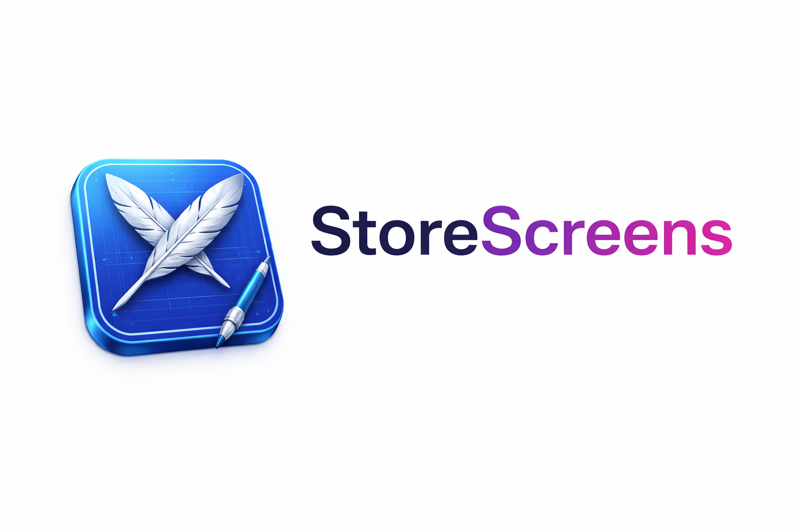

# StoreScreens

Capture App Store screenshots across every required device size in one command. Runs your UI tests on multiple simulators in parallel (or natively on macOS), organizes the output by device and locale, and auto-detects which App Store size each simulator maps to. Supports iPhone, iPad, Apple Watch, and Mac App Store screenshots.

## Three pieces, one workflow

StoreScreens ships as three complementary pieces. Most users only need the CLI; the other two exist to make AI coding assistants first-class operators.

| Piece | What it is | When you want it |
|---|---|---|
| `storescreens` (CLI) | The core binary. Runs UI tests across simulators, captures screenshots, builds the HTML preview gallery. | Always - this is the engine. Use it from your terminal, CI, or scripts. |
| `storescreens-mcp` (MCP server) | A structured wrapper that exposes the CLI's operations as [Model Context Protocol](https://modelcontextprotocol.io) tools with inline progress streaming. | When your AI coding assistant (Claude Code, Cursor, etc.) should drive captures directly instead of parsing CLI output from a Bash call. |
| [storescreens-skill](https://github.com/ciscoriordan/storescreens-skill) | An agent skill - instructions and templates that teach an assistant how to detect your Xcode project, generate config, scaffold UI tests, and run a capture. | When you want an assistant to do the full setup for you, from zero to first screenshots, with no manual steps. Works with any assistant that supports skills. |

Both the CLI and MCP server are installed by `brew install storescreens`.

### How this compares to other Xcode MCP servers

StoreScreens is purpose-built for one job: generating the complete set of App Store Connect screenshots. It is not a general Xcode control surface, and it is not competing with the general-purpose Xcode MCP servers, it complements them.

| Tool | Scope | Best for | App Store screenshot output |
|---|---|---|---|
| `storescreens` | Narrow. App Store screenshot capture, device-size routing, locale and appearance matrix, HTML preview gallery. | Producing the final screenshot set for App Store Connect in one command. | Yes. Named, organized by device and locale, ready to upload. |
| [Apple Xcode MCP](https://developer.apple.com/documentation/xcode/giving-agentic-coding-tools-access-to-xcode) (built into Xcode 26.3+) | Xcode-resident tools. Most notably `RenderPreview` for a single SwiftUI `#Preview`. | Checking one view's layout without spinning up a simulator. | No. |
| [XcodeBuildMCP](https://github.com/getsentry/XcodeBuildMCP) | General iOS/macOS build, test, and device interaction driven by `xcodebuild`. | Letting an agent compile, test, and debug iOS/macOS projects through a unified MCP interface. | No. |
| [xc-mcp](https://github.com/conorluddy/xc-mcp) | 29 tools covering build, simulator lifecycle, and accessibility-first UI automation. Optimized for low-context agent interactions. | Agents that need to drive the simulator via semantic accessibility queries (fast, token-cheap) instead of parsing screenshots. | No, its screenshot tool is for a single capture, not a full App Store matrix. |

If you are shipping an app, you will likely use StoreScreens alongside one of the general servers: the general server handles build and run, StoreScreens handles the screenshot matrix at the end.

Each run produces a browsable HTML preview with per-device galleries:

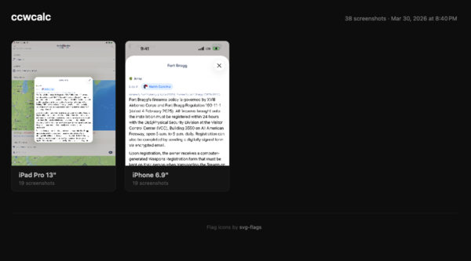

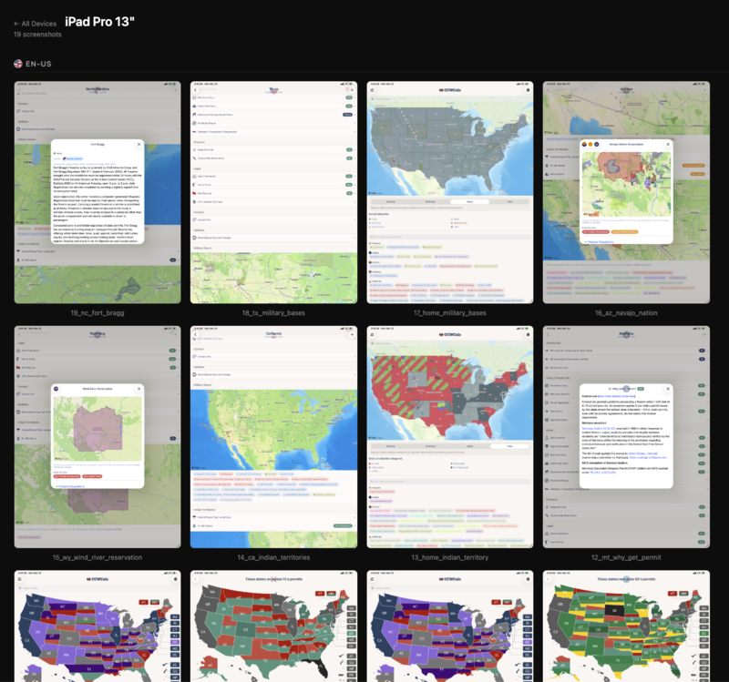

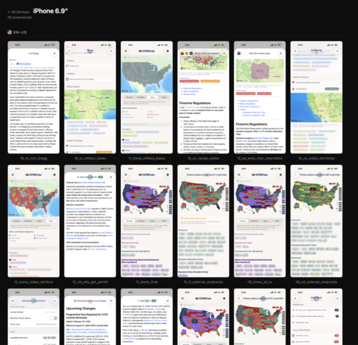

When the MCP server is configured, the agent streams per-screenshot progress inline as each device captures:

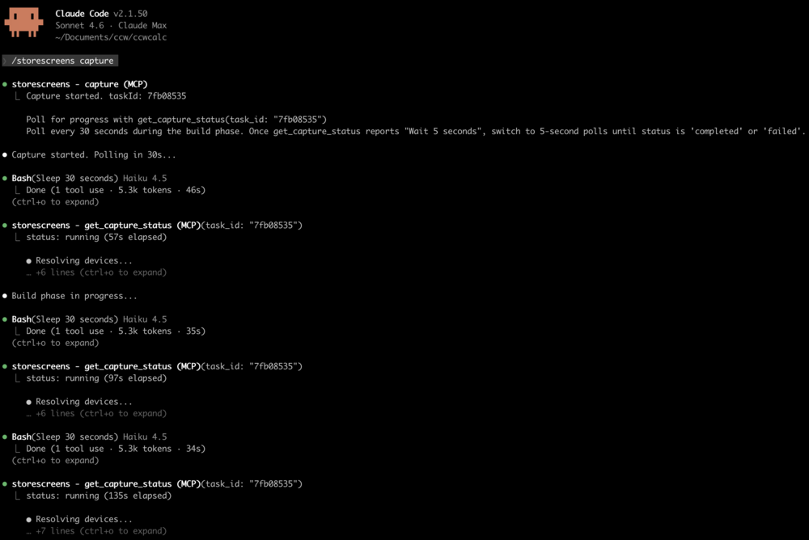

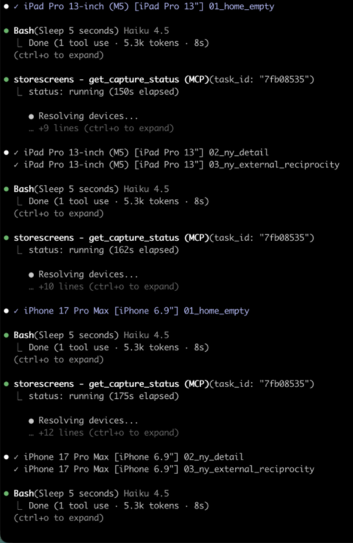

<video src="https://github.com/user-attachments/assets/fb0c0cf1-8fdc-4e28-98c9-1baded6dd947" controls></video>

## Install

Requires macOS 14+ (Sonoma or later) on Apple Silicon (arm64). Intel Macs are not supported.

### Homebrew

```bash
brew tap ciscoriordan/tap
brew install storescreens
```

### Script

```bash
curl -fsSL https://raw.githubusercontent.com/ciscoriordan/storescreens-cli/main/install.sh | sh
```

### From source

Requires Xcode 16+.

```bash
git clone https://github.com/ciscoriordan/storescreens-cli.git
cd storescreens-cli
swift build -c release
sudo cp .build/release/storescreens-cli /usr/local/bin/storescreens
```

Verify the install worked:

```bash
storescreens --help
```

## Quick Start

```bash
cd /path/to/your/xcode-project

# 1. Generate a config file
storescreens init

# 2. Generate screenshot UI tests
storescreens setup

# 3. Open the generated test file and add your app navigation (see below)
open MyAppUITests/ScreenshotTests.swift

# 4. Capture screenshots on all devices (--verbose for live output)
storescreens capture --verbose
```

### How it works

The CLI uses XCUITest - Apple's built-in UI testing framework - to drive your app and capture screenshots. A UI test launches your app in a simulator, taps through screens programmatically, and saves screenshots at each step. The CLI then runs that test across every device size in your config.

#### Do I need a UI test target?

Yes. If your project doesn't have one yet, add it in Xcode:

1. File > New > Target
2. Select UI Testing Bundle
3. Name it something like `MyAppUITests`
4. Make sure it's targeting your app

`storescreens setup` will detect the target automatically. If none exists, it prints these steps for you.

#### Using a manually written test file

If you wrote your `ScreenshotTests.swift` by hand (rather than generating it with `storescreens setup`), the target setup requires one extra step because Xcode auto-creates a placeholder test file when you add the target:

1. File → New → Target → UI Testing Bundle
2. Name it to match your `test_target` in `storescreens.yml` (e.g. `ExampleUITests`)
3. Set Target to be Tested to your app
4. Click Finish - Xcode creates the target with a default `ExampleUITestsLaunchTests.swift` placeholder
5. Delete the placeholder file Xcode generated (move to Trash)
6. Right-click your UI test group in the Project Navigator → Add Files to "[project]"
7. Select your `ScreenshotTests.swift` and confirm it is added to the `ExampleUITests` target
8. In `storescreens.yml`, set `test_target` and `test_class` to match:

```yaml
test_target: ExampleUITests
test_class: ScreenshotTests
```

Then verify everything builds before running the full capture. Pipe the output to a log file so you can inspect errors:

```bash
# Confirm the test target builds and the test is discoverable
xcodebuild build-for-testing \
  -workspace Example.xcworkspace \
  -scheme Example \
  -destination 'platform=iOS Simulator,name=iPhone 17 Pro' \
  2>&1 | tee build.log

# Then capture (--verbose for live terminal output; logs are always saved)
storescreens capture --verbose
```

#### The generated test file

`storescreens setup` asks you to name the screens you want to capture, then generates a test file:

```swift
// MyAppUITests/ScreenshotTests.swift

import XCTest

class ScreenshotTests: XCTestCase {
    func testScreenshots() {
        let app = XCUIApplication()
        app.launch()

        takeScreenshot(named: "Home")

        // TODO: Navigate to Search Results
        takeScreenshot(named: "SearchResults")

        // TODO: Navigate to Detail
        takeScreenshot(named: "Detail")

        // TODO: Navigate to Settings
        takeScreenshot(named: "Settings")
    }

    func takeScreenshot(named name: String) {
        let screenshot = XCUIScreen.main.screenshot()
        let attachment = XCTAttachment(screenshot: screenshot)
        attachment.name = name
        attachment.lifetime = .keepAlways
        add(attachment)
    }
}
```

The first screenshot captures whatever's on screen right after launch. Each `// TODO` is where you add code to navigate to the next screen.

Name screenshots with meaningful identifiers (`Home`, `Search`, `Detail`) and let the `screenshots:` list in `storescreens.yml` drive display order. After capture, storescreens stamps each output PNG's mtime and creationDate in that order, so `ls -t` and Finder's "Date Created" sort match the order you configured. No numeric prefixes needed.

#### Adding navigation

Replace each TODO with XCUITest calls that interact with your app's UI. Common patterns:

```swift
// Tap a tab bar button
app.tabBars.buttons["Search"].tap()

// Tap a navigation link or button
app.buttons["Settings"].tap()

// Tap a list row
app.cells["My Profile"].tap()

// Type into a search field
app.searchFields.firstMatch.tap()
app.typeText("recipes")

// Scroll down
app.swipeUp()

// Wait for content to load
let element = app.staticTexts["Welcome"]
_ = element.waitForExistence(timeout: 5)
```

A complete example:

```swift
func testScreenshots() {
    let app = XCUIApplication()
    app.launch()

    // Home screen - shown right after launch
    takeScreenshot(named: "Home")

    // Search - tap the search tab, enter a query
    app.tabBars.buttons["Search"].tap()
    app.searchFields.firstMatch.tap()
    app.typeText("recipes")
    takeScreenshot(named: "Search")

    // Detail - tap a result
    app.cells.firstMatch.tap()
    takeScreenshot(named: "Detail")

    // Settings - go back, open settings
    app.navigationBars.buttons.firstMatch.tap()
    app.tabBars.buttons["Settings"].tap()
    takeScreenshot(named: "Settings")
}
```

You can test your navigation works before running the full capture - just run the test in Xcode with Cmd+U or click the diamond next to the test function.

#### Accessibility identifiers

UI tests find elements by accessibility identifier, text label, or type. Always prefer `.accessibilityIdentifier()` over matching by text, since text labels can appear in multiple places (e.g. your app name on both the launch screen and the main toolbar), causing tests to match the wrong element or pass prematurely.

Add identifiers to your SwiftUI views:

```swift
// Buttons and interactive elements
Button("Save") { ... }
  .accessibilityIdentifier("saveButton")

// Loading indicators - so tests can wait for loading to finish
ProgressView()
  .accessibilityIdentifier("loadingIndicator")

// Content containers - so tests can wait for content to appear
ScrollView { ... }
  .accessibilityIdentifier("mainContent")

// Toolbar items
ToolbarItem(placement: .topBarLeading) {
  Button { ... } label: { Image(systemName: "gear") }
    .accessibilityIdentifier("settingsButton")
}

// Search fields
TextField("Search", text: $query)
  .accessibilityIdentifier("searchField")
```

Then in your test, wait for elements by identifier instead of using `sleep()`:

```swift
// Bad: fragile timing, screenshots may capture loading spinners
sleep(5)
takeScreenshot(named: "Home")

// Good: waits for actual content to load
waitForElement(id: "mainContent", timeout: 15)
takeScreenshot(named: "Home")
```

The generated `waitForElement()` helper searches all element types by accessibility identifier, so it works for buttons, text, scroll views, or any other element.

Common pitfall: If your app name (e.g. "MyApp") appears as `Text("MyApp")` in both `LaunchScreen.swift` and your main view's toolbar, a test like `app.staticTexts["MyApp"].waitForExistence(timeout: 10)` will match the launch screen text and proceed before your main content loads. Use a unique identifier instead:

```swift
// In your main view:
Text("MyApp")
  .accessibilityIdentifier("mainTitle")

// In your test:
app.staticTexts["mainTitle"].waitForExistence(timeout: 10)
```

#### How screenshots are saved

By default, screenshots are collected from the filesystem. Your test code writes PNGs directly to a cache directory, and the CLI copies them to the output folder after the test finishes.

The generated `takeScreenshot()` helper does two things:
1. Creates an `XCTAttachment` (stored in the `.xcresult` bundle as a backup)
2. Writes a PNG file to the StoreScreens cache directory on the host filesystem

The CLI reads the cache directory from a breadcrumb file at `~/.storescreens-cache-dir`, which it writes before each capture run. Your test code discovers this path using `SIMULATOR_HOST_HOME`:

```swift
let hostHome = ProcessInfo.processInfo.environment["SIMULATOR_HOST_HOME"]
    ?? ProcessInfo.processInfo.environment["HOME"]
    ?? NSHomeDirectory()
let breadcrumb = (hostHome as NSString).appendingPathComponent(".storescreens-cache-dir")
let cacheDir = try? String(contentsOfFile: breadcrumb, encoding: .utf8)
    .trimmingCharacters(in: .whitespacesAndNewlines)
```

Intermediate screenshots and named pipes for real-time logging are stored in `.storescreens-cache/` in your project directory. Add it to `.gitignore`:

```
.storescreens-cache
```

##### Why filesystem over xcresult?

Filesystem capture is the primary path because it gives you things xcresult export can't:

- Streaming progress - PNGs land one-by-one as the test runs, so the MCP server streams per-screenshot updates to your AI assistant. `xcresulttool export` only runs after the entire test finishes, so progress is all-or-nothing.
- Incremental safety - if the test crashes partway through, you still get every screenshot captured before the crash.
- Deterministic filenames - you pick the name. `xcresulttool` appends `_N_UUID.png` to every attachment, which has to be regex-stripped back to the original name.
- No silent skip rules - `xcresulttool` silently drops attachments whose names start with `Screenshot`, `UI Snapshot`, `Synthesized Event`, `Screen Recording`, and several others. Filesystem writes are always kept, no matter what you name them.
- Faster - no post-processing step after the test finishes.

The tradeoff: filesystem capture only works on simulators, because it relies on `SIMULATOR_HOST_HOME` to cross the sandbox boundary back to your Mac. App Store screenshots are simulator-only anyway, so this rarely matters.

If you need to capture on real devices, or you want attachments visible in Xcode's built-in test report UI, pass `--xcresult` instead:

```bash
storescreens capture --xcresult
```

#### Screenshot mode in your app

Your app can detect when it's being run by StoreScreens and adjust its behavior accordingly. The generated test file launches your app with `--screenshotMode` as a launch argument:

```swift
app.launchArguments = ["--screenshotMode"]
```

Check for this in your app to set up the ideal state for screenshots:

```swift
// In your root view or app entry point
.task {
    if ProcessInfo.processInfo.arguments.contains("--screenshotMode") {
        // Grant pro/premium access so screenshots show full features
        settings.isProUser = true

        // Disable animations for faster, deterministic screenshots
        UIView.setAnimationsEnabled(false)

        // Reset any persisted UI state (e.g., expansion toggles, onboarding)
        UserDefaults.standard.set("", forKey: "expandedSections")
    }
}
```

Common things to configure in screenshot mode:

- Simulate pro/premium access - show the full app without paywalls. Make sure your entitlement checks don't override this (skip StoreKit verification in screenshot mode).
- Disable animations - makes UI interactions instant and screenshots deterministic.
- Reset UI state - clear persisted toggles, expansion states, or onboarding flags so tests always start from a known state.
- Seed sample data - pre-populate the app with good-looking content if it would otherwise be empty on first launch.

#### Simple mode (no tests needed)

If you don't want to write UI tests, use simple mode instead:

```bash
storescreens capture --mode simple
```

This boots each simulator, installs and launches your app, and takes a single screenshot of whatever's on screen. Good for capturing your launch screen or a static state.

## Commands

| Command | Description |
|---------|-------------|
| `storescreens init` | Generate a `storescreens.yml` config file |
| `storescreens setup` | Set up screenshot UI tests (interactive wizard) |
| `storescreens capture` | Capture screenshots on all configured devices |
| `storescreens check` | Scan source for iPad-unsafe patterns and device assumptions |
| `storescreens list` | Show available simulators and App Store size mappings |
| `storescreens screenshot` | Take a quick screenshot of a running simulator |
| `storescreens render` | Render captioned/framed screenshots from an existing capture |
| `storescreens templates` | List the built-in render templates (curated background + type + chrome presets) |
| `storescreens bezels` | Import / inspect Apple device bezel assets used by `render` |
| `storescreens auth` | Manage App Store Connect API credentials |
| `storescreens metadata init` | Scaffold `metadata/<locale>/*.txt` files + README |
| `storescreens submit` | Upload rendered screenshots + metadata to App Store Connect |
| `storescreens upload-build` | Archive, export, and upload the `.ipa` to App Store Connect / TestFlight |
| `storescreens status` | Show current ASC state: versions and any in-flight review submission |
| `storescreens --help` | Show help and available commands |

### `storescreens init`

Generates a `storescreens.yml` config file by auto-detecting your project:

- Finds your `.xcodeproj` or `.xcworkspace`
- Detects your scheme and deployment target
- Picks simulators that match required App Store sizes and are compatible with your deployment target
- Warns if any required sizes are missing

```bash
storescreens init              # generate config
storescreens init --force      # overwrite existing config
```

### `storescreens setup`

Interactive wizard that generates a screenshot test file and wires it into your config. It scans your Swift source to auto-discover screens from `TabView`, `NavigationLink`, `.sheet`, `.fullScreenCover`, and [Navigator](https://github.com/hmlongco/Navigator) route patterns.

```
$ storescreens setup

Project Detection
  ✓ Found project: MyApp.xcodeproj
  ✓ Detected scheme: MyApp

UI Test Target
  ✓ Found UI test target: MyAppUITests

Screenshot Screens
  Found 4 screens in your source code:
    1. Home (TabView)
    2. Search (TabView)
    3. Settings (NavigationLink)
    4. Profile (sheet)

  Press Enter to use these, or type your own (comma-separated)
  >
  ✓ Using discovered screens.

  ✓ Wrote MyAppUITests/ScreenshotTests.swift (4 screenshots)
  ✓ Updated storescreens.yml
```

If no screens are found in your source, it falls back to asking you to type them manually. If no UI test target exists, it prints step-by-step instructions to create one in Xcode.

Use `--non-interactive` to skip prompts and use auto-discovered screens (or defaults if none found).

### `storescreens capture`

Captures screenshots using one of two modes.

XCTest mode (default) - runs your UI tests, collects screenshots written to the filesystem by your test code. Use `--verbose` to see full xcodebuild output in the terminal (logs are always saved to the output directory either way):

```bash
storescreens capture --verbose
```

How it works:
1. Runs `xcodebuild test` on each target simulator
2. Your test code writes screenshots as PNGs to a shared cache directory
3. The CLI collects PNGs from the cache and organizes them into folders by device size

Simple mode - boots each simulator, installs your app, and takes a raw screenshot of whatever's on screen:

```bash
storescreens capture --mode simple
```

Useful if you don't have UI tests and just want a quick capture of your launch screen.

Options:

| Flag | Description |
|------|-------------|
| `--mode xctest\|simple` | Capture mode (default: `xctest`) |
| `--config PATH` | Config file path (default: `storescreens.yml`) |
| `--output DIR` | Override output directory |
| `--locale LOCALE` | Override locales (repeatable) |
| `--retries N` | Retry failed test runs per device |
| `--keep-alive` | Keep simulators running after capture |
| `--xcresult` | Extract screenshots from `.xcresult` bundle instead of filesystem |
| `--only PREFIXES` | Only capture screenshots matching these prefixes (comma-separated) |
| `--skip-check` | Skip preflight source code check |
| `--no-render` | Skip the post-capture render pass even if `render.enabled: true` is set in config |
| `--verbose` | Stream full xcodebuild output to terminal (logs are always saved to `logs/`) |

### `storescreens check`

Scans your Swift source files for patterns that can crash or break on iPad and other device-specific assumptions. Runs automatically before every `storescreens capture` unless disabled.

```
$ storescreens check

Preflight Check
  iPad detected in config - running iPad-specific checks
✗ Views/ContentView.swift:47  [toolbar-tabbar-hidden]
    .toolbarVisibility(.hidden, for: .tabBar) without iPad guard - may crash on iPad
! Views/CardView.swift:89  [hardcoded-screen-dimensions]
    Possible hardcoded iPhone screen dimension (390) - use GeometryReader instead

1 error, 1 warning found
Errors block capture. Use --skip-check to bypass.
```

Detection rules:

| Rule | Severity | What it catches |
|------|----------|-----------------|
| `toolbar-tabbar-hidden` | Error | `.toolbarVisibility(.hidden, for: .tabBar)` without an iPad device check - can crash on iPad |
| `unguarded-cloudkit` | Error | `CKContainer`/`CKDatabase` usage without an `accountStatus` check, error handling, or UI-testing guard - crashes in simulator without iCloud account |
| `uiscreen-main-bounds` | Warning | `UIScreen.main.bounds` - deprecated, doesn't handle iPad split view or multiple scenes |
| `hardcoded-screen-dimensions` | Warning | Literal iPhone screen sizes (390, 844, etc.) used in layout context |
| `navigation-view-stack` | Warning | `.navigationViewStyle(.stack)` forces stack navigation on iPad |

iPad-specific rules only fire when an iPad is in your configured device list. The scanner is guard-aware - it won't flag `.toolbarVisibility(.hidden, for: .tabBar)` if it finds a `UIDevice` / `userInterfaceIdiom` check in the surrounding lines, and it won't flag CloudKit usage if the file contains an `isUITesting` guard, `accountStatus` check, `try`/`catch`, or `screenshotMode` launch argument check.

| Flag | Description |
|------|-------------|
| `--config PATH` | Config file path (default: `storescreens.yml`) |
| `--directory DIR` | Directory to scan (default: `.`) |
| `--verbose` | Show verbose output |

### `storescreens list`

Shows available simulators and which App Store size they map to. By default, only shows devices that match a known App Store size (excludes Apple Watch).

```
$ storescreens list

Available Simulators
  Name                    State     App Store Size
  ──────────────────────────────────────────────────
  iPad Pro 13-inch (M5)   Shutdown  iPad Pro 13"
  iPhone 17 Pro Max       Shutdown  iPhone 6.9"
  iPhone 17 Pro           Shutdown  iPhone 6.3"
  iPhone 16 Plus          Shutdown  iPhone 6.7"
  ...
```

| Flag | Description |
|------|-------------|
| `--all` | Show all simulators, including non-App Store sizes |
| `--include-watch` | Include Apple Watch simulators |
| `--include-mac` | Show Mac App Store screenshot sizes |
| `--json` | Machine-readable output |

### `storescreens screenshot`

Takes a quick screenshot of a running simulator's current screen. No build, no tests - just captures whatever is on screen and saves it to a file. Intended for quick visual checks during UI development.

```bash
# Screenshot the first booted simulator
storescreens screenshot

# Screenshot a specific simulator
storescreens screenshot --simulator "iPhone 17 Pro" --output screenshot.png

# Boot the simulator if it's not running
storescreens screenshot --simulator "iPhone 17 Pro" --boot
```

| Flag | Description |
|------|-------------|
| `--simulator NAME` | Simulator name (default: first booted simulator) |
| `--udid UDID` | Simulator UDID (alternative to `--simulator`) |
| `--output PATH` | Output file path (default: `screenshot.png`) |
| `--boot` | Boot the simulator if it's not already running |
| `--verbose` | Show verbose output |

## Configuration

`storescreens.yml`:

```yaml
project: "MyApp.xcodeproj"
scheme: "MyApp"

devices:
  - simulator: "iPhone 17 Pro Max"
  - simulator: "iPhone 17 Pro"
  - simulator: "iPad Pro 13-inch (M5)"
  # macOS devices run tests natively (no simulator)
  # - simulator: "Mac 2560x1600"
  #   platform: macOS

# Multiple locales (optional) - runs the full capture once per locale
# locales:
#   - en-US
#   - ja
#   - de-DE

output_dir: "./storescreens-output"

# XCTest mode: which tests to run
test_target: MyAppUITests
test_class: ScreenshotTests

# Preflight source code check (default: true)
# preflight: false
```

All values can be overridden via CLI flags.

<details>
<summary>Full config reference</summary>

```yaml
# Project or workspace (one required)
project: "MyApp.xcodeproj"
# workspace: "MyApp.xcworkspace"

scheme: "MyApp"

devices:
  - simulator: "iPhone 17 Pro Max"
  - simulator: "iPhone 17 Pro"
  - simulator: "iPad Pro 13-inch (M5)"
  # macOS: tests run natively, no simulator needed
  # - simulator: "Mac 2560x1600"
  #   platform: macOS
  # Per-device test selection: restrict a device to specific test methods,
  # overriding the top-level test_class. Useful for iPad-only or iPhone-only
  # screenshots that render poorly on the other form factor.
  #   - simulator: "iPad Pro 13-inch (M5)"
  #     tests:
  #       - testLandscapePolytonic   # shorthand, expanded to test_target/test_class/method
  #       - LandscapeTests/testFoo   # class-qualified, expanded to test_target/LandscapeTests/testFoo
  #       - MyAppUITests/Other/testBar  # fully qualified, passed through verbatim

# Locales - runs full capture once per locale
locales:
  - en-US
  - ja
  - de-DE

# Custom flags for the HTML preview gallery (optional).
# Keys are Xcode locale codes. Values are either:
#   - A filename (without .svg) from ciscoriordan/svg-flags/circle/languages/
#   - A full https:// URL, used as-is
# Merged with built-in defaults; your values win on collisions.
# locale_flags:
#   en-IN: in-en
#   hi: in-hi
#   custom: https://example.com/my-flag.svg

# Display order for App Store Connect. Drives render order, HTML preview
# gallery order, and the mtime stamp on captured PNGs so `ls -t` / Finder
# "Date Created" sort matches this list. Also acts as a filter: only
# screenshots whose name appears here are kept.
# screenshots:
#   - "Home"
#   - "Search"
#   - "Detail"

output_dir: "./storescreens-output"

# Run history: 1 = overwrite (default), 0 = keep all, N = keep last N
# keep_runs: 1

# XCTest mode
test_target: MyAppUITests
test_class: ScreenshotTests

# Simple mode: launch arguments (not supported for macOS devices)
# launch_arguments:
#   - "--uitesting"
#   - "--reset-state"

# Preflight source code check before capture (default: true)
# Scans for iPad-unsafe patterns. Use --skip-check to bypass per-run.
# preflight: true

# Upload after capture (default: false)
# upload: true

# Advanced: run the test suite twice per device (discard first, capture
# second). Useful when the app needs one full launch to finish seeding
# data (CloudKit, ODR, etc.). Default: false.
# warmup_run: true

# Advanced: override the simulator status bar (9:41 AM, full signal, full
# battery) for clean screenshots. Default: true. Set to false to leave
# the live status bar alone.
# status_bar: false

# Advanced: custom args passed to `xcrun simctl status_bar override` when
# status_bar is true. Default covers time, cellular mode, battery, and
# operator; override when a specific screenshot needs different values.
# status_bar_arguments: "--time 9:41 --batteryLevel 100"

# Advanced: auto-dismiss system alerts (App Store review prompts, etc.)
# during tests. Default: true.
# dismiss_system_alerts: false

# Advanced: log verbosity. "quiet" (errors/warnings only), "normal"
# (default), or "verbose" (full xcodebuild output).
# log_level: verbose

# Advanced: persistent DerivedData directory for faster incremental
# builds. When unset, a per-run temp dir is used and cleaned up after.
# derived_data_path: .derivedData

# Advanced: keep older `preview_*.html` pages on the gallery index under
# a "From older runs" heading. Default: false (a fresh capture wipes
# previews whose device/appearance isn't in the current run).
# keep_old_previews: true

# Render pass (optional): composites captioned images from captures
# render:
#   enabled: true
#   output_dir: ./storescreens-framed
#   caption:
#     title:
#       font: system
#       weight: bold
#       font_size_pct: 5.5
#       color: "#ffffff"
#     min_height_pct: 22
#   chrome:
#     style: bezel
#   slides:
#     "Home":
#       caption: "Your recipes, organized."
```

</details>

## Rendering captioned screenshots

`storescreens` can post-process captured screenshots into framed, captioned images suitable for App Store Connect uploads. Add a `render:` block to `storescreens.yml` and run `storescreens render` (or let it run automatically after `storescreens capture`).

### Quick start

```yaml
render:
  enabled: true
  output_dir: ./storescreens-framed

  background:
    color: "#1a1a2e"

  caption:
    title:
      font: system
      weight: bold
      font_size_pct: 5.5
      color: "#ffffff"
    min_height_pct: 22

  chrome:
    style: stroke
    stroke_color: "#ffffff"
    stroke_width: 3

  slides:
    "Home":
      caption: "Your recipes, organized."
    "Search":
      caption:
        - Find anything
        - in *seconds*.
    "Detail":
      caption:
        title: Every **detail**, at a glance.
        subtitle: Powered by AI
        highlights:
          - { match: detail, color: "#feb909", weight: heavy }
```

Run the render independently:

```bash
storescreens render
```

Or run capture with the render pass included (auto-enabled by `render.enabled: true`):

```bash
storescreens capture
```

Use `--no-render` to skip the render pass on a given capture run.

### Templates

Skip the hand-tuning with a named template: a curated palette, typography, and background pattern bundle. Add `template: <id>` under `render:` and every field that a template provides becomes a default (your own explicit fields still win).

```yaml
render:
  enabled: true
  template: sahara     # see `storescreens templates` for the list

  slides:
    "Home":
      caption: "Your adventure, planned."
```

Or try one on an existing capture without editing the config:

```bash
storescreens render --template midnight
```

List what's available:

```bash
storescreens templates
```

| | ID | Look | Best for |
|---|---|---|---|
| 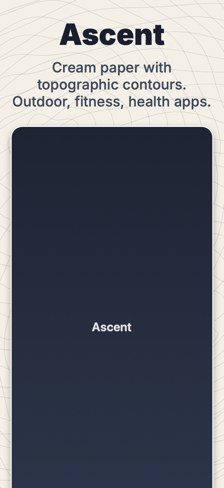 | `ascent` | Cream paper with topographic contours | Outdoor, fitness, health |
| 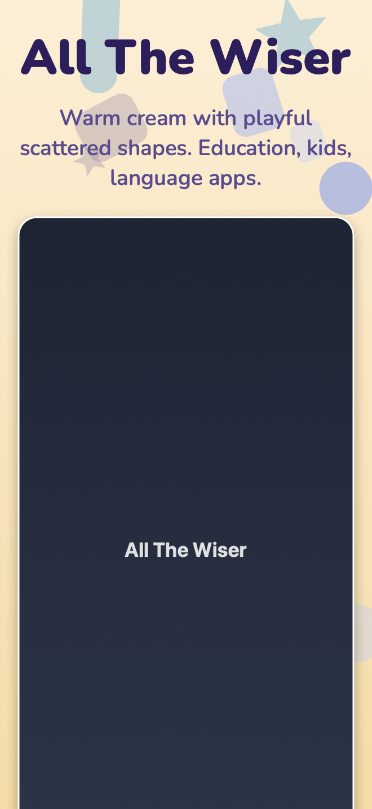 | `all_the_wiser` | Warm cream with playful scattered shapes | Education, kids, language |
| 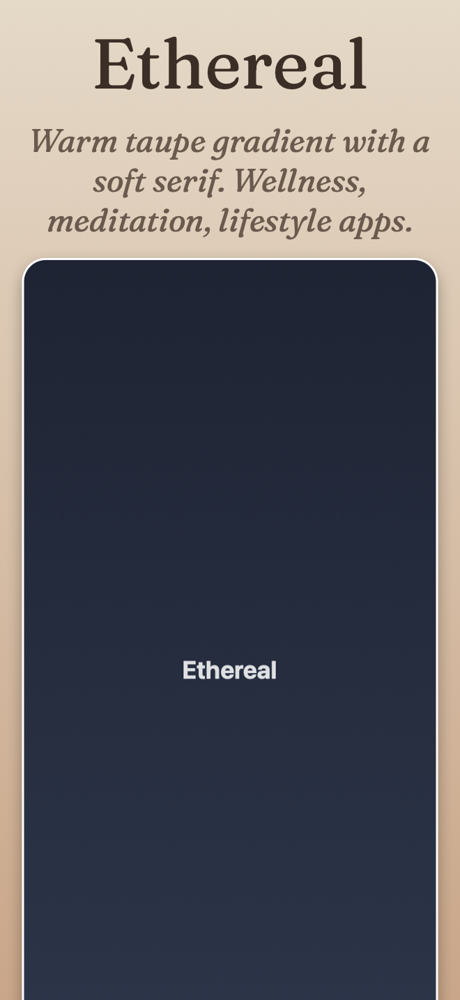 | `ethereal` | Warm taupe gradient, soft serif | Wellness, meditation, lifestyle |
| 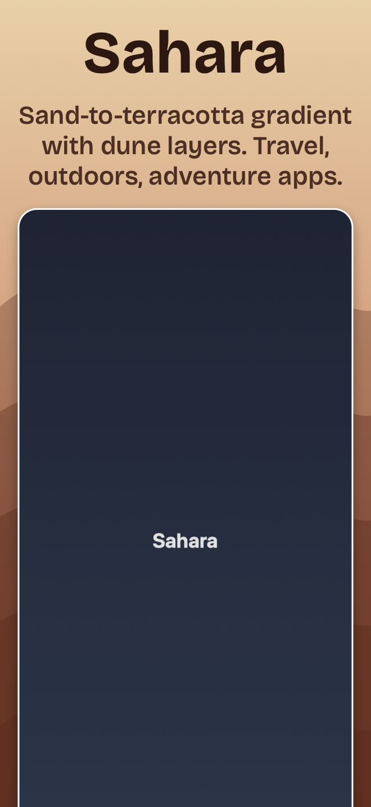 | `sahara` | Sand-to-terracotta gradient with dune layers | Travel, adventure |
| 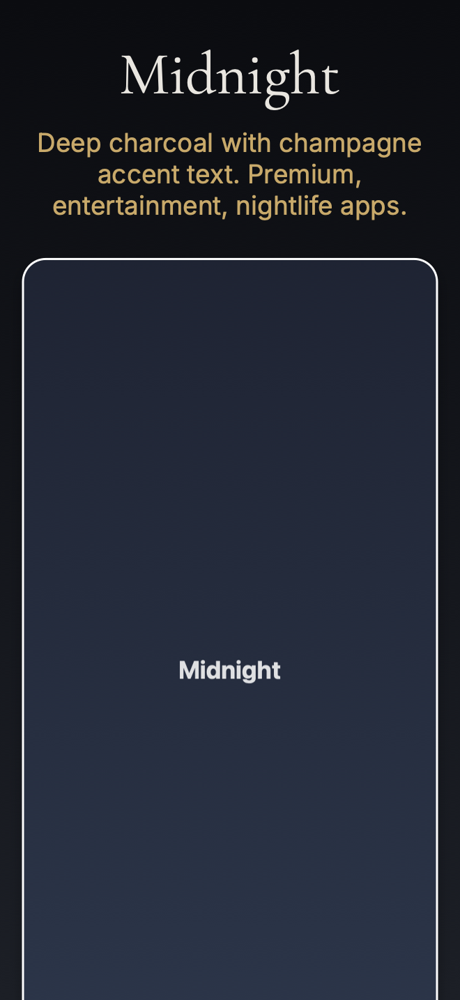 | `midnight` | Deep charcoal with champagne accent text | Premium, entertainment, nightlife |
| 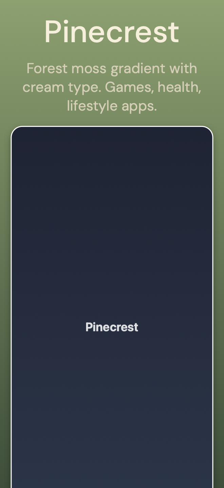 | `pinecrest` | Forest moss gradient with cream type | Games, health, lifestyle |
| 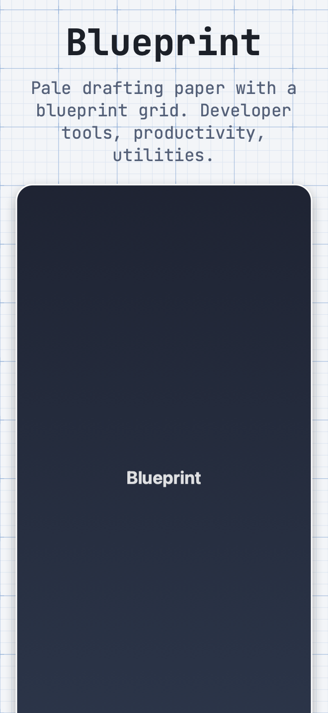 | `blueprint` | Pale drafting paper with a grid | Developer tools, productivity |
| 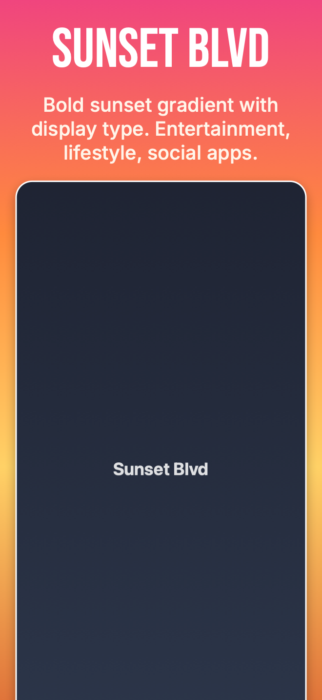 | `sunset_blvd` | Bold four-stop sunset gradient, display type | Entertainment, lifestyle, social |
|  | `jazz_and_wine` | Deep bordeaux with elegant cream serif | Food, drink, hospitality, creative |

The showcase PNGs above are rendered by `TemplateShowcaseTests.testRegenerateShowcaseAssets`. Regenerate with `STORESCREENS_WRITE_SHOWCASE=1 swift test --filter TemplateShowcaseTests` after tweaking any template. The white rounded-rect frame in each thumbnail is `chrome.style: stroke` (a CoreGraphics outline), not a real Apple bezel PSD, so regenerating doesn't require the Apple Design Resources DMGs to be installed. When you apply a template to your own captures, each defaults to `chrome.style: bezel` and uses real silver/titanium bezels once you've run `storescreens bezels import`.

#### Template credits

The nine built-in templates are clean-room reproductions of the *visual direction* (palette, typography mood, pattern concept, target app category) of the free templates in [ButterKit](https://butterkit.app/templates/), which are [MIT-licensed](https://butterkit.app/license-agreement/). Nothing from ButterKit is bundled: no PSDs, SVGs, bitmaps, or code. Backgrounds are drawn procedurally in CoreGraphics (`PatternRenderer.swift`), fonts resolve via the Google Fonts API at render time, and every color, weight, and size is redefined in `RenderTemplate.swift` using StoreScreens' own render config shape. The showcase PNGs in `assets/templates/` are generated by `TemplateShowcaseTests` against a synthetic placeholder screenshot (also not sourced from ButterKit). Names are preserved so users who've seen ButterKit's catalog recognize the aesthetic.

Individual credits: *Ethereal* is by Zach Spitulski (founder of ButterKit); the other eight (*Ascent*, *All The Wiser*, *Sahara*, *Midnight*, *Pinecrest*, *Blueprint*, *Sunset Blvd*, *Jazz & Wine*) are credited to the ButterKit team on [butterkit.app/templates](https://butterkit.app/templates/). If you like the aesthetic, check out ButterKit directly. They ship many more templates plus a 3D rendering engine for the marketing pieces StoreScreens doesn't do.

Templates set `background`, `caption`, and `chrome` defaults. You still pick captions per slide via the usual `slides:` block, and any field you write in the config overrides the template.

Background patterns (`topographic`, `blueprint_grid`, `dune_layers`, `soft_waves`, `gamified_shapes`) can also be used directly without a template:

```yaml
render:
  background:
    color: "#F4EFE7"
    pattern:
      pattern: topographic
      color: "#1A1F2E"
      opacity: 0.15
```

### Chrome styles

- `none`: no chrome; screenshot drawn at the padded rect.
- `stroke`: rounded-rect clip with device-derived corner radius plus optional colored border and drop shadow. Zero asset download.
- `bezel`: screenshot composited inside a real Apple device bezel. Requires [bezel assets](#device-bezels).

### Fonts

Four forms for `font:`:

```yaml
font: system                        # SF Pro / system font
font: "Helvetica Neue"              # installed font family
font: "./assets/Inter-Bold.otf"     # local file
font:                               # bundle for correct bold/italic
  regular: ./Inter-Regular.otf
  bold: ./Inter-Bold.otf
  italic: ./Inter-Italic.otf
font:                               # Google Fonts auto-download
  google: Inter
  version: "3.19"                   # optional version pin
```

Google Fonts are cached to `~/Library/Caches/storescreens/fonts/`.

#### Per-locale font overrides

A single typeface rarely covers every script you ship. Add `locale_overrides:` to either caption role to swap the font (or any other style field) when a specific locale is being rendered:

```yaml
caption:
  title:
    font:
      google: Cormorant Garamond     # default for Latin scripts
    weight: bold
    locale_overrides:
      el:
        font: { google: GFS Didot }  # Greek slides use Didot
      ja:
        font: "Hiragino Mincho ProN" # CJK serif for Japanese
        weight: regular
```

Each entry is itself a `CaptionRole`; non-nil fields shadow the role defaults for that locale, the rest fall through. Works for both `caption.title` and `caption.subtitle`. Locales absent from the map keep the role unchanged.

### Captions

- Bare string → single title, wraps at canvas width.
- Array of strings → strict line breaks (never wrapped inside an array item).
- Object → `title:`, `subtitle:`, optional `highlights:` for per-word color/weight.
- Markdown supported inline: `**bold**`, `*italic*`, `` `code` ``.
- `highlights:` overrides color / weight / italic on literal substring matches (case-sensitive, all occurrences).

### Alignment and nudge

Each caption role (`title`, `subtitle`) has independent horizontal alignment:

```yaml
caption:
  title:
    align: left        # left | center (default) | right
  subtitle:
    align: right
```

The caption block as a whole can be vertically positioned inside its reserved band, and captions, images, laurels, and logos all accept a fine-grained `nudge`:

```yaml
caption:
  vertical_align: top   # top | center (default) | bottom
  nudge:
    x_pct: 0            # positive = right, negative = left
    y_pct: -2           # positive = up (toward screen top), negative = down

logo:
  nudge:
    x_pct: 1
    y_pct: 0
```

`nudge.x_pct` and `nudge.y_pct` are percentages of the canvas width and height respectively, so offsets stay the same relative size across iPhone 6.9", iPad 13", and Mac renders. Both are optional; omit a field and it's treated as zero.

### Images

Up to two image overlays per slide, dropped into one of three slots around the caption block. Each entry is independent: each has its own path, slot, alignment, and nudge.

```yaml
render:
  images:
    - path: ./marketing/logo-wordmark.svg
      position: above_title       # above_title | below_title | above_subtitle | below_subtitle
      align: center               # left | center (default) | right
      max_height_pct: 6           # % of canvas height; default 8
      placement: first_only       # first_only | all | none
```

`below_title` and `above_subtitle` are aliases for the same physical slot (the gap between the title and subtitle text); pick whichever reads more naturally. `placement` defaults to `first_only` for the `above_title` slot and `all` for every other slot, matching the "logo on slide 1, badges on every slide" convention.

When a caption is present, the `above_title` slot extends from the canvas top down to just above the caption block, so the image is automatically balanced between the canvas edge and the caption text without any manual `nudge.y_pct`. When the caption shifts (via `caption.nudge` or `caption.vertical_align`), the image follows. Configs upgraded from pre-2.8 may want to drop their old `images[].nudge.y_pct` workaround, since the default already puts the logo near the caption.

Two images in the same slot stack horizontally:

```yaml
render:
  images:
    - path: ./marketing/badge-editors-choice.png
      position: below_subtitle
      align: center
      max_height_pct: 9
    - path: ./marketing/badge-press.png
      position: below_subtitle
      align: center
      max_height_pct: 9
```

Slot distribution rules:

- 1 item: respects its `align` (default `center`), centered vertically in the slot, with `nudge` applied last.
- 2 items: auto-distribute with equal whitespace. `gap = (canvas_width - item1_width - item2_width) / 3`; item 1 left at `gap`, item 2 left at `canvas_width - gap - item2_width`. Items never overlap as long as their combined width fits the canvas. The `align` field controls each item's internal text alignment (e.g. laurel title alignment) but does not affect anchoring. If the items are too wide together, they're clamped to abut at the midline and a warning is logged - lower `max_height_pct` to fit.

`path` accepts a `{ light:, dark: }` variant the same way `background.image` does, so a wordmark can swap between dark/light files when rendering both appearances.

The legacy `logo:` block still works and is treated as a single image at `above_title`. Setting `images: []` (an explicitly empty array) suppresses that legacy fallback.

### Laurels

A laurel "award badge" overlay - left and right laurel SVGs flanking centered title and subtitle text, tinted to a single color. Up to two per slide, same slot rules as `images`.

```yaml
render:
  laurels:
    - title: "Editors' Choice"
      subtitle: "App Store"
      color: "#FFD66B"               # single hex, or { light:, dark: } variant
      position: below_subtitle       # default; same slots as images
      align: center
      max_height_pct: 11
      placement: all                 # default; laurels usually repeat
```

`title` is bold by default, `subtitle` is regular. Override per-role with `title_style` and `subtitle_style`, which take the same fields as `caption.title` / `caption.subtitle` (font, weight, italic, font_size_pct, color, align):

```yaml
render:
  laurels:
    - title: "4.9"
      subtitle: "200k reviews"
      color:
        light: "#1A1F2E"
        dark:  "#FFD66B"
      title_style:
        font_size_pct: 4.0
        weight: heavy
      subtitle_style:
        font_size_pct: 2.4
        italic: true
      inset_pct: 4                     # default 4. Positive = laurels closer to text (may overlap); negative = wider gap.
```

The laurel SVGs ship with the renderer; `color` tints both leaves with a solid fill (alpha-mask, so any color works). Two laurels in the same slot follow the same same-align/different-align rules as images.

### Tables

A 2D grid of text with optional borders. Up to two per slide, same slot semantics as images and laurels.

```yaml
render:
  tables:
    - rows:
        - ["5,064",   "Verbs"]
        - ["2x more", "than competitors"]
      text_color: "#FFFFFF"
      border_color: "#FFD66B"
      cell_style:
        weight: bold
      position: below_subtitle
      max_height_pct: 14
```

Use `columns:` instead of `rows:` for column-major content. Rows of unequal length are padded with empty cells, so the grid is always rectangular. Cell content can include `\n` for in-cell line breaks; the row containing the multi-line cell auto-grows. Cell font size auto-derives to fit `max_height_pct` divided across the total number of text lines (a row with 2-line cells takes twice the height of a 1-line row), uniformly applied unless you override `cell_style.font_size_pct`. Per-column horizontal alignment via `column_aligns: [left, right]`; per-column vertical alignment via `column_valigns: [top, top]` (handy when a row auto-grows for a multi-line cell and you want neighboring single-line cells to anchor to the top instead of vertical-centering in the row). Border defaults to all sides + inner grid lines at width_pct: 0.15; override with `border.sides: [outer]`, `[inner]`, or per-side names like `[top, bottom]`.

## Device bezels

The `bezel` chrome style requires PSD files from Apple's Design Resources. Apple licenses these for use with Apple products; we don't redistribute.

### Install

1. Download DMGs from https://developer.apple.com/design/resources/ (Product Bezels section; iPhone, iPad, MacBook as needed).
2. Double-click each DMG to mount.
3. Run:

```bash
storescreens bezels import
```

This auto-scans `/Volumes/` for Apple Design Resource DMGs, classifies PSDs by screen pixel dimensions, applies your colorway preferences, and exports transparent-screen PNGs + JSON sidecars to `~/Library/Application Support/storescreens/bezels/`.

### Inspect

```bash
storescreens bezels check   # list installed bezels
storescreens bezels path    # print the install directory
```

### Override per project

Drop bezel PNGs + their JSON sidecars into `./bezels/` next to `storescreens.yml` to override the user-global set for that project only.

### Colorway / model preference

By default the importer picks "Space Black" when available, else Silver / Natural Titanium. Override per project:

```yaml
render:
  chrome:
    style: bezel
    model_preference: [Pro Max, Pro, Air]
    colorway_preference: ["Cosmic Orange", Silver]
```

## Uploading to App Store Connect

`storescreens submit` pushes rendered screenshots and per-locale metadata (description, what's new, keywords, etc.) to App Store Connect via Apple's official API.

### Prerequisites

1. Create an App Store Connect API key at https://appstoreconnect.apple.com/access/integrations/api. Choose either Admin or App Manager access. Download the `AuthKey_XXXXXX.p8` file and keep it safe; Apple only lets you download it once.
2. Record the Key ID (10-character alphanumeric) and Issuer ID (a UUID) from the same page.

### Configure credentials

Either set environment variables (CI-friendly):

```bash
export ASC_KEY_ID=ABCDE12345
export ASC_ISSUER_ID=69a6de84-03c8-47e3-e053-5b8c7c11a4d1
export ASC_KEY_PATH=~/.appstoreconnect/AuthKey_ABCDE12345.p8
```

Or generate a pre-filled credentials template and edit it:

```bash
storescreens auth init
```

This writes `~/.storescreens/asc-credentials.yml` (0600 perms) with commented placeholders for `key_id`, `issuer_id`, and `key_path`, and opens it in your editor. Replace the three `REPLACE_ME` values with your real credentials.

Or run the interactive login that prompts for each value:

```bash
storescreens auth login
```

Either way, verify with:

```bash
storescreens auth status
```

This mints a JWT and hits `/v1/users` to confirm the key works.

### Add an `app_store_connect:` block

```yaml
app_store_connect:
  # One of app_id or bundle_id is required. bundle_id is resolved via the API.
  bundle_id: com.example.recipes
  # app_id: "1234567890"

  metadata_dir: ./metadata    # default: ./metadata

  submit:
    create_version: "1.2.0"   # creates the version if it doesn't exist
    screenshots: true
    metadata: true
    submit_for_review: false  # hard default; review submission is manual
```

### Metadata directory layout

Scaffold a starting directory with:

```bash
storescreens metadata init --locales en-US es-ES ja
```

This creates `metadata/<locale>/` folders plus a `metadata/README.md` field reference. You create only the `.txt` files you want; missing files mean "don't touch that App Store field".

Fastlane convention. One folder per locale, one file per field:

```
metadata/
  en-US/
    name.txt
    subtitle.txt
    description.txt
    keywords.txt
    promotional_text.txt
    release_notes.txt
    support_url.txt
    marketing_url.txt
    privacy_url.txt
    privacy_choices_url.txt
    review_notes.txt
    review_contact_first_name.txt
    review_contact_last_name.txt
    review_contact_phone.txt
    review_contact_email.txt
    review_demo_account_name.txt
    review_demo_account_password.txt
  es-ES/
    description.txt
    release_notes.txt
    ...
```

App Store Connect splits per-locale metadata across two resources, and `submit` routes each file to the correct endpoint:

| File | ASC resource |
|------|--------------|
| `name.txt` | `appInfoLocalizations.name` |
| `subtitle.txt` | `appInfoLocalizations.subtitle` |
| `privacy_url.txt` | `appInfoLocalizations.privacyPolicyUrl` |
| `privacy_choices_url.txt` | `appInfoLocalizations.privacyChoicesUrl` |
| `description.txt` | `appStoreVersionLocalizations.description` |
| `keywords.txt` | `appStoreVersionLocalizations.keywords` |
| `promotional_text.txt` | `appStoreVersionLocalizations.promotionalText` |
| `release_notes.txt` | `appStoreVersionLocalizations.whatsNew` |
| `support_url.txt` | `appStoreVersionLocalizations.supportUrl` |
| `marketing_url.txt` | `appStoreVersionLocalizations.marketingUrl` |

`appInfoLocalizations` lives on the app-level `appInfo` record, which can only be edited while the app has a version in an editable state (`PREPARE_FOR_SUBMISSION`, `DEVELOPER_REJECTED`, `METADATA_REJECTED`, etc.). If the only existing version is `READY_FOR_SALE`, App Store Connect won't accept `name`/`subtitle`/privacy URL PATCHes; `submit` detects the missing editable `appInfo`, logs `Skipped name/subtitle update — no editable appInfo (create a new editable version first)`, and proceeds with the version-level fields. To update name/subtitle on an already-released app, bump `submit.create_version` so `submit` creates a new editable version (which auto-creates a fresh editable `appInfo`).

`review_notes.txt` and the `review_contact_*.txt` / `review_demo_account_*.txt` files feed the version-level `appStoreReviewDetails` resource (the "App Review Information" panel in App Store Connect): free-form notes Apple's reviewers see when triaging, plus contact info Apple uses if they need to reach you during review, plus an optional demo-account login. These fields are NOT per-locale on Apple's side, so put them under one locale (any locale, typically your primary). If they appear in multiple locale folders, the alphabetically-first one wins and the rest emit a warning.

Any field you don't want to change: leave the file out. Present files replace whatever's currently in App Store Connect. Trailing whitespace and newlines are trimmed.

### Upload

Dry run first to validate everything without pushing:

```bash
storescreens submit --dry-run
```

It checks credentials, app lookup, metadata directory, and confirms every rendered PNG maps to a valid App Store display type and stays under Apple's 8 MB size cap.

Live upload:

```bash
storescreens submit
```

Flags:
- `--skip-screenshots` / `--skip-metadata` to upload only one side
- `--version-override 1.2.1` overrides `submit.create_version`
- `--submit-for-review` / `--no-submit-for-review` overrides `submit.submit_for_review` for one run without touching the yml
- `--render-dir` / `--metadata-dir` override config paths

Screenshot uploads are destructive: each App Store Connect screenshot set is wiped and re-populated from the manifest so the local rendered PNGs are the source of truth. The manifest's screenshot order becomes the App Store display order.

Re-runs are cheap. Both metadata and screenshots are idempotent: before PATCHing a localization, `submit` fetches the current version-localization attributes from ASC and sends only fields that actually differ (unchanged fields skip the PATCH entirely). Before wiping a screenshot set, it reads each existing screenshot's `sourceFileChecksum` (MD5) and compares to the local render's MD5 in manifest order. If the set already matches, no DELETEs fire and no uploads happen. The report lists unchanged locales with `count: 0` so you can see the skip happened.

### Submit for review

Set `submit_for_review: true` in the `submit:` block to automatically send the version to App Review after uploads finish. This posts to Apple's `reviewSubmissions` flow; no manual "Submit for Review" click in the web UI is needed.

```yaml
app_store_connect:
  submit:
    create_version: "1.2.0"
    screenshots: true
    metadata: true
    submit_for_review: true   # default false
```

Submission runs only after screenshots + metadata have been successfully uploaded, so the version is complete when Apple picks it up. The review submission ID and final state (`WAITING_FOR_REVIEW` on success) are included in the report output.

Under the hood we use Apple's newer three-step `reviewSubmissions` flow (create the submission, POST a `reviewSubmissionItems` to attach the version, PATCH `submitted:true` to push it into `WAITING_FOR_REVIEW`). The older per-version `appStoreVersionSubmissions` endpoint has been retired.

#### Auto-cancel of stuck prior submissions

When Apple rejects a build, the previous `reviewSubmission` transitions to state `UNRESOLVED_ISSUES` and the rejected version is "stuck inside" that submission. The next `submit` cycle would otherwise fail at the POST `reviewSubmissionItems` step with a 409 (`STATE_ERROR.ENTITY_STATE_INVALID`, "Item is already present in [other-submission]"). To avoid manual cleanup in the ASC web UI, `submit` does a pre-flight cleanup before creating a new submission:

1. List existing `reviewSubmissions` for the app on the configured platform.
2. If any are in `UNRESOLVED_ISSUES` (rejected) or `READY_FOR_REVIEW` (an aborted prior submit's draft), PATCH `canceled: true` on each one and poll until the state settles to `COMPLETE`. The IDs of canceled submissions land in `report.canceledReviewSubmissionIDs`.
3. If any are in `IN_REVIEW` or `WAITING_FOR_REVIEW`, **bail loudly with an error**. Apple is actively reviewing (or about to), and pulling the rug out from under that wastes a review slot. Cancel manually via the ASC web UI if you really mean to resubmit.
4. Once the cleanup settles, proceed with the normal three-step flow.

Note: programmatic cancel uses PATCH `{"canceled": true}` on the submission. ASC's `DELETE /v1/reviewSubmissions/{id}` returns 403 regardless of state, so `submit` does not attempt DELETE.

Prefer to leave `submit_for_review: false` in the yml as the default safe state and opt in per-run with `--submit-for-review` on the CLI when you're ready to ship. The inverse `--no-submit-for-review` suppresses submission even if the yml has it enabled, which is handy for a dry rehearsal against the production config. If neither flag is passed, the yml value wins. The flags combine with `--skip-screenshots --skip-metadata` if you just want to re-trigger the review submission against an already-uploaded version.

#### App Review notes and contact info

`metadata/<locale>/review_notes.txt` and the matching `review_contact_*.txt` / `review_demo_account_*.txt` files feed the version's `appStoreReviewDetails` resource. They cover everything in the "App Review Information" panel of the ASC web UI:

| File | ASC field |
|------|-----------|
| `review_notes.txt` | `notes` (free-form notes for Apple's reviewers) |
| `review_contact_first_name.txt` | `contactFirstName` |
| `review_contact_last_name.txt` | `contactLastName` |
| `review_contact_phone.txt` | `contactPhone` |
| `review_contact_email.txt` | `contactEmail` |
| `review_demo_account_name.txt` | `demoAccountName` |
| `review_demo_account_password.txt` | `demoAccountPassword` |

Apple stores these per-version (not per-locale), so put the files under one locale only - typically your primary. The reader picks the alphabetically first locale that has any `review_*.txt` file and warns about review files in other locales. The PATCH only sends fields that actually differ from ASC's current values; an unchanged review-detail produces a `review detail: unchanged` line in the progress output and no API call.

### Pricing and availability

A brand-new app can't be submitted for review without having Pricing and Availability set in App Store Connect. `submit` can do both via the ASC API so the whole setup lives in one yml:

```yaml
app_store_connect:
  bundle_id: com.example.app

  pricing:
    free: true
    base_territory: USA

  availability:
    territories: all                    # or ["USA", "CAN", "GBR"]
    available_in_new_territories: true
```

Both blocks are optional and idempotent. `pricing` only supports `free: true` today (paid pricing requires price-tier lookup, which isn't wired up yet - set paid pricing in the ASC web UI). The step is a no-op if the app already has a price schedule, so re-runs don't overwrite manual edits. `availability` accepts either `"all"` (expanded to every territory Apple supports at submit time) or an explicit list of ISO 3166-1 alpha-3 codes; it diffs against the current availability and skips the POST if nothing changed.

`release_notes.txt` (`whatsNew`) is also handled intelligently: ASC rejects release notes on the first version of a brand-new app, so `submit` detects that case (no prior released version on the app) and drops `whatsNew` from the metadata PATCH with a `skipping whatsNew` progress line. Leave your `release_notes.txt` in place - it'll be picked up automatically on subsequent submissions.

### Categories, age rating, and review info

Three more YAML blocks finish out what `submit` writes to App Store Connect, all optional:

```yaml
app_store_connect:
  bundle_id: com.example.app

  categories:
    primary: EDUCATION
    secondary: REFERENCE
    # primary_subcategory_one: GAMES_ACTION   # only relevant for GAMES

  age_rating:
    cartoon_or_fantasy_violence: NONE
    realistic_violence: NONE
    profanity_or_crude_humor: NONE
    gambling: false
    unrestricted_web_access: false
    kids_age_band: NONE

  review_info:
    first_name: Jane
    last_name: Doe
    phone_number: "+1 555 123 4567"
    email_address: jane@example.com
    notes: |
      Multi-line notes for Apple's reviewers.
```

`categories` and `age_rating` live on the editable AppInfo - the same record that hosts `name`/`subtitle`/`privacy_url` - so they require an editable AppInfo state (typically `PREPARE_FOR_SUBMISSION`). When the only AppInfo is `READY_FOR_SALE`, `submit` skips both with `skipped: no editable appInfo` (same skip-reason path as name/subtitle). Bump `submit.create_version` to create a new editable version and re-run.

`review_info` lives on the version's `appStoreReviewDetails` resource and is always editable. It's a YAML alternative to the per-locale `review_*.txt` files. When both YAML and files are present, YAML wins on a per-field basis. Demo-account credentials auto-flip `demo_account_required: true` unless you explicitly say otherwise; conversely, when no demo-account fields are configured at all and `submit` is creating a fresh review-detail record, it sends `demo_account_required: false` explicitly so Apple's "Sign-In Required" checkbox doesn't default to checked.

`storescreens submit --dry-run` validates each block in place: categories are checked against `GET /v1/appCategories` (a typo like `EDUKATION` fails before the live PATCH), age-rating frequency strings round-trip through a strict Codable enum, and `review_info` checks that any partial demo-account credentials are paired up.

All three diff against ASC before writing, so re-running an unchanged config is a quiet no-op:

```
categories: unchanged
age rating: unchanged
review detail: unchanged
```

API quirks worth knowing:

- **Categories use `PATCH /v1/appInfos/{id}` with relationships**, not the per-relationship endpoints. Apple's `PATCH /v1/appInfos/{id}/relationships/primaryCategory` returns `403 FORBIDDEN_ERROR` "does not allow UPDATE" - the parent PATCH is the only programmatic path that works. The body shape we use:
  ```json
  { "data": { "type": "appInfos", "id": "...",
              "relationships": {
                "primaryCategory":   { "data": { "type": "appCategories", "id": "EDUCATION" } },
                "secondaryCategory": { "data": { "type": "appCategories", "id": "REFERENCE" } }
              } } }
  ```
  All six category slots (primary, secondary, plus two subcategories under each) can be set in one PATCH.
- **The literal string `"none"` in `secondary:` (or any subcategory slot) means "explicitly clear"** and emits `data: null` on the wire. Useful for downgrading a 2-category app to a single primary.
- **Age-rating PATCHes reject empty bodies.** ASC errors out if every attribute matches what's already there. The orchestrator pre-diffs and skips the PATCH entirely when nothing differs.
- **Editable-record requirement.** `appInfos` only accepts PATCHes while in `PREPARE_FOR_SUBMISSION`, `DEVELOPER_REJECTED`, `METADATA_REJECTED`, `INVALID_BINARY`, `WAITING_FOR_REVIEW`, or `IN_REVIEW`. The orchestrator surfaces a missing-editable-AppInfo case as `report.appInfoSkipped = .noEditableAppInfo` and a clear progress line.

### What `submit` writes to ASC

Quick map of what each YAML block sends to which App Store Connect resource:

| YAML block | ASC resource | Endpoint | Notes |
|------------|--------------|----------|-------|
| `submit.create_version` | `appStoreVersions` | POST + PATCH | Find-or-create the version, attach the latest VALID build. |
| `metadata/<locale>/{description,keywords,promotional_text,release_notes,support_url,marketing_url}.txt` | `appStoreVersionLocalizations` | PATCH | Per-locale, per-version. |
| `metadata/<locale>/{name,subtitle,privacy_url,privacy_choices_url}.txt` | `appInfoLocalizations` | PATCH | Per-locale, app-level (lives on editable AppInfo). |
| `metadata/<locale>/review_*.txt` _or_ `review_info:` | `appStoreReviewDetails` | POST or PATCH | Per-version, not per-locale. |
| `pricing.free: true` | `appPriceSchedules` | POST | Idempotent: skips if a schedule already exists. |
| `availability.territories` | `appAvailabilities` (v2) | POST | Diffs against current; skips if unchanged. |
| `categories.{primary,secondary,...}` | `appInfos` (relationships) | PATCH | All six slots in one body. |
| `age_rating.*` | `ageRatingDeclarations` | PATCH | Diffed before write; skips empty diffs. |
| Rendered PNGs in `render.output_dir` | `appScreenshotSets` + `appScreenshots` | DELETE-then-POST | Idempotent via MD5 checksum; reorders are wipe + reupload. |
| `submit.attach_build` | `appStoreVersions.build` (relationship) | PATCH | Latest VALID build for the marketing version. |
| `submit.export_compliance` | `builds.usesNonExemptEncryption` | PATCH | On the attached build. |
| `submit.submit_for_review: true` | `reviewSubmissions` 3-step | POST + PATCH | Cleans up stale prior submissions first. |

Every step is idempotent: re-running the same `submit` against an unchanged config is mostly a series of GETs and a clean report.

For the full schema (every field, default, gotcha) see `references/submit-reference.md` in the storescreens skill.

### Troubleshooting

- "credentials not configured": run `storescreens auth login` or check the `ASC_*` env vars.
- "no App Store Connect app matched": the `bundle_id` in config doesn't match any app in your ASC team; double-check spelling or use `app_id` instead.
- "no ASC display type for WxH": the rendered screenshot has unsupported dimensions. Most commonly this means a non-App-Store simulator. Rebuild with supported devices.
- "8MB limit exceeded": Apple caps individual screenshots at 8 MB. Reduce the PNG compression quality or simplify the background image.

### Checking on a submission with `storescreens status`

After running `storescreens submit --submit-for-review`, you don't need to log in to App Store Connect to see what's happening. `storescreens status` queries ASC and prints a one-screen summary of the current state of the app:

```bash
storescreens status
```

```
App Store Connect status
  app:        MyApp (1234567890)
  bundle id:  com.example.myapp
  platform:   IOS

  Versions:
    1.0.1     WAITING_FOR_REVIEW    2026-05-09 14:05
    1.0       READY_FOR_SALE        2026-05-06 18:51

  Open review submissions:
    WAITING_FOR_REVIEW    abc-...    submitted 2026-05-09 14:11

  Submission is queued; Apple has not started reviewing yet.
```

`--json` switches to machine-readable output for scripts and CI. `--platform` accepts `IOS` (default), `MAC_OS`, `TV_OS`, `VISION_OS`. Read-only: makes no changes to the app.

## Archiving + uploading the app binary

`storescreens submit` ships screenshots and text metadata. To also archive the `.ipa` and upload it to App Store Connect / TestFlight, use `storescreens upload-build`:

```bash
storescreens upload-build init   # scaffold upload_build: block, open in editor
storescreens upload-build        # xcodebuild archive + exportArchive + altool upload-app
```

Reuses the same ASC API credentials as `submit`. Pins `DEVELOPER_DIR` to a production Xcode (auto-detected from `/Applications/Xcode*.app`, excluding Xcode-beta) so a beta `xcode-select -p` can't taint the archive; override with `xcode_path:` or `--xcode-path`.

Minimum config:

```yaml
app_store_connect:
  bundle_id: com.example.app
  upload_build: {}   # defaults: scheme from top-level, Release, app-store, auto Xcode, ./build
```

Useful flags:

- `--dry-run` prints the plan (which Xcode, scheme, destination, output paths, resolved version + build) without running xcodebuild.
- `--skip-upload` archives + exports but keeps the `.ipa` local (use `skip_upload: true` in yml for the same effect). Also skips the pre-archive version check.
- `--xcode-path /Applications/Xcode.app` forces a specific Xcode.
- `--marketing-version 1.2.0` / `--build 3` force a specific version and/or build number (overrides what's in the project).
- `--no-auto-bump` errors out instead of rewriting the pbxproj when a bump is required.
- `--verbose` streams full xcodebuild output instead of filtered progress.

### Automatic version + build resolution

Before archiving, `upload-build` queries App Store Connect for your app and decides whether your current `MARKETING_VERSION` / `CURRENT_PROJECT_VERSION` will produce a legal upload:

- Marketing version already shipped -> bump patch (`1.1.7` -> `1.1.8`), reset build to `1`.
- Marketing version is editable but TestFlight already has builds -> bump build number past `max(existing)`.
- Fresh version -> keep what you have.

When a bump is required, it rewrites the `project.pbxproj` in place (every config of every target, matching `agvtool new-version -all` / `new-marketing-version`) and syncs `submit.create_version` in `storescreens.yml` so the next `storescreens submit` picks up the right version. Opt out with `upload_build.auto_bump: false` or `--no-auto-bump`.

Full schema (every field + defaults, ExportOptions.plist generation, altool flow, version resolver rules, troubleshooting): run `storescreens upload-build --help` and `storescreens upload-build init --help`.

## App Store Connect Screenshot Sizes

StoreScreens labels devices by physical screen dimension (6.9", 6.3", etc.). Here's how those map to what App Store Connect requires:

| App Store Connect slot | StoreScreens size | Simulator to use |
|------------------------|-------------------|------------------|
| 6.9" (primary required) | 6.9" | `iPhone 17 Pro Max` |
| 6.5" (auto-filled from 6.9") ¹ | 6.5" | `iPhone 11 Pro Max`, `iPhone Xs Max` ² |
| 6.3" | 6.3" | `iPhone 17 Pro`, `iPhone 17`, `iPhone Air` |
| 6.1" | 6.1" | `iPhone 16`, `iPhone 15` |
| 5.5" | 5.5" | `iPhone 8 Plus` |
| 4.7" | 4.7" | `iPhone SE (3rd generation)` |
| iPad 13" (required when iPad supported) | iPad Pro 13" | `iPad Pro 13-inch (M5)` |
| iPad 11" | iPad Pro 11" | `iPad Pro 11-inch (M5)` |
| iPad Pro 12.9" (2nd Gen) | iPad Pro 12.9" | `iPad Pro 12.9-inch (2nd generation)` ³ |
| iPad 10.5" | iPad 10.5" | `iPad Air (3rd generation)` ³ |
| iPad 9.7" | iPad 9.7" | `iPad (6th generation)` ³ |

No 6.7" slot exists in App Store Connect.

¹ 6.5" is auto-filled - providing 6.9" screenshots causes App Store Connect to automatically use them for the 6.5" slot too. A dedicated 6.5" simulator is only needed if you want distinct screenshots for that slot.

² 6.5" (1242×2688) is the iPhone XS Max / 11 Pro Max resolution. No current simulator produces it - only these older simulators do.

³ Older iPad slots (12.9" 2nd Gen, 10.5", 9.7") require older simulator runtimes that may not be installed. Most apps only need the 13" slot.

### Mac App Store

macOS apps don't use simulators. XCUITests run natively on the Mac. Add macOS devices to your config with `platform: macOS`:

```yaml
devices:
  - simulator: "Mac 2560x1600"
    platform: macOS
```

| Mac App Store slot | StoreScreens size | Notes |
|--------------------|-------------------|-------|
| 2880x1800 | Mac 2880x1800 | 15" Retina (MacBook Pro 15") |
| 2560x1600 | Mac 2560x1600 | 13" Retina (MacBook Pro 13", Air M1+) |
| 1440x900 | Mac 1440x900 | Non-Retina |
| 1280x800 | Mac 1280x800 | Minimum required |

macOS XCUITests set the app window size in test code before capturing. Your test should resize the window to the target screenshot dimensions. Example:

```swift
// In your ScreenshotTests.swift for macOS
let app = XCUIApplication()
app.launch()

// Resize the window to match the target screenshot size
let window = app.windows.firstMatch
window.frame = CGRect(x: 0, y: 0, width: 1280, height: 800)
```

Use `storescreens list --include-mac` to see available Mac App Store sizes.

References:
- [Apple: Screenshot specifications](https://developer.apple.com/help/app-store-connect/reference/app-information/screenshot-specifications/)
- [Apple Changed App Store Connect Screenshot Sizes (Sep 2024)](https://www.iwantanelephant.com/blog/2024/09/12/important-update-apple-changed-app-store-connect-screenshot-requirements/)

## Output

Screenshots are organized by device size (and locale/appearance if configured), along with an HTML preview and build logs:

```
storescreens-output/
├── preview.html                    ← index page (card grid linking to each page below)
├── preview_iPhone_6.9_light.html   ← per-device/appearance screenshot gallery
├── preview_iPhone_6.9_dark.html
├── preview_iPad_Pro_13_light.html
├── manifest.json
├── logs/
│   └── test-a1b2c3d4.log          ← per-device build + test output (one per simulator)
├── light/
│   ├── iPhone_6.9_Home.png
│   ├── iPhone_6.9_SearchResults.png
│   ├── iPad_Pro_13_Home.png
│   └── ...
├── dark/
│   └── ...
```

File mtimes and creationDates are stamped in the order of the top-level `screenshots:` list in `storescreens.yml`, so `ls -t storescreens-output/light/` and Finder's "Date Created" sort both reflect the order you configured (first in list = newest). This means screenshots can be named with their meaningful identifier only: no `01_` / `02_` prefixes needed just to get alphabetical sort to match display order. If `screenshots:` is unset, file mtimes are left alone (legacy behavior).

When capture completes successfully, `preview.html` automatically opens in your default browser. Each card links to a detail page for that device size and appearance. When multiple locales are configured, each locale section is labeled with its country/language flag.

If you run a new capture that only covers some device/appearance combinations, preview pages from the previous run are kept and labeled "from older run" with their timestamp in the index.

With locales enabled, a locale directory is added:

```
storescreens-output/
├── en-US/
│   ├── light/
│   │   ├── iPhone_6.9_Home.png
│   │   ├── iPad_Pro_13_Home.png
│   │   └── ...
│   └── dark/
│       └── ...
├── ja/
│   └── ...
└── de-DE/
    └── ...
```

### Build Logs

Every capture run saves full xcodebuild output to `logs/` in the output directory:

- `test-<id>.log` - one per device, containing the full build + test output (compiler errors, element lookups, assertion failures, test durations)
- `test-debug-<id>.log` - debug prints from your test code, if you write to the StoreScreens named pipe

When something goes wrong, check these logs first - the root cause is almost always visible in the xcodebuild output. Use `--verbose` to also stream xcodebuild output to the terminal in real time.

#### Event flow diagram

This shows what fires during a capture run and where each piece ends up:

```
xcodebuild (build phase)
  └── stdout ──────────────────────────────────────→ logs/test-<id>.log
                                                       (always saved; --verbose also prints to terminal)

xcodebuild (test execution phase)
  └── writes to .xcresult bundle (no stdout)            ← why terminal goes silent during tests

Your ScreenshotTests.swift
  ├── takeScreenshot() writes PNG ─────────────────→ .storescreens-cache/<Device>/<name>.png
  │     (host filesystem, via SIMULATOR_HOST_HOME breadcrumb)    ↑
  │                                                    live watcher polls this dir every 500ms
  └── print() → storescreens named pipe ───────────→ logs/test-debug-<id>.log

CaptureOrchestrator emits CaptureEvent
  ├── .phase(msg)              → "● msg"
  ├── .deviceLog(device, msg)  → "  msg"  ← xcodebuild stdout (non-TTY/MCP only)
  ├── .screenshotCaptured(…)   → "  ✓ device [slot] name"  ← live watcher (non-TTY) or
  │                                                            organizeFromFilesystem (TTY/CLI)
  ├── .deviceCompleted(…)      → "✓ device: N screenshots"
  ├── .deviceFailed(…)         → "✗ device: error"
  └── .preflightFinding(…)     → "⚑ check:rule - message"

MCP (storescreens-mcp) - get_capture_status
  ├── recent meaningful events from AsyncTaskStore   ← the events above
  ├── tailDeviceLogs()  when silent >60s ───────────→ reads logs/test-<id>.log tail
  └── scanDeviceLogs()  always ─────────────────────→ scans logs/test-<id>.log for errors
```

## Locales

When `locales` is set in your config:

- XCTest mode: passes `-testLanguage` and `-testRegion` to `xcodebuild`, so your app launches in the target language without modifying simulator settings.
- Simple mode: modifies the simulator's language preferences and reboots before capturing.

## Filtering Screenshots

Use `--only` to capture a subset of screenshots without modifying your test code. Pass a comma-separated list of prefixes - only screenshots whose names match will be captured:

```bash
# Only capture screenshots starting with "14" or "18"
storescreens capture --only 14,18

# More specific prefixes
storescreens capture --only 14_ca_indian,18_tx_military
```

The filter works by writing a filter file that the test reads at runtime. Navigation still runs for all screenshots (maintaining test state), but `takeScreenshot` returns early for non-matching names. The filter file is automatically cleaned up after capture completes.

## Retries

Simulators can be flaky. Use `--retries` to automatically retry failed test runs:

```bash
storescreens capture --retries 2
```

## Run History

By default, each successful capture replaces the previous output. Failed runs preserve the last good output.

Change this with `keep_runs` in your config:

| Value | Behavior |
|-------|----------|
| `1` (default) | Overwrite on success. Failed runs keep previous output. |
| `0` | Keep all runs in timestamped directories. |
| `N` | Keep the last N runs. |

With history enabled, a `latest` symlink always points to the most recent successful run.

## Device Size Detection

The CLI reads screen dimensions directly from Xcode's CoreSimulator device profiles at runtime - no hardcoded device list. When Apple releases new devices with existing screen sizes (e.g., iPhone 18 Pro Max with the same resolution as iPhone 17 Pro Max), they appear seamlessly under the correct App Store size category. Devices with entirely new screen sizes are detected automatically and shown with their raw dimensions (e.g., `iPhone 1440x3120`).

To get friendly display names for new screen sizes (e.g., `iPhone 7.1"`), update the CLI via Homebrew:

```bash
brew upgrade storescreens
```

## Real-Time Test Logging

When your UI tests write to the StoreScreens named pipe, the CLI displays progress in real time:

```
                  ✓ iPhone 17 Pro Max -> iPhone 6.9"

Building for testing...
✓ Build succeeded

Booting 1 simulators...
✓ Booted iPhone 17 Pro Max

Overriding status bar...
✓ Status bar overridden

Warming up app (10s for setup)...
✓ Launched on iPhone 17 Pro Max
✓ Warmup complete

Running tests on 1 simulators...
  ▸ Launching app with --screenshotMode
  ▸ Waiting for deck list...
  ▸ Deck list ready
  ▸ [1/8] Deck Selection
  ▸ Captured screenshot DeckSelection
  ▸ [2/8] Country/Region Picker
  ▸ Tapping 'Select region' button
```

## Preflight Check

Every `storescreens capture` run automatically scans your Swift source for common issues before building. This catches problems like unconditional tab bar hiding (which crashes on iPad) before you waste time on a full build + test cycle.

The check is device-aware - iPad-specific rules only run when your config includes an iPad device. If you only capture iPhone screenshots, iPad rules are skipped entirely.

To disable the automatic check, either:

- Add `preflight: false` to your `storescreens.yml`
- Pass `--skip-check` to a single capture run

You can also run the check independently:

```bash
storescreens check                          # uses storescreens.yml for device context
storescreens check --directory ./MyApp      # scan a specific directory
```

## MCP tools

`storescreens-mcp` is installed alongside the CLI by `brew install storescreens`. Point your AI assistant at it (e.g. add an entry under `mcpServers` in `.mcp.json`) and the following tools become available:

| Tool | Description |
|------|-------------|
| `capture` | Start full App Store screenshot capture in background (returns a `taskId` to poll). |
| `get_capture_status` | Poll progress for a running capture. Streams per-screenshot updates as PNGs land. |
| `get_capture_result` | Fetch the full manifest once a capture is complete. |
| `take_screenshot` | Capture the current simulator screen and return the image inline in under a second. No build or test run. |
| `check` | Run the preflight scan for iPad-unsafe patterns and device assumptions without starting a capture. |
| `list_simulators` | List available simulators grouped by App Store size slot. |
| `list_screenshots` | List screenshots from the last capture. |
| `get_screenshot` | Load a saved PNG as an inline image. |
| `list_templates` | List the built-in render templates (id, name, category, description). |
| `set_template` | Write `render.template: <id>` into `storescreens.yml`. Rejects unknown ids. |
| `read_config` / `write_config` | Read or update `storescreens.yml`. |

The agent skill at [storescreens-skill](https://github.com/ciscoriordan/storescreens-skill) wraps these tools with the end-to-end workflow (detect project, scaffold UI tests, configure devices, run capture, render, submit).

## Agent Skill

Use [storescreens-skill](https://github.com/ciscoriordan/storescreens-skill) to let an AI coding assistant handle the full setup - project detection, config generation, UI test scaffolding, and capture - automatically. The skill also supports targeted screenshots for quick visual checks during development.

### Works with Xcode MCP (Xcode 26.3+)

StoreScreens complements Xcode's built-in MCP server. When both are available, the agent can pick the right tool for each situation:

- Xcode `RenderPreview`: check a single SwiftUI `#Preview` in isolation (no simulator needed)
- StoreScreens `take_screenshot`: capture the full running app in a simulator (<1 second)
- StoreScreens `capture`: full App Store screenshot suite across multiple devices, locales, and appearances

## Releasing

Releases are driven entirely by pushing a semver tag. `.github/workflows/release.yml` does the rest.

```bash
# Bump VERSION to match the new tag, commit, then:
git tag v2.1.1
git push origin v2.1.1
```

That one push triggers, in order:

1. Build + GitHub Release: compiles `storescreens` and `storescreens-mcp` in release mode, tars them under `storescreens-v<version>-macos.tar.gz`, and attaches the tarball to a new GitHub Release whose notes are auto-generated from merged PRs.
2. Homebrew tap bump: rewrites `Formula/storescreens.rb` in [`ciscoriordan/homebrew-tap`](https://github.com/ciscoriordan/homebrew-tap) with the new URL and SHA256 so `brew upgrade storescreens` picks up the release. Requires the `HOMEBREW_TAP_TOKEN` secret (fine-grained PAT, `Contents: Write` on the tap).
3. Skill tag + template sync: syncs `Sources/storescreens-cli/Resources/ScreenshotTests.swift.template` into `ciscoriordan/storescreens-skill`'s `assets/`, commits the diff if any, and mirrors the same `v<version>` tag onto the skill so `npx skills add ciscoriordan/storescreens-skill@v<version>` and `brew install ciscoriordan/tap/storescreens@<version>` resolve to matching behavior. Requires `SKILL_REPO_TOKEN` (or falls back to `HOMEBREW_TAP_TOKEN` if that token's scope covers the skill repo).
4. Web rebuild: fires a `repository_dispatch(cli-release)` at [`ciscoriordan/storescreens-web`](https://github.com/ciscoriordan/storescreens-web). Its `Hero.astro` fetches this repo's `releases/latest` at build time, so the site's "V X.Y.Z AVAILABLE NOW" eyebrow updates on the next deploy. Requires `WEB_REPO_TOKEN` (`Contents: Write` on storescreens-web).

Steps 2-4 are `continue-on-error: true`. A missing or too-narrowly-scoped token emits a warning and a manual command to run, but does not fail the release. The GitHub Release itself (step 1) is fatal on error.

## Alternatives

This tool is for native Apple platforms (iOS, iPadOS, watchOS, macOS). For cross-platform screenshot automation (Android, React Native, Flutter), use [fastlane](https://fastlane.tools/).

## Acknowledgements

- Built-in render templates (`ascent`, `all_the_wiser`, `ethereal`, `sahara`, `midnight`, `pinecrest`, `blueprint`, `sunset_blvd`, `jazz_and_wine`) take their names and visual direction from the free MIT-licensed templates at [ButterKit](https://butterkit.app/templates/). The implementations here are independent and no ButterKit code or artwork is bundled. See [Template credits](#template-credits) for more.
- Device bezel rendering uses PSDs from [Apple Design Resources](https://developer.apple.com/design/resources/). Apple licenses these for use with Apple products; StoreScreens does not redistribute them. Users download the DMGs from Apple and `storescreens bezels import` extracts what it needs locally.

## Star History

[](https://www.star-history.com/#ciscoriordan/storescreens-cli&Date)

## License

[MIT](LICENSE) &copy; 2026 Francisco Riordan
